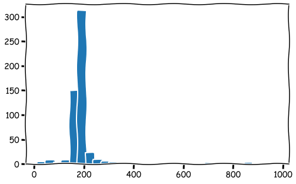

### Questions
- Numerical vs Categorical columns
    - How is numerical defined? 
    - When are the statistics important for these types of columns?
    - How does one handle null values and placeholders?
- How does one identify placeholders vs a legitimiate data point
- How does one filter a dataframe using conditionals? 
    - Specify rows based on conditions

### Objectives
YWBAT 
* describe and apply strategies for handling null values
* "" for handling placeholders
* "" normalizing and standardizing data
* use method chaining to store slices of data to variables
* explain the importance of method chaining
* apply the groupby method to create a new dataframe
* create a pivot table

### Outline
* Questions
* Load in our data and clean it

### Outline


```python
import pandas as pd
import numpy as np

import matplotlib.pyplot as plt
import seaborn as sns
plt.xkcd()
```


    <matplotlib.rc_context at 0x1a1c8730b8>


### Loading in super hero powers


```python
df = pd.read_csv("super_hero_powers.csv")
df.head()
```


<div>
<style scoped>
    .dataframe tbody tr th:only-of-type {
        vertical-align: middle;
    }

    .dataframe tbody tr th {
        vertical-align: top;
    }

    .dataframe thead th {
        text-align: right;
    }
</style>
<table border="1" class="dataframe">
  <thead>
    <tr style="text-align: right;">
      <th></th>
      <th>hero_names</th>
      <th>Agility</th>
      <th>Accelerated Healing</th>
      <th>Lantern Power Ring</th>
      <th>Dimensional Awareness</th>
      <th>Cold Resistance</th>
      <th>Durability</th>
      <th>Stealth</th>
      <th>Energy Absorption</th>
      <th>Flight</th>
      <th>...</th>
      <th>Web Creation</th>
      <th>Reality Warping</th>
      <th>Odin Force</th>
      <th>Symbiote Costume</th>
      <th>Speed Force</th>
      <th>Phoenix Force</th>
      <th>Molecular Dissipation</th>
      <th>Vision - Cryo</th>
      <th>Omnipresent</th>
      <th>Omniscient</th>
    </tr>
  </thead>
  <tbody>
    <tr>
      <th>0</th>
      <td>3-D Man</td>
      <td>True</td>
      <td>False</td>
      <td>False</td>
      <td>False</td>
      <td>False</td>
      <td>False</td>
      <td>False</td>
      <td>False</td>
      <td>False</td>
      <td>...</td>
      <td>False</td>
      <td>False</td>
      <td>False</td>
      <td>False</td>
      <td>False</td>
      <td>False</td>
      <td>False</td>
      <td>False</td>
      <td>False</td>
      <td>False</td>
    </tr>
    <tr>
      <th>1</th>
      <td>A-Bomb</td>
      <td>False</td>
      <td>True</td>
      <td>False</td>
      <td>False</td>
      <td>False</td>
      <td>True</td>
      <td>False</td>
      <td>False</td>
      <td>False</td>
      <td>...</td>
      <td>False</td>
      <td>False</td>
      <td>False</td>
      <td>False</td>
      <td>False</td>
      <td>False</td>
      <td>False</td>
      <td>False</td>
      <td>False</td>
      <td>False</td>
    </tr>
    <tr>
      <th>2</th>
      <td>Abe Sapien</td>
      <td>True</td>
      <td>True</td>
      <td>False</td>
      <td>False</td>
      <td>True</td>
      <td>True</td>
      <td>False</td>
      <td>False</td>
      <td>False</td>
      <td>...</td>
      <td>False</td>
      <td>False</td>
      <td>False</td>
      <td>False</td>
      <td>False</td>
      <td>False</td>
      <td>False</td>
      <td>False</td>
      <td>False</td>
      <td>False</td>
    </tr>
    <tr>
      <th>3</th>
      <td>Abin Sur</td>
      <td>False</td>
      <td>False</td>
      <td>True</td>
      <td>False</td>
      <td>False</td>
      <td>False</td>
      <td>False</td>
      <td>False</td>
      <td>False</td>
      <td>...</td>
      <td>False</td>
      <td>False</td>
      <td>False</td>
      <td>False</td>
      <td>False</td>
      <td>False</td>
      <td>False</td>
      <td>False</td>
      <td>False</td>
      <td>False</td>
    </tr>
    <tr>
      <th>4</th>
      <td>Abomination</td>
      <td>False</td>
      <td>True</td>
      <td>False</td>
      <td>False</td>
      <td>False</td>
      <td>False</td>
      <td>False</td>
      <td>False</td>
      <td>False</td>
      <td>...</td>
      <td>False</td>
      <td>False</td>
      <td>False</td>
      <td>False</td>
      <td>False</td>
      <td>False</td>
      <td>False</td>
      <td>False</td>
      <td>False</td>
      <td>False</td>
    </tr>
  </tbody>
</table>
<p>5 rows × 168 columns</p>
</div>


### let's gather columns of similar data types


```python
all_boolean_columns = []

for column in df.columns:
    if df[column].dtype != bool:
        all_boolean_columns.append(column)

        
all_boolean_columns
```


    ['hero_names']


```python
for column in df.columns:
    if df[column].dtype == bool:
        continue
    else:
        print(column)
```

    hero_names


### count the null values in 'Agility' column


```python
df['Agility'].isna().sum() == 0
```


    True


### print any column that has a null value


```python
for column in df.columns:
    if df[column].isna().sum() > 0:
        print(column)
```

### Load in heros_information.csv


```python
df2 = pd.read_csv("heroes_information.csv", index_col=0)
df2.head()
```


<div>
<style scoped>
    .dataframe tbody tr th:only-of-type {
        vertical-align: middle;
    }

    .dataframe tbody tr th {
        vertical-align: top;
    }

    .dataframe thead th {
        text-align: right;
    }
</style>
<table border="1" class="dataframe">
  <thead>
    <tr style="text-align: right;">
      <th></th>
      <th>name</th>
      <th>Gender</th>
      <th>Eye color</th>
      <th>Race</th>
      <th>Hair color</th>
      <th>Height</th>
      <th>Publisher</th>
      <th>Skin color</th>
      <th>Alignment</th>
      <th>Weight</th>
    </tr>
  </thead>
  <tbody>
    <tr>
      <th>0</th>
      <td>A-Bomb</td>
      <td>Male</td>
      <td>yellow</td>
      <td>Human</td>
      <td>No Hair</td>
      <td>203.0</td>
      <td>Marvel Comics</td>
      <td>-</td>
      <td>good</td>
      <td>441.0</td>
    </tr>
    <tr>
      <th>1</th>
      <td>Abe Sapien</td>
      <td>Male</td>
      <td>blue</td>
      <td>Icthyo Sapien</td>
      <td>No Hair</td>
      <td>191.0</td>
      <td>Dark Horse Comics</td>
      <td>blue</td>
      <td>good</td>
      <td>65.0</td>
    </tr>
    <tr>
      <th>2</th>
      <td>Abin Sur</td>
      <td>Male</td>
      <td>blue</td>
      <td>Ungaran</td>
      <td>No Hair</td>
      <td>185.0</td>
      <td>DC Comics</td>
      <td>red</td>
      <td>good</td>
      <td>90.0</td>
    </tr>
    <tr>
      <th>3</th>
      <td>Abomination</td>
      <td>Male</td>
      <td>green</td>
      <td>Human / Radiation</td>
      <td>No Hair</td>
      <td>203.0</td>
      <td>Marvel Comics</td>
      <td>-</td>
      <td>bad</td>
      <td>441.0</td>
    </tr>
    <tr>
      <th>4</th>
      <td>Abraxas</td>
      <td>Male</td>
      <td>blue</td>
      <td>Cosmic Entity</td>
      <td>Black</td>
      <td>-99.0</td>
      <td>Marvel Comics</td>
      <td>-</td>
      <td>bad</td>
      <td>-99.0</td>
    </tr>
  </tbody>
</table>
</div>


```python
df2.info()

### what does 'object' dtype indicate?
### text, dictionary
```

    <class 'pandas.core.frame.DataFrame'>
    Int64Index: 734 entries, 0 to 733
    Data columns (total 10 columns):
    name          734 non-null object
    Gender        734 non-null object
    Eye color     734 non-null object
    Race          734 non-null object
    Hair color    734 non-null object
    Height        734 non-null float64
    Publisher     719 non-null object
    Skin color    734 non-null object
    Alignment     734 non-null object
    Weight        732 non-null float64
    dtypes: float64(2), object(8)
    memory usage: 63.1+ KB


```python
# How can we check if name column is a unique identifier?

df2.name.unique().shape[0] == df2.shape[0]
```


    False


```python
df2.name.value_counts().head() # you can apply a .head() to a Series object
```


    Goliath           3
    Spider-Man        3
    Captain Marvel    2
    Batgirl           2
    Blue Beetle       2
    Name: name, dtype: int64


### Identify columns with null values


```python
df2.isna().sum()
```


    name           0
    Gender         0
    Eye color      0
    Race           0
    Hair color     0
    Height         0
    Publisher     15
    Skin color     0
    Alignment      0
    Weight         2
    dtype: int64


**Fetch the null values in the Publisher column**


```python
df2[df2.Publisher.isna()==True]

# what would you do at this point if Publisher was important?

# replace NaN with 'Unknown'
# delete the rows, but we lose the data
# manually input them, since there are only 15
```


<div>
<style scoped>
    .dataframe tbody tr th:only-of-type {
        vertical-align: middle;
    }

    .dataframe tbody tr th {
        vertical-align: top;
    }

    .dataframe thead th {
        text-align: right;
    }
</style>
<table border="1" class="dataframe">
  <thead>
    <tr style="text-align: right;">
      <th></th>
      <th>name</th>
      <th>Gender</th>
      <th>Eye color</th>
      <th>Race</th>
      <th>Hair color</th>
      <th>Height</th>
      <th>Publisher</th>
      <th>Skin color</th>
      <th>Alignment</th>
      <th>Weight</th>
    </tr>
  </thead>
  <tbody>
    <tr>
      <th>46</th>
      <td>Astro Boy</td>
      <td>Male</td>
      <td>brown</td>
      <td>-</td>
      <td>Black</td>
      <td>-99.0</td>
      <td>NaN</td>
      <td>-</td>
      <td>good</td>
      <td>-99.0</td>
    </tr>
    <tr>
      <th>86</th>
      <td>Bionic Woman</td>
      <td>Female</td>
      <td>blue</td>
      <td>Cyborg</td>
      <td>Black</td>
      <td>-99.0</td>
      <td>NaN</td>
      <td>-</td>
      <td>good</td>
      <td>-99.0</td>
    </tr>
    <tr>
      <th>138</th>
      <td>Brundlefly</td>
      <td>Male</td>
      <td>-</td>
      <td>Mutant</td>
      <td>-</td>
      <td>193.0</td>
      <td>NaN</td>
      <td>-</td>
      <td>-</td>
      <td>-99.0</td>
    </tr>
    <tr>
      <th>175</th>
      <td>Chuck Norris</td>
      <td>Male</td>
      <td>-</td>
      <td>-</td>
      <td>-</td>
      <td>178.0</td>
      <td>NaN</td>
      <td>-</td>
      <td>good</td>
      <td>-99.0</td>
    </tr>
    <tr>
      <th>204</th>
      <td>Darkside</td>
      <td>-</td>
      <td>-</td>
      <td>-</td>
      <td>-</td>
      <td>-99.0</td>
      <td>NaN</td>
      <td>-</td>
      <td>bad</td>
      <td>-99.0</td>
    </tr>
    <tr>
      <th>244</th>
      <td>Ethan Hunt</td>
      <td>Male</td>
      <td>brown</td>
      <td>Human</td>
      <td>Brown</td>
      <td>168.0</td>
      <td>NaN</td>
      <td>-</td>
      <td>good</td>
      <td>-99.0</td>
    </tr>
    <tr>
      <th>263</th>
      <td>Flash Gordon</td>
      <td>Male</td>
      <td>-</td>
      <td>-</td>
      <td>-</td>
      <td>-99.0</td>
      <td>NaN</td>
      <td>-</td>
      <td>good</td>
      <td>-99.0</td>
    </tr>
    <tr>
      <th>286</th>
      <td>Godzilla</td>
      <td>-</td>
      <td>-</td>
      <td>Kaiju</td>
      <td>-</td>
      <td>108.0</td>
      <td>NaN</td>
      <td>grey</td>
      <td>bad</td>
      <td>NaN</td>
    </tr>
    <tr>
      <th>348</th>
      <td>Jack Bauer</td>
      <td>Male</td>
      <td>-</td>
      <td>-</td>
      <td>-</td>
      <td>-99.0</td>
      <td>NaN</td>
      <td>-</td>
      <td>good</td>
      <td>-99.0</td>
    </tr>
    <tr>
      <th>354</th>
      <td>Jason Bourne</td>
      <td>Male</td>
      <td>-</td>
      <td>Human</td>
      <td>-</td>
      <td>-99.0</td>
      <td>NaN</td>
      <td>-</td>
      <td>good</td>
      <td>-99.0</td>
    </tr>
    <tr>
      <th>381</th>
      <td>Katniss Everdeen</td>
      <td>Female</td>
      <td>-</td>
      <td>Human</td>
      <td>-</td>
      <td>-99.0</td>
      <td>NaN</td>
      <td>-</td>
      <td>good</td>
      <td>-99.0</td>
    </tr>
    <tr>
      <th>389</th>
      <td>King Kong</td>
      <td>Male</td>
      <td>yellow</td>
      <td>Animal</td>
      <td>Black</td>
      <td>30.5</td>
      <td>NaN</td>
      <td>-</td>
      <td>good</td>
      <td>NaN</td>
    </tr>
    <tr>
      <th>393</th>
      <td>Kool-Aid Man</td>
      <td>Male</td>
      <td>black</td>
      <td>-</td>
      <td>No Hair</td>
      <td>-99.0</td>
      <td>NaN</td>
      <td>red</td>
      <td>good</td>
      <td>-99.0</td>
    </tr>
    <tr>
      <th>542</th>
      <td>Rambo</td>
      <td>Male</td>
      <td>brown</td>
      <td>Human</td>
      <td>Black</td>
      <td>178.0</td>
      <td>NaN</td>
      <td>-</td>
      <td>good</td>
      <td>83.0</td>
    </tr>
    <tr>
      <th>658</th>
      <td>The Cape</td>
      <td>Male</td>
      <td>-</td>
      <td>-</td>
      <td>-</td>
      <td>-99.0</td>
      <td>NaN</td>
      <td>-</td>
      <td>good</td>
      <td>-99.0</td>
    </tr>
  </tbody>
</table>
</div>


```python
# this is how we would manually input 'Dark Horse Comics' into the 'Astro Boy' row

df2.loc[df2.name=='Astro Boy', 'Publisher'] = 'Dark Horse Comics'
```


```python
# you can fill nulls this way
# but it's better to use the .fillna method
# df2.loc[df2.Publisher.isnull()==True, 'Publisher']='Unknown'


```


```python
df2.loc[df2.name=='Abraxas', 'Height']=-99.0
```


```python
df2.loc[df2.name=='Abraxas']
```


<div>
<style scoped>
    .dataframe tbody tr th:only-of-type {
        vertical-align: middle;
    }

    .dataframe tbody tr th {
        vertical-align: top;
    }

    .dataframe thead th {
        text-align: right;
    }
</style>
<table border="1" class="dataframe">
  <thead>
    <tr style="text-align: right;">
      <th></th>
      <th>name</th>
      <th>Gender</th>
      <th>Eye color</th>
      <th>Race</th>
      <th>Hair color</th>
      <th>Height</th>
      <th>Publisher</th>
      <th>Skin color</th>
      <th>Alignment</th>
      <th>Weight</th>
    </tr>
  </thead>
  <tbody>
    <tr>
      <th>4</th>
      <td>Abraxas</td>
      <td>Male</td>
      <td>blue</td>
      <td>Cosmic Entity</td>
      <td>Black</td>
      <td>-99</td>
      <td>Marvel Comics</td>
      <td>-</td>
      <td>bad</td>
      <td>-99.0</td>
    </tr>
  </tbody>
</table>
</div>


```python
# this doesn't work for modifying data in the dataframe
df2[df2['name']=='Abraxas']['Height']='really tall'
```

    /Users/rcarrasco/anaconda3/lib/python3.7/site-packages/ipykernel_launcher.py:2: SettingWithCopyWarning: 
    A value is trying to be set on a copy of a slice from a DataFrame.
    Try using .loc[row_indexer,col_indexer] = value instead
    
    See the caveats in the documentation: http://pandas.pydata.org/pandas-docs/stable/indexing.html#indexing-view-versus-copy
      


```python
df2.Height.replace(to_replace=-99.0, value=np.nan, inplace=True)
```


```python
df2.Weight.replace(to_replace=-99.0, value=np.nan, inplace=True)
```


```python
df2.Height.value_counts(sort=True, ascending=False).head()
```


    183.0    59
    188.0    51
    178.0    39
    180.0    38
    185.0    35
    Name: Height, dtype: int64


```python
df2.Height.mean(), df2.Height.std()

### How do we handle numerical null values
```


    (186.72630560928434, 59.25189465200381)


```python
df2.Height.isna().sum()
```


    217


```python
plt.figure(figsize=(8, 5))
plt.hist(df2.Height, bins=30)
plt.show()
```

    /Users/rcarrasco/anaconda3/lib/python3.7/site-packages/numpy/lib/histograms.py:824: RuntimeWarning: invalid value encountered in greater_equal
      keep = (tmp_a >= first_edge)
    /Users/rcarrasco/anaconda3/lib/python3.7/site-packages/numpy/lib/histograms.py:825: RuntimeWarning: invalid value encountered in less_equal
      keep &= (tmp_a <= last_edge)





### Methods for handling numerical nulls


```python
# replace with 0
df2['Height'].replace(to_replace=np.nan, value=0, inplace=True)
df2.head()
```


<div>
<style scoped>
    .dataframe tbody tr th:only-of-type {
        vertical-align: middle;
    }

    .dataframe tbody tr th {
        vertical-align: top;
    }

    .dataframe thead th {
        text-align: right;
    }
</style>
<table border="1" class="dataframe">
  <thead>
    <tr style="text-align: right;">
      <th></th>
      <th>name</th>
      <th>Gender</th>
      <th>Eye color</th>
      <th>Race</th>
      <th>Hair color</th>
      <th>Height</th>
      <th>Publisher</th>
      <th>Skin color</th>
      <th>Alignment</th>
      <th>Weight</th>
    </tr>
  </thead>
  <tbody>
    <tr>
      <th>0</th>
      <td>A-Bomb</td>
      <td>Male</td>
      <td>yellow</td>
      <td>Human</td>
      <td>No Hair</td>
      <td>203.0</td>
      <td>Marvel Comics</td>
      <td>-</td>
      <td>good</td>
      <td>441.0</td>
    </tr>
    <tr>
      <th>1</th>
      <td>Abe Sapien</td>
      <td>Male</td>
      <td>blue</td>
      <td>Icthyo Sapien</td>
      <td>No Hair</td>
      <td>191.0</td>
      <td>Dark Horse Comics</td>
      <td>blue</td>
      <td>good</td>
      <td>65.0</td>
    </tr>
    <tr>
      <th>2</th>
      <td>Abin Sur</td>
      <td>Male</td>
      <td>blue</td>
      <td>Ungaran</td>
      <td>No Hair</td>
      <td>185.0</td>
      <td>DC Comics</td>
      <td>red</td>
      <td>good</td>
      <td>90.0</td>
    </tr>
    <tr>
      <th>3</th>
      <td>Abomination</td>
      <td>Male</td>
      <td>green</td>
      <td>Human / Radiation</td>
      <td>No Hair</td>
      <td>203.0</td>
      <td>Marvel Comics</td>
      <td>-</td>
      <td>bad</td>
      <td>441.0</td>
    </tr>
    <tr>
      <th>4</th>
      <td>Abraxas</td>
      <td>Male</td>
      <td>blue</td>
      <td>Cosmic Entity</td>
      <td>Black</td>
      <td>0.0</td>
      <td>Marvel Comics</td>
      <td>-</td>
      <td>bad</td>
      <td>NaN</td>
    </tr>
  </tbody>
</table>
</div>


```python
# replace with the mean Height
mean_height = 186.72630560928434
df2['Height'].replace(to_replace=0.0, value=mean_height, inplace=True)

df2.head()
```


<div>
<style scoped>
    .dataframe tbody tr th:only-of-type {
        vertical-align: middle;
    }

    .dataframe tbody tr th {
        vertical-align: top;
    }

    .dataframe thead th {
        text-align: right;
    }
</style>
<table border="1" class="dataframe">
  <thead>
    <tr style="text-align: right;">
      <th></th>
      <th>name</th>
      <th>Gender</th>
      <th>Eye color</th>
      <th>Race</th>
      <th>Hair color</th>
      <th>Height</th>
      <th>Publisher</th>
      <th>Skin color</th>
      <th>Alignment</th>
      <th>Weight</th>
    </tr>
  </thead>
  <tbody>
    <tr>
      <th>0</th>
      <td>A-Bomb</td>
      <td>Male</td>
      <td>yellow</td>
      <td>Human</td>
      <td>No Hair</td>
      <td>203.000000</td>
      <td>Marvel Comics</td>
      <td>-</td>
      <td>good</td>
      <td>441.0</td>
    </tr>
    <tr>
      <th>1</th>
      <td>Abe Sapien</td>
      <td>Male</td>
      <td>blue</td>
      <td>Icthyo Sapien</td>
      <td>No Hair</td>
      <td>191.000000</td>
      <td>Dark Horse Comics</td>
      <td>blue</td>
      <td>good</td>
      <td>65.0</td>
    </tr>
    <tr>
      <th>2</th>
      <td>Abin Sur</td>
      <td>Male</td>
      <td>blue</td>
      <td>Ungaran</td>
      <td>No Hair</td>
      <td>185.000000</td>
      <td>DC Comics</td>
      <td>red</td>
      <td>good</td>
      <td>90.0</td>
    </tr>
    <tr>
      <th>3</th>
      <td>Abomination</td>
      <td>Male</td>
      <td>green</td>
      <td>Human / Radiation</td>
      <td>No Hair</td>
      <td>203.000000</td>
      <td>Marvel Comics</td>
      <td>-</td>
      <td>bad</td>
      <td>441.0</td>
    </tr>
    <tr>
      <th>4</th>
      <td>Abraxas</td>
      <td>Male</td>
      <td>blue</td>
      <td>Cosmic Entity</td>
      <td>Black</td>
      <td>186.726306</td>
      <td>Marvel Comics</td>
      <td>-</td>
      <td>bad</td>
      <td>NaN</td>
    </tr>
  </tbody>
</table>
</div>


```python
# replace with normal distribution of random numbers

mean_height = df2.Height.mean()
std_height = df2.Height.std()
num_missing = df2.Height.isna().sum()

new_values = np.random.normal(mean_height, std_height, num_missing)

df2.loc[df2.Height.isna(), 'Height'] = new_values

df2.head()
```


<div>
<style scoped>
    .dataframe tbody tr th:only-of-type {
        vertical-align: middle;
    }

    .dataframe tbody tr th {
        vertical-align: top;
    }

    .dataframe thead th {
        text-align: right;
    }
</style>
<table border="1" class="dataframe">
  <thead>
    <tr style="text-align: right;">
      <th></th>
      <th>name</th>
      <th>Gender</th>
      <th>Eye color</th>
      <th>Race</th>
      <th>Hair color</th>
      <th>Height</th>
      <th>Publisher</th>
      <th>Skin color</th>
      <th>Alignment</th>
      <th>Weight</th>
    </tr>
  </thead>
  <tbody>
    <tr>
      <th>0</th>
      <td>A-Bomb</td>
      <td>Male</td>
      <td>yellow</td>
      <td>Human</td>
      <td>No Hair</td>
      <td>203.000000</td>
      <td>Marvel Comics</td>
      <td>NaN</td>
      <td>good</td>
      <td>441.0</td>
    </tr>
    <tr>
      <th>1</th>
      <td>Abe Sapien</td>
      <td>Male</td>
      <td>blue</td>
      <td>Icthyo Sapien</td>
      <td>No Hair</td>
      <td>191.000000</td>
      <td>Dark Horse Comics</td>
      <td>blue</td>
      <td>good</td>
      <td>65.0</td>
    </tr>
    <tr>
      <th>2</th>
      <td>Abin Sur</td>
      <td>Male</td>
      <td>blue</td>
      <td>Ungaran</td>
      <td>No Hair</td>
      <td>185.000000</td>
      <td>DC Comics</td>
      <td>red</td>
      <td>good</td>
      <td>90.0</td>
    </tr>
    <tr>
      <th>3</th>
      <td>Abomination</td>
      <td>Male</td>
      <td>green</td>
      <td>Human / Radiation</td>
      <td>No Hair</td>
      <td>203.000000</td>
      <td>Marvel Comics</td>
      <td>NaN</td>
      <td>bad</td>
      <td>441.0</td>
    </tr>
    <tr>
      <th>4</th>
      <td>Abraxas</td>
      <td>Male</td>
      <td>blue</td>
      <td>Cosmic Entity</td>
      <td>Black</td>
      <td>144.728494</td>
      <td>Marvel Comics</td>
      <td>NaN</td>
      <td>bad</td>
      <td>NaN</td>
    </tr>
  </tbody>
</table>
</div>


```python
plt.figure(figsize=(8, 5))
plt.hist(df2.Height, bins=30)
plt.show()
```


### How can we filter placeholders?
- You really can't you just have to find them


```python
df2["Skin color"].replace(to_replace="-", value=np.nan, inplace=True)
```


```python
df2["Skin color"].unique() # quick scan for placeholders
```


    array([nan, 'blue', 'red', 'black', 'grey', 'gold', 'green', 'white',
           'pink', 'silver', 'red / black', 'yellow', 'purple',
           'orange / white', 'gray', 'blue-white', 'orange'], dtype=object)


```python
df2.Gender.unique()
```


    array(['Male', 'Female', '-'], dtype=object)


```python
df2["Gender"].replace(to_replace="-", value=np.nan, inplace=True)
```


```python
df2["Eye color"].replace(to_replace="-", value=np.nan, inplace=True)
```


```python
df2["Race"].replace(to_replace="-", value=np.nan, inplace=True)
```


```python
df2["Hair color"].replace(to_replace="-", value=np.nan, inplace=True)
```


```python
df2["Alignment"].replace(to_replace="-", value=np.nan, inplace=True)
```

### or apply replace to entire dataframe


```python
df2.replace(to_replace=["-", -99.0], value=np.nan, inplace=True)
```


```python
df2.isnull().sum()
```


    name            0
    Gender         29
    Eye color     172
    Race          304
    Hair color    172
    Height        217
    Publisher      15
    Skin color    662
    Alignment       7
    Weight        239
    dtype: int64


```python
# I would just drop Skin Color, because of the amount of Null values
df2 = df2.drop("Skin color", axis=1)
df2.head()
```


<div>
<style scoped>
    .dataframe tbody tr th:only-of-type {
        vertical-align: middle;
    }

    .dataframe tbody tr th {
        vertical-align: top;
    }

    .dataframe thead th {
        text-align: right;
    }
</style>
<table border="1" class="dataframe">
  <thead>
    <tr style="text-align: right;">
      <th></th>
      <th>name</th>
      <th>Gender</th>
      <th>Eye color</th>
      <th>Race</th>
      <th>Hair color</th>
      <th>Height</th>
      <th>Publisher</th>
      <th>Alignment</th>
      <th>Weight</th>
    </tr>
  </thead>
  <tbody>
    <tr>
      <th>0</th>
      <td>A-Bomb</td>
      <td>Male</td>
      <td>yellow</td>
      <td>Human</td>
      <td>No Hair</td>
      <td>203.0</td>
      <td>Marvel Comics</td>
      <td>good</td>
      <td>441.0</td>
    </tr>
    <tr>
      <th>1</th>
      <td>Abe Sapien</td>
      <td>Male</td>
      <td>blue</td>
      <td>Icthyo Sapien</td>
      <td>No Hair</td>
      <td>191.0</td>
      <td>Dark Horse Comics</td>
      <td>good</td>
      <td>65.0</td>
    </tr>
    <tr>
      <th>2</th>
      <td>Abin Sur</td>
      <td>Male</td>
      <td>blue</td>
      <td>Ungaran</td>
      <td>No Hair</td>
      <td>185.0</td>
      <td>DC Comics</td>
      <td>good</td>
      <td>90.0</td>
    </tr>
    <tr>
      <th>3</th>
      <td>Abomination</td>
      <td>Male</td>
      <td>green</td>
      <td>Human / Radiation</td>
      <td>No Hair</td>
      <td>203.0</td>
      <td>Marvel Comics</td>
      <td>bad</td>
      <td>441.0</td>
    </tr>
    <tr>
      <th>4</th>
      <td>Abraxas</td>
      <td>Male</td>
      <td>blue</td>
      <td>Cosmic Entity</td>
      <td>Black</td>
      <td>NaN</td>
      <td>Marvel Comics</td>
      <td>bad</td>
      <td>NaN</td>
    </tr>
  </tbody>
</table>
</div>


## Now that my dataframe is cleaned, I'm going to save it as a clean file


```python
df2.to_csv("./cleaned_heroes_information.csv", index=0) 
# this will create the dataframe without that weird 'Unnamed' column
```


```python
###

df3 = pd.read_csv("./cleaned_heroes_information.csv")
df3.head()
```


<div>
<style scoped>
    .dataframe tbody tr th:only-of-type {
        vertical-align: middle;
    }

    .dataframe tbody tr th {
        vertical-align: top;
    }

    .dataframe thead th {
        text-align: right;
    }
</style>
<table border="1" class="dataframe">
  <thead>
    <tr style="text-align: right;">
      <th></th>
      <th>name</th>
      <th>Gender</th>
      <th>Eye color</th>
      <th>Race</th>
      <th>Hair color</th>
      <th>Height</th>
      <th>Publisher</th>
      <th>Alignment</th>
      <th>Weight</th>
    </tr>
  </thead>
  <tbody>
    <tr>
      <th>0</th>
      <td>A-Bomb</td>
      <td>Male</td>
      <td>yellow</td>
      <td>Human</td>
      <td>No Hair</td>
      <td>203.0</td>
      <td>Marvel Comics</td>
      <td>good</td>
      <td>441.0</td>
    </tr>
    <tr>
      <th>1</th>
      <td>Abe Sapien</td>
      <td>Male</td>
      <td>blue</td>
      <td>Icthyo Sapien</td>
      <td>No Hair</td>
      <td>191.0</td>
      <td>Dark Horse Comics</td>
      <td>good</td>
      <td>65.0</td>
    </tr>
    <tr>
      <th>2</th>
      <td>Abin Sur</td>
      <td>Male</td>
      <td>blue</td>
      <td>Ungaran</td>
      <td>No Hair</td>
      <td>185.0</td>
      <td>DC Comics</td>
      <td>good</td>
      <td>90.0</td>
    </tr>
    <tr>
      <th>3</th>
      <td>Abomination</td>
      <td>Male</td>
      <td>green</td>
      <td>Human / Radiation</td>
      <td>No Hair</td>
      <td>203.0</td>
      <td>Marvel Comics</td>
      <td>bad</td>
      <td>441.0</td>
    </tr>
    <tr>
      <th>4</th>
      <td>Abraxas</td>
      <td>Male</td>
      <td>blue</td>
      <td>Cosmic Entity</td>
      <td>Black</td>
      <td>NaN</td>
      <td>Marvel Comics</td>
      <td>bad</td>
      <td>NaN</td>
    </tr>
  </tbody>
</table>
</div>


```python
renamed_cols = [col.lower().replace(" ", "_") for col in df3.columns]
print(renamed_cols)

name_mapper = dict(zip(df3.columns, renamed_cols))

name_mapper
```

    ['name', 'gender', 'eye_color', 'race', 'hair_color', 'height', 'publisher', 'alignment', 'weight']


    {'name': 'name',
     'Gender': 'gender',
     'Eye color': 'eye_color',
     'Race': 'race',
     'Hair color': 'hair_color',
     'Height': 'height',
     'Publisher': 'publisher',
     'Alignment': 'alignment',
     'Weight': 'weight'}


```python
df3.rename(mapper=name_mapper, axis=1, inplace=True)
df3.head()
```


<div>
<style scoped>
    .dataframe tbody tr th:only-of-type {
        vertical-align: middle;
    }

    .dataframe tbody tr th {
        vertical-align: top;
    }

    .dataframe thead th {
        text-align: right;
    }
</style>
<table border="1" class="dataframe">
  <thead>
    <tr style="text-align: right;">
      <th></th>
      <th>name</th>
      <th>gender</th>
      <th>eye_color</th>
      <th>race</th>
      <th>hair_color</th>
      <th>height</th>
      <th>publisher</th>
      <th>alignment</th>
      <th>weight</th>
    </tr>
  </thead>
  <tbody>
    <tr>
      <th>0</th>
      <td>A-Bomb</td>
      <td>Male</td>
      <td>yellow</td>
      <td>Human</td>
      <td>No Hair</td>
      <td>203.0</td>
      <td>Marvel Comics</td>
      <td>good</td>
      <td>441.0</td>
    </tr>
    <tr>
      <th>1</th>
      <td>Abe Sapien</td>
      <td>Male</td>
      <td>blue</td>
      <td>Icthyo Sapien</td>
      <td>No Hair</td>
      <td>191.0</td>
      <td>Dark Horse Comics</td>
      <td>good</td>
      <td>65.0</td>
    </tr>
    <tr>
      <th>2</th>
      <td>Abin Sur</td>
      <td>Male</td>
      <td>blue</td>
      <td>Ungaran</td>
      <td>No Hair</td>
      <td>185.0</td>
      <td>DC Comics</td>
      <td>good</td>
      <td>90.0</td>
    </tr>
    <tr>
      <th>3</th>
      <td>Abomination</td>
      <td>Male</td>
      <td>green</td>
      <td>Human / Radiation</td>
      <td>No Hair</td>
      <td>203.0</td>
      <td>Marvel Comics</td>
      <td>bad</td>
      <td>441.0</td>
    </tr>
    <tr>
      <th>4</th>
      <td>Abraxas</td>
      <td>Male</td>
      <td>blue</td>
      <td>Cosmic Entity</td>
      <td>Black</td>
      <td>NaN</td>
      <td>Marvel Comics</td>
      <td>bad</td>
      <td>NaN</td>
    </tr>
  </tbody>
</table>
</div>


```python
# what are the value counts for the 'alignment' column
df3.alignment.value_counts()
```


    good       496
    bad        207
    neutral     24
    Name: alignment, dtype: int64


```python
df3[df3.alignment.isna()]

# there is a small enough number that you could replace these manually
```


<div>
<style scoped>
    .dataframe tbody tr th:only-of-type {
        vertical-align: middle;
    }

    .dataframe tbody tr th {
        vertical-align: top;
    }

    .dataframe thead th {
        text-align: right;
    }
</style>
<table border="1" class="dataframe">
  <thead>
    <tr style="text-align: right;">
      <th></th>
      <th>name</th>
      <th>gender</th>
      <th>eye_color</th>
      <th>race</th>
      <th>hair_color</th>
      <th>height</th>
      <th>publisher</th>
      <th>alignment</th>
      <th>weight</th>
    </tr>
  </thead>
  <tbody>
    <tr>
      <th>33</th>
      <td>Anti-Venom</td>
      <td>Male</td>
      <td>blue</td>
      <td>Symbiote</td>
      <td>Blond</td>
      <td>229.0</td>
      <td>Marvel Comics</td>
      <td>NaN</td>
      <td>358.0</td>
    </tr>
    <tr>
      <th>110</th>
      <td>Blackwulf</td>
      <td>Male</td>
      <td>red</td>
      <td>Alien</td>
      <td>White</td>
      <td>188.0</td>
      <td>Marvel Comics</td>
      <td>NaN</td>
      <td>88.0</td>
    </tr>
    <tr>
      <th>138</th>
      <td>Brundlefly</td>
      <td>Male</td>
      <td>NaN</td>
      <td>Mutant</td>
      <td>NaN</td>
      <td>193.0</td>
      <td>NaN</td>
      <td>NaN</td>
      <td>NaN</td>
    </tr>
    <tr>
      <th>426</th>
      <td>Man of Miracles</td>
      <td>NaN</td>
      <td>blue</td>
      <td>God / Eternal</td>
      <td>Silver</td>
      <td>NaN</td>
      <td>Image Comics</td>
      <td>NaN</td>
      <td>NaN</td>
    </tr>
    <tr>
      <th>535</th>
      <td>Q</td>
      <td>Male</td>
      <td>NaN</td>
      <td>God / Eternal</td>
      <td>NaN</td>
      <td>NaN</td>
      <td>Star Trek</td>
      <td>NaN</td>
      <td>NaN</td>
    </tr>
    <tr>
      <th>676</th>
      <td>Trickster</td>
      <td>Male</td>
      <td>blue</td>
      <td>Human</td>
      <td>Blond</td>
      <td>183.0</td>
      <td>DC Comics</td>
      <td>NaN</td>
      <td>81.0</td>
    </tr>
    <tr>
      <th>692</th>
      <td>Venompool</td>
      <td>Male</td>
      <td>NaN</td>
      <td>Symbiote</td>
      <td>NaN</td>
      <td>226.0</td>
      <td>Marvel Comics</td>
      <td>NaN</td>
      <td>NaN</td>
    </tr>
  </tbody>
</table>
</div>


```python
df3.name.str.lower().head()
```


    0         a-bomb
    1     abe sapien
    2       abin sur
    3    abomination
    4        abraxas
    Name: name, dtype: object


### convert all lettering to lowercase


```python
for column in df3.columns:
    if df3[column].dtype=='O':
        df3[column] = df3[column].str.lower()
        
df3.head()
```


<div>
<style scoped>
    .dataframe tbody tr th:only-of-type {
        vertical-align: middle;
    }

    .dataframe tbody tr th {
        vertical-align: top;
    }

    .dataframe thead th {
        text-align: right;
    }
</style>
<table border="1" class="dataframe">
  <thead>
    <tr style="text-align: right;">
      <th></th>
      <th>name</th>
      <th>gender</th>
      <th>eye_color</th>
      <th>race</th>
      <th>hair_color</th>
      <th>height</th>
      <th>publisher</th>
      <th>alignment</th>
      <th>weight</th>
    </tr>
  </thead>
  <tbody>
    <tr>
      <th>0</th>
      <td>a-bomb</td>
      <td>male</td>
      <td>yellow</td>
      <td>human</td>
      <td>no hair</td>
      <td>203.0</td>
      <td>marvel comics</td>
      <td>good</td>
      <td>441.0</td>
    </tr>
    <tr>
      <th>1</th>
      <td>abe sapien</td>
      <td>male</td>
      <td>blue</td>
      <td>icthyo sapien</td>
      <td>no hair</td>
      <td>191.0</td>
      <td>dark horse comics</td>
      <td>good</td>
      <td>65.0</td>
    </tr>
    <tr>
      <th>2</th>
      <td>abin sur</td>
      <td>male</td>
      <td>blue</td>
      <td>ungaran</td>
      <td>no hair</td>
      <td>185.0</td>
      <td>dc comics</td>
      <td>good</td>
      <td>90.0</td>
    </tr>
    <tr>
      <th>3</th>
      <td>abomination</td>
      <td>male</td>
      <td>green</td>
      <td>human / radiation</td>
      <td>no hair</td>
      <td>203.0</td>
      <td>marvel comics</td>
      <td>bad</td>
      <td>441.0</td>
    </tr>
    <tr>
      <th>4</th>
      <td>abraxas</td>
      <td>male</td>
      <td>blue</td>
      <td>cosmic entity</td>
      <td>black</td>
      <td>NaN</td>
      <td>marvel comics</td>
      <td>bad</td>
      <td>NaN</td>
    </tr>
  </tbody>
</table>
</div>


### Let's make a column with superpowers!!!!
* column name = superpowers
* dtype = list
* list populated by strings


```python
df.shape, df3.shape
```


    ((667, 168), (734, 9))


```python
hero = df3.name[0]
hero
```


    'a-bomb'


```python
hero_row = df.loc[df["hero_names"].str.lower()==hero].drop('hero_names', axis=1)
hero_row
```


<div>
<style scoped>
    .dataframe tbody tr th:only-of-type {
        vertical-align: middle;
    }

    .dataframe tbody tr th {
        vertical-align: top;
    }

    .dataframe thead th {
        text-align: right;
    }
</style>
<table border="1" class="dataframe">
  <thead>
    <tr style="text-align: right;">
      <th></th>
      <th>Agility</th>
      <th>Accelerated Healing</th>
      <th>Lantern Power Ring</th>
      <th>Dimensional Awareness</th>
      <th>Cold Resistance</th>
      <th>Durability</th>
      <th>Stealth</th>
      <th>Energy Absorption</th>
      <th>Flight</th>
      <th>Danger Sense</th>
      <th>...</th>
      <th>Web Creation</th>
      <th>Reality Warping</th>
      <th>Odin Force</th>
      <th>Symbiote Costume</th>
      <th>Speed Force</th>
      <th>Phoenix Force</th>
      <th>Molecular Dissipation</th>
      <th>Vision - Cryo</th>
      <th>Omnipresent</th>
      <th>Omniscient</th>
    </tr>
  </thead>
  <tbody>
    <tr>
      <th>1</th>
      <td>False</td>
      <td>True</td>
      <td>False</td>
      <td>False</td>
      <td>False</td>
      <td>True</td>
      <td>False</td>
      <td>False</td>
      <td>False</td>
      <td>False</td>
      <td>...</td>
      <td>False</td>
      <td>False</td>
      <td>False</td>
      <td>False</td>
      <td>False</td>
      <td>False</td>
      <td>False</td>
      <td>False</td>
      <td>False</td>
      <td>False</td>
    </tr>
  </tbody>
</table>
<p>1 rows × 167 columns</p>
</div>


```python
hero_super_powers = []
for col in hero_row.columns:
    if hero_row[col].values[0] == True:
        hero_super_powers.append(col)
```


```python
hero_super_powers
```


    ['Accelerated Healing',
     'Durability',
     'Longevity',
     'Super Strength',
     'Stamina',
     'Camouflage',
     'Self-Sustenance']


```python
heros = {}
# {hero_name: [list of powers]}
for index, row in df.iterrows():
    powers = []
    for col in row.index[1:]:
        if row[col] == True:
            powers.append(col.lower())
    heros[row.values[0].lower()] = powers
heros
```


    {'3-d man': ['agility', 'super strength', 'stamina', 'super speed'],
     'a-bomb': ['accelerated healing',
      'durability',
      'longevity',
      'super strength',
      'stamina',
      'camouflage',
      'self-sustenance'],
     'abe sapien': ['agility',
      'accelerated healing',
      'cold resistance',
      'durability',
      'underwater breathing',
      'marksmanship',
      'weapons master',
      'longevity',
      'intelligence',
      'super strength',
      'telepathy',
      'stamina',
      'immortality',
      'reflexes',
      'enhanced sight',
      'sub-mariner'],
     'abin sur': ['lantern power ring'],
     'abomination': ['accelerated healing',
      'intelligence',
      'super strength',
      'stamina',
      'super speed',
      'invulnerability',
      'animation',
      'super breath'],
     'abraxas': ['dimensional awareness',
      'flight',
      'intelligence',
      'super strength',
      'size changing',
      'super speed',
      'teleportation',
      'magic',
      'dimensional travel',
      'immortality',
      'invulnerability',
      'molecular manipulation',
      'energy manipulation',
      'power cosmic'],
     'absorbing man': ['cold resistance',
      'durability',
      'energy absorption',
      'super strength',
      'invulnerability',
      'elemental transmogrification',
      'fire resistance',
      'natural armor',
      'molecular manipulation',
      'heat resistance',
      'matter absorption'],
     'adam monroe': ['accelerated healing', 'immortality', 'regeneration'],
     'adam strange': ['durability',
      'stealth',
      'flight',
      'marksmanship',
      'weapons master',
      'intelligence',
      'super speed',
      'fire resistance',
      'enhanced sight',
      'power suit'],
     'agent bob': ['stealth'],
     'agent zero': ['energy absorption',
      'longevity',
      'super strength',
      'energy blasts',
      'energy beams',
      'power suit'],
     'air-walker': ['flight',
      'super strength',
      'super speed',
      'self-sustenance',
      'molecular manipulation',
      'power cosmic'],
     'ajax': ['agility',
      'super strength',
      'super speed',
      'heat generation',
      'power suit'],
     'alan scott': ['flight',
      'danger sense',
      'intelligence',
      'telepathy',
      'energy blasts',
      'super speed',
      'teleportation',
      'energy beams',
      'phasing',
      'force fields',
      'hypnokinesis',
      'energy manipulation',
      'invisibility'],
     'alex mercer': ['agility',
      'accelerated healing',
      'stealth',
      'energy absorption',
      'danger sense',
      'marksmanship',
      'weapons master',
      'longevity',
      'super strength',
      'energy blasts',
      'stamina',
      'super speed',
      'enhanced senses',
      'jump',
      'shapeshifting',
      'immortality',
      'invulnerability',
      'elasticity',
      'substance secretion',
      'enhanced hearing',
      'natural armor',
      'adaptation',
      'gliding',
      'natural weapons',
      'wallcrawling',
      'matter absorption',
      'vision - thermal'],
     'alex woolsly': ['underwater breathing'],
     'alien': ['agility',
      'cold resistance',
      'durability',
      'stealth',
      'super strength',
      'super speed',
      'enhanced senses',
      'jump',
      'substance secretion',
      'natural armor',
      'heat resistance',
      'natural weapons',
      'wallcrawling',
      'vision - thermal'],
     'allan quatermain': ['marksmanship'],
     'amazo': ['agility',
      'lantern power ring',
      'durability',
      'flight',
      'underwater breathing',
      'marksmanship',
      'power augmentation',
      'longevity',
      'intelligence',
      'super strength',
      'cryokinesis',
      'telepathy',
      'energy blasts',
      'duplication',
      'size changing',
      'stamina',
      'super speed',
      'weapon-based powers',
      'teleportation',
      'enhanced senses',
      'jump',
      'shapeshifting',
      'camouflage',
      'phasing',
      'fire control',
      'enhanced memory',
      'reflexes',
      'invulnerability',
      'energy constructs',
      'force fields',
      'power absorption',
      'enhanced hearing',
      'time travel',
      'enhanced smell',
      'water control',
      'vision - telescopic',
      'magnetism',
      'invisibility',
      'vision - microscopic',
      'super breath',
      'vision - night',
      'vision - heat',
      'vision - x-ray',
      'vision - thermal'],
     'ammo': ['weapons master'],
     'ando masahashi': ['power augmentation'],
     'angel': ['agility',
      'accelerated healing',
      'durability',
      'stealth',
      'flight',
      'longevity',
      'super strength',
      'stamina',
      'super speed',
      'enhanced senses',
      'magic',
      'immortality',
      'enhanced memory',
      'psionic powers',
      'enhanced hearing',
      'gliding',
      'vision - telescopic',
      'toxin and disease resistance'],
     'angel dust': ['agility', 'super strength', 'stamina', 'super speed'],
     'angel salvadore': ['flight',
      'animal attributes',
      'animal oriented powers',
      'regeneration',
      'toxin and disease control'],
     'angela': ['longevity'],
     'animal man': ['animal attributes',
      'telepathy',
      'energy blasts',
      'animal oriented powers',
      'empathy'],
     'annihilus': ['agility',
      'durability',
      'flight',
      'super strength',
      'stamina',
      'super speed',
      'reflexes'],
     'ant-man': ['intelligence', 'size changing'],
     'ant-man ii': ['agility',
      'stealth',
      'intelligence',
      'super strength',
      'telepathy',
      'size changing',
      'stamina',
      'animal oriented powers',
      'animal control'],
     'anti-monitor': ['accelerated healing',
      'dimensional awareness',
      'durability',
      'energy absorption',
      'flight',
      'power augmentation',
      'intelligence',
      'super strength',
      'telepathy',
      'energy blasts',
      'size changing',
      'darkforce manipulation',
      'teleportation',
      'energy beams',
      'immortality',
      'invulnerability',
      'energy constructs',
      'molecular manipulation',
      'power suit',
      'time travel',
      'time manipulation',
      'matter absorption',
      'reality warping'],
     'anti-spawn': ['durability',
      'super strength',
      'energy blasts',
      'stamina',
      'teleportation',
      'energy manipulation'],
     'anti-venom': ['accelerated healing',
      'durability',
      'danger sense',
      'super strength',
      'stamina',
      'enhanced senses',
      'shapeshifting',
      'camouflage',
      'reflexes',
      'elasticity',
      'toxin and disease resistance',
      'wallcrawling',
      'web creation',
      'symbiote costume'],
     'apocalypse': ['agility',
      'accelerated healing',
      'energy absorption',
      'flight',
      'power augmentation',
      'longevity',
      'super strength',
      'telepathy',
      'energy blasts',
      'size changing',
      'stamina',
      'super speed',
      'teleportation',
      'telekinesis',
      'shapeshifting',
      'immortality',
      'reflexes',
      'invulnerability',
      'force fields',
      'natural armor',
      'molecular manipulation',
      'levitation',
      'biokinesis'],
     'aquababy': ['underwater breathing', 'super strength', 'water control'],
     'aqualad': ['durability',
      'underwater breathing',
      'super strength',
      'cryokinesis',
      'telepathy',
      'stamina',
      'super speed',
      'energy beams',
      'magic',
      'enhanced hearing',
      'heat generation',
      'water control',
      'vision - night'],
     'aquaman': ['agility',
      'accelerated healing',
      'cold resistance',
      'durability',
      'stealth',
      'underwater breathing',
      'longevity',
      'intelligence',
      'super strength',
      'telepathy',
      'stamina',
      'super speed',
      'enhanced senses',
      'reflexes',
      'invulnerability',
      'enhanced hearing',
      'animal control',
      'enhanced sight',
      'heat resistance',
      'enhanced smell',
      'water control',
      'sonar',
      'sub-mariner',
      'vision - night'],
     'arachne': ['agility',
      'accelerated healing',
      'durability',
      'super strength',
      'stamina',
      'super speed',
      'reflexes',
      'psionic powers',
      'toxin and disease resistance',
      'enhanced touch',
      'wallcrawling',
      'web creation'],
     'archangel': ['agility',
      'accelerated healing',
      'durability',
      'flight',
      'super strength',
      'stamina',
      'gliding',
      'vision - telescopic'],
     'arclight': ['durability', 'super strength', 'stamina', 'seismic power'],
     'ardina': ['agility',
      'accelerated healing',
      'cold resistance',
      'durability',
      'flight',
      'super strength',
      'energy blasts',
      'super speed',
      'enhanced senses',
      'reflexes',
      'invulnerability',
      'self-sustenance',
      'empathy',
      'molecular manipulation',
      'energy manipulation',
      'heat resistance',
      'power cosmic'],
     'ares': ['agility',
      'accelerated healing',
      'durability',
      'super strength',
      'stamina',
      'super speed',
      'immortality',
      'reflexes'],
     'ariel': ['telepathy', 'teleportation'],
     'armor': ['super strength', 'energy armor', 'psionic powers'],
     'astro boy': ['flight',
      'super strength',
      'energy blasts',
      'super speed',
      'weapon-based powers',
      'enhanced hearing',
      'vision - telescopic',
      'omnilingualism'],
     'atlas': ['durability',
      'stealth',
      'intelligence',
      'super strength',
      'size changing',
      'stamina',
      'super speed',
      'immortality',
      'reflexes',
      'invulnerability',
      'self-sustenance'],
     'atom': ['longevity',
      'super strength',
      'duplication',
      'stamina',
      'super speed',
      'radiation immunity'],
     'atom girl': ['size changing'],
     'atom ii': ['flight',
      'super strength',
      'size changing',
      'density control',
      'gliding'],
     'atom iii': ['size changing'],
     'atom iv': ['intelligence'],
     'aurora': ['accelerated healing',
      'durability',
      'flight',
      'energy blasts',
      'super speed',
      'reflexes',
      'molecular manipulation',
      'light control',
      'illumination',
      'molecular combustion'],
     'azazel': ['accelerated healing',
      'longevity',
      'teleportation',
      'dimensional travel',
      'shapeshifting',
      'regeneration'],
     'azrael': ['weapons master',
      'super strength',
      'stamina',
      'super speed',
      'weapon-based powers'],
     'aztar': ['flight',
      'super strength',
      'telepathy',
      'stamina',
      'astral travel',
      'super speed',
      'teleportation',
      'magic',
      'invulnerability',
      'precognition',
      'intangibility',
      'illusions',
      'invisibility'],
     'bananaman': ['flight', 'super strength', 'super speed', 'invulnerability'],
     'bane': ['durability',
      'super strength',
      'stamina',
      'super speed',
      'enhanced memory',
      'reflexes'],
     'banshee': ['flight',
      'audio control',
      'force fields',
      'enhanced hearing',
      'sonar',
      'sonic scream'],
     'bantam': ['durability', 'super strength', 'stamina'],
     'batgirl': ['stealth',
      'marksmanship',
      'weapons master',
      'intelligence',
      'stamina',
      'weapon-based powers',
      'reflexes'],
     'batgirl iv': ['agility',
      'stealth',
      'weapons master',
      'peak human condition',
      'toxin and disease resistance'],
     'batgirl vi': ['agility', 'marksmanship', 'stamina', 'weapon-based powers'],
     'batman': ['agility',
      'durability',
      'stealth',
      'underwater breathing',
      'marksmanship',
      'weapons master',
      'intelligence',
      'super strength',
      'stamina',
      'super speed',
      'weapon-based powers',
      'peak human condition',
      'reflexes',
      'gliding',
      'power suit',
      'vision - night',
      'vision - infrared'],
     'batman ii': ['agility',
      'stealth',
      'marksmanship',
      'weapons master',
      'intelligence',
      'stamina',
      'weapon-based powers',
      'peak human condition'],
     'battlestar': ['agility',
      'durability',
      'super strength',
      'stamina',
      'super speed',
      'reflexes'],
     'batwoman v': ['stealth',
      'marksmanship',
      'weapons master',
      'intelligence',
      'stamina',
      'dexterity'],
     'beak': ['flight', 'gliding', 'vision - telescopic'],
     'beast': ['agility',
      'accelerated healing',
      'animal attributes',
      'intelligence',
      'super strength',
      'stamina',
      'dexterity',
      'super speed',
      'enhanced senses',
      'jump',
      'reflexes',
      'natural weapons',
      'wallcrawling',
      'vision - night'],
     'beast boy': ['agility',
      'durability',
      'flight',
      'animal attributes',
      'super strength',
      'size changing',
      'super speed',
      'animal oriented powers',
      'shapeshifting',
      'empathy',
      'natural armor',
      'natural weapons',
      'sub-mariner',
      'wallcrawling'],
     'ben 10': ['omnitrix', 'shapeshifting'],
     'beta ray bill': ['accelerated healing',
      'super strength',
      'stamina',
      'super speed',
      'immortality',
      'invulnerability',
      'toxin and disease resistance'],
     'beyonder': ['accelerated healing',
      'dimensional awareness',
      'energy absorption',
      'flight',
      'super strength',
      'telepathy',
      'energy blasts',
      'size changing',
      'super speed',
      'teleportation',
      'telekinesis',
      'shapeshifting',
      'immortality',
      'invulnerability',
      'force fields',
      'psionic powers',
      'energy manipulation',
      'omnipotent',
      'reality warping'],
     'big barda': ['agility',
      'durability',
      'flight',
      'longevity',
      'super strength',
      'stamina',
      'immortality',
      'reflexes',
      'invulnerability',
      'toxin and disease resistance'],
     'big daddy': ['stamina'],
     'big man': ['marksmanship'],
     'bill harken': ['super strength',
      'super speed',
      'toxin and disease resistance'],
     'billy kincaid': ['possession'],
     'binary': ['durability',
      'energy absorption',
      'flight',
      'super strength',
      'energy blasts',
      'super speed'],
     'bionic woman': ['agility',
      'durability',
      'super strength',
      'stamina',
      'super speed',
      'jump',
      'enhanced hearing'],
     'bird-brain': ['flight', 'animal attributes', 'natural weapons'],
     'bird-man': ['flight',
      'super strength',
      'animal oriented powers',
      'natural weapons'],
     'bird-man ii': ['flight', 'power suit'],
     'birdman': ['agility',
      'energy absorption',
      'flight',
      'longevity',
      'intelligence',
      'super strength',
      'energy blasts',
      'stamina',
      'immortality',
      'force fields'],
     'bishop': ['accelerated healing',
      'energy absorption',
      'super strength',
      'energy blasts',
      'stamina',
      'invulnerability',
      'time travel',
      'energy resistance'],
     'bizarro': ['agility',
      'accelerated healing',
      'durability',
      'energy absorption',
      'flight',
      'marksmanship',
      'longevity',
      'super strength',
      'cryokinesis',
      'stamina',
      'super speed',
      'enhanced senses',
      'jump',
      'invulnerability',
      'self-sustenance',
      'enhanced hearing',
      'hypnokinesis',
      'enhanced sight',
      'vision - telescopic',
      'vision - microscopic',
      'super breath',
      'vision - x-ray',
      'vision - cryo'],
     'bizarro-girl': ['agility',
      'accelerated healing',
      'durability',
      'energy absorption',
      'flight',
      'super strength',
      'stamina',
      'super speed',
      'enhanced senses',
      'jump',
      'enhanced memory',
      'reflexes',
      'invulnerability',
      'enhanced hearing',
      'enhanced sight',
      'vision - telescopic',
      'toxin and disease resistance',
      'vision - microscopic',
      'super breath',
      'vision - cryo'],
     'black abbott': ['telepathy',
      'energy blasts',
      'telekinesis',
      'mind control',
      'mind blast'],
     'black adam': ['accelerated healing',
      'flight',
      'longevity',
      'intelligence',
      'super strength',
      'energy blasts',
      'stamina',
      'super speed',
      'telekinesis',
      'magic',
      'clairvoyance',
      'invulnerability',
      'self-sustenance',
      'enhanced hearing'],
     'black bolt': ['agility',
      'durability',
      'energy absorption',
      'flight',
      'longevity',
      'super strength',
      'telepathy',
      'energy blasts',
      'stamina',
      'super speed',
      'reflexes',
      'molecular manipulation',
      'sonic scream'],
     'black canary': ['agility',
      'stealth',
      'marksmanship',
      'weapons master',
      'intelligence',
      'stamina',
      'audio control',
      'reflexes',
      'sonic scream'],
     'black cat': ['agility',
      'super strength',
      'stamina',
      'super speed',
      'reflexes',
      'probability manipulation',
      'vision - infrared'],
     'black flash': ['agility',
      'stealth',
      'flight',
      'super strength',
      'stamina',
      'super speed',
      'death touch',
      'enhanced senses',
      'dimensional travel',
      'immortality',
      'intangibility',
      'natural weapons',
      'time manipulation'],
     'black knight iii': ['weapon-based powers'],
     'black lightning': ['energy absorption',
      'flight',
      'energy blasts',
      'electrokinesis',
      'peak human condition',
      'force fields',
      'energy manipulation'],
     'black mamba': ['darkforce manipulation', 'hypnokinesis', 'illusions'],
     'black manta': ['agility',
      'cold resistance',
      'durability',
      'stealth',
      'underwater breathing',
      'marksmanship',
      'weapons master',
      'super strength',
      'energy blasts',
      'stamina',
      'super speed',
      'jump',
      'peak human condition',
      'camouflage',
      'power suit',
      'vision - telescopic',
      'sub-mariner',
      'vision - infrared'],
     'black panther': ['agility',
      'stealth',
      'marksmanship',
      'weapons master',
      'stamina',
      'enhanced senses',
      'peak human condition',
      'enhanced memory',
      'reflexes',
      'enhanced hearing',
      'enhanced smell',
      'vision - telescopic',
      'vision - night'],
     'black vulcan': ['flight', 'super speed', 'electrokinesis', 'time travel'],
     'black widow': ['agility',
      'stealth',
      'marksmanship',
      'weapons master',
      'longevity',
      'intelligence',
      'stamina',
      'peak human condition',
      'reflexes'],
     'blackout': ['agility',
      'accelerated healing',
      'durability',
      'super strength',
      'stamina',
      'super speed',
      'camouflage',
      'reflexes',
      'vision - telescopic',
      'vision - night'],
     'blackwing': ['flight', 'telepathy'],
     'blackwulf': ['durability', 'super strength', 'energy blasts', 'death touch'],
     'blade': ['agility',
      'accelerated healing',
      'weapons master',
      'super strength',
      'stamina',
      'super speed',
      'enhanced senses',
      'enhanced hearing',
      'enhanced smell',
      'vision - telescopic',
      'vision - night'],
     'bling!': ['durability', 'natural armor', 'natural weapons'],
     'blink': ['teleportation'],
     'blizzard': ['cryokinesis', 'weapon-based powers'],
     'blizzard ii': ['cryokinesis'],
     'blob': ['durability', 'super strength', 'gravity control'],
     'bloodaxe': ['agility',
      'durability',
      'super strength',
      'cryokinesis',
      'energy blasts',
      'stamina',
      'super speed',
      'weapon-based powers',
      'teleportation',
      'fire control',
      'reflexes',
      'invulnerability',
      'magnetism'],
     'bloodhawk': ['flight',
      'enhanced senses',
      'shapeshifting',
      'regeneration',
      'natural weapons',
      'radiation immunity',
      'toxin and disease resistance'],
     'bloodwraith': ['energy absorption',
      'weapons master',
      'super strength',
      'energy blasts',
      'weapon-based powers',
      'teleportation',
      'telekinesis',
      'magic',
      'invulnerability'],
     'blue beetle': ['flight', 'super strength', 'energy blasts'],
     'blue beetle ii': ['intelligence'],
     'blue beetle iii': ['agility',
      'accelerated healing',
      'cold resistance',
      'flight',
      'super strength',
      'energy blasts',
      'force fields',
      'technopath/cyberpath',
      'power suit',
      'energy manipulation',
      'heat resistance',
      'symbiote costume'],
     'blue streak': ['accelerated healing', 'super speed', 'power suit'],
     'boba fett': ['agility',
      'stealth',
      'flight',
      'marksmanship',
      'weapons master',
      'intelligence',
      'stamina',
      'enhanced hearing',
      'enhanced sight',
      'power suit',
      'radar sense'],
     'bomb queen': ['accelerated healing', 'energy blasts'],
     'boom-boom': ['agility',
      'energy absorption',
      'energy blasts',
      'energy beams',
      'psionic powers',
      'energy manipulation'],
     'booster gold': ['agility',
      'durability',
      'flight',
      'weapons master',
      'longevity',
      'intelligence',
      'super strength',
      'energy blasts',
      'enhanced senses',
      'invulnerability',
      'force fields',
      'precognition',
      'enhanced hearing',
      'power suit',
      'time travel',
      'time manipulation',
      'vision - infrared',
      'vision - x-ray'],
     'box iv': ['telekinesis'],
     'bradley': ['electrokinesis'],
     'brainiac': ['durability',
      'flight',
      'longevity',
      'intelligence',
      'super strength',
      'telepathy',
      'super speed',
      'telekinesis',
      'force fields',
      'self-sustenance',
      'omnilingualism'],
     'brainiac 5': ['intelligence', 'energy beams', 'force fields'],
     'brother voodoo': ['magic'],
     'brundlefly': ['agility',
      'stealth',
      'super strength',
      'stamina',
      'toxin and disease control',
      'wallcrawling'],
     'buffy': ['agility',
      'accelerated healing',
      'durability',
      'stealth',
      'danger sense',
      'super strength',
      'stamina',
      'super speed',
      'enhanced memory',
      'reflexes',
      'psionic powers',
      'vision - telescopic'],
     'bullseye': ['durability', 'marksmanship', 'weapons master'],
     'bumblebee': ['stealth',
      'flight',
      'intelligence',
      'super strength',
      'energy blasts',
      'size changing',
      'stamina',
      'electrokinesis',
      'enhanced sight',
      'power suit'],
     'bumbleboy': ['flight', 'telepathy'],
     'bushido': ['agility', 'weapons master'],
     'cable': ['agility',
      'accelerated healing',
      'durability',
      'stealth',
      'flight',
      'marksmanship',
      'weapons master',
      'intelligence',
      'super strength',
      'telepathy',
      'energy blasts',
      'stamina',
      'dexterity',
      'super speed',
      'teleportation',
      'telekinesis',
      'astral projection',
      'force fields',
      'psionic powers',
      'technopath/cyberpath',
      'precognition',
      'mind control',
      'molecular manipulation',
      'mind blast',
      'time travel',
      'illusions',
      'cloaking',
      'telepathy resistance',
      'mind control resistance',
      'vision - thermal'],
     'callisto': ['agility',
      'accelerated healing',
      'super strength',
      'enhanced senses',
      'reflexes',
      'wallcrawling',
      'vision - night'],
     'cameron hicks': ['marksmanship', 'hyperkinesis', 'spatial awareness'],
     'cannonball': ['energy absorption',
      'flight',
      'energy armor',
      'super speed',
      'immortality'],
     'captain america': ['agility',
      'durability',
      'stealth',
      'marksmanship',
      'weapons master',
      'longevity',
      'stamina',
      'weapon-based powers',
      'peak human condition',
      'reflexes'],
     'captain atom': ['agility',
      'accelerated healing',
      'energy absorption',
      'flight',
      'weapons master',
      'super strength',
      'energy blasts',
      'super speed',
      'enhanced senses',
      'immortality',
      'phasing',
      'invulnerability',
      'force fields',
      'self-sustenance',
      'radiation control',
      'technopath/cyberpath',
      'natural armor',
      'enhanced sight',
      'molecular manipulation',
      'heat generation',
      'energy manipulation',
      'time travel',
      'radiation immunity',
      'energy resistance',
      'time manipulation',
      'invisibility',
      'radiation absorption'],
     'captain britain': ['agility',
      'durability',
      'stealth',
      'flight',
      'super strength',
      'stamina',
      'super speed',
      'enhanced senses',
      'reflexes',
      'force fields'],
     'captain cold': ['cryokinesis', 'weapon-based powers'],
     'captain epic': ['super strength', 'super speed', 'jump'],
     'captain hindsight': ['flight', 'super speed', 'enhanced senses'],
     'captain marvel': ['agility',
      'accelerated healing',
      'cold resistance',
      'durability',
      'energy absorption',
      'flight',
      'danger sense',
      'marksmanship',
      'longevity',
      'intelligence',
      'super strength',
      'energy blasts',
      'stamina',
      'super speed',
      'teleportation',
      'magic',
      'clairvoyance',
      'immortality',
      'enhanced memory',
      'reflexes',
      'invulnerability',
      'energy constructs',
      'self-sustenance',
      'precognition',
      'enhanced hearing',
      'hypnokinesis',
      'levitation',
      'energy manipulation',
      'heat resistance',
      'toxin and disease resistance',
      'omnilingualism',
      'magic resistance',
      'super breath'],
     'captain marvel ii': ['intelligence',
      'super strength',
      'clairvoyance',
      'invulnerability',
      'hypnokinesis',
      'omnilingualism'],
     'captain midnight': ['stealth', 'flight', 'marksmanship', 'intelligence'],
     'captain planet': ['flight',
      'super strength',
      'cryokinesis',
      'telepathy',
      'energy blasts',
      'stamina',
      'super speed',
      'electrokinesis',
      'enhanced senses',
      'telekinesis',
      'shapeshifting',
      'immortality',
      'element control',
      'fire control',
      'invulnerability',
      'empathy',
      'elemental transmogrification',
      'enhanced hearing',
      'enhanced sight',
      'molecular manipulation',
      'enhanced smell',
      'water control',
      'plant control',
      'sub-mariner',
      'super breath',
      'terrakinesis'],
     'captain universe': ['cold resistance',
      'flight',
      'power augmentation',
      'energy blasts',
      'enhanced senses',
      'molecular manipulation',
      'energy manipulation',
      'heat resistance'],
     'carnage': ['agility',
      'accelerated healing',
      'durability',
      'danger sense',
      'super strength',
      'stamina',
      'super speed',
      'weapon-based powers',
      'jump',
      'shapeshifting',
      'camouflage',
      'reflexes',
      'natural weapons',
      'wallcrawling',
      'web creation',
      'symbiote costume'],
     'cat': ['agility', 'super strength', 'stamina', 'enhanced senses', 'jump'],
     'catwoman': ['agility',
      'stealth',
      'marksmanship',
      'animal attributes',
      'stamina',
      'dexterity',
      'peak human condition',
      'empathy'],
     'century': ['teleportation', 'dimensional travel', 'regeneration'],
     'cerebra': ['power sense'],
     'chamber': ['telepathy', 'energy beams', 'psionic powers', 'mind blast'],
     'chameleon': ['shapeshifting'],
     'changeling': ['telepathy', 'telekinesis', 'shapeshifting'],
     'cheetah': ['agility',
      'stealth',
      'stamina',
      'animal oriented powers',
      'reflexes'],
     'cheetah ii': ['agility',
      'super strength',
      'stamina',
      'super speed',
      'animal oriented powers',
      'reflexes'],
     'cheetah iii': ['agility',
      'durability',
      'stealth',
      'animal attributes',
      'intelligence',
      'super strength',
      'stamina',
      'super speed',
      'animal oriented powers',
      'enhanced senses',
      'jump',
      'shapeshifting',
      'reflexes',
      'enhanced hearing',
      'animal control',
      'enhanced sight',
      'enhanced smell',
      'vision - night'],
     'chromos': ['agility',
      'super strength',
      'energy blasts',
      'stamina',
      'teleportation',
      'energy beams',
      'fire control',
      'reflexes',
      'probability manipulation',
      'heat resistance',
      'telepathy resistance',
      'vision - heat'],
     'chuck norris': ['peak human condition'],
     'citizen steel': ['agility',
      'durability',
      'super strength',
      'super speed',
      'jump',
      'reflexes',
      'natural armor'],
     'claire bennet': ['accelerated healing', 'regeneration'],
     'clayface': ['agility',
      'super strength',
      'size changing',
      'density control',
      'stamina',
      'super speed',
      'shapeshifting'],
     'cloak': ['dimensional awareness',
      'darkforce manipulation',
      'teleportation',
      'force fields',
      'intangibility'],
     'cogliostro': ['immortality', 'invulnerability'],
     'colossus': ['cold resistance',
      'durability',
      'super strength',
      'stamina',
      'super speed',
      'invulnerability',
      'self-sustenance',
      'natural armor',
      'heat resistance'],
     'concrete': ['super strength', 'stamina'],
     'copycat': ['stealth',
      'weapons master',
      'shapeshifting',
      'camouflage',
      'power absorption'],
     'cottonmouth': ['super strength'],
     'crimson crusader': ['flight',
      'longevity',
      'force fields',
      'gravity control'],
     'crimson dynamo': ['durability', 'flight', 'super strength', 'energy blasts'],
     'crystal': ['super strength',
      'stamina',
      'super speed',
      'element control',
      'fire control',
      'reflexes',
      'water control',
      'wind control'],
     'curse': ['intelligence', 'energy blasts', 'magic'],
     'cy-gor': ['animal attributes',
      'super strength',
      'stamina',
      'dexterity',
      'super speed',
      'enhanced senses',
      'technopath/cyberpath'],
     'cyborg': ['durability',
      'flight',
      'super strength',
      'stamina',
      'super speed',
      'weapon-based powers',
      'enhanced senses',
      'technopath/cyberpath',
      'enhanced hearing',
      'natural armor',
      'power suit',
      'vision - thermal'],
     'cyborg superman': ['durability',
      'energy absorption',
      'flight',
      'super strength',
      'stamina',
      'super speed',
      'immortality',
      'invulnerability',
      'energy constructs',
      'technopath/cyberpath',
      'enhanced hearing',
      'molecular manipulation',
      'energy manipulation',
      'vision - telescopic',
      'vision - microscopic',
      'vision - night',
      'vision - heat',
      'qwardian power ring',
      'vision - x-ray'],
     'cyclops': ['agility',
      'energy absorption',
      'marksmanship',
      'intelligence',
      'energy blasts',
      'energy beams',
      'energy resistance'],
     'dl hawkins': ['phasing'],
     'dagger': ['energy blasts', 'light control', 'natural weapons'],
     'daphne powell': ['telepathy'],
     'daredevil': ['agility',
      'stealth',
      'marksmanship',
      'weapons master',
      'intelligence',
      'telepathy',
      'stamina',
      'enhanced senses',
      'reflexes',
      'enhanced hearing',
      'echolocation',
      'enhanced smell',
      'enhanced touch',
      'radar sense'],
     'darkhawk': ['durability',
      'flight',
      'energy blasts',
      'weapon-based powers',
      'force fields',
      'power suit',
      'vision - telescopic',
      'vision - infrared'],
     'darkman': ['durability', 'intelligence', 'super strength'],
     'darkseid': ['agility',
      'accelerated healing',
      'dimensional awareness',
      'flight',
      'marksmanship',
      'intelligence',
      'super strength',
      'telepathy',
      'energy blasts',
      'size changing',
      'stamina',
      'super speed',
      'teleportation',
      'telekinesis',
      'energy beams',
      'dimensional travel',
      'immortality',
      'astral projection',
      'reflexes',
      'invulnerability',
      'force fields',
      'psionic powers',
      'mind control',
      'molecular manipulation',
      'levitation',
      'energy manipulation',
      'toxin and disease resistance',
      'resurrection'],
     'darkstar': ['flight',
      'energy blasts',
      'teleportation',
      'energy constructs',
      'energy manipulation'],
     'darth maul': ['agility',
      'durability',
      'stealth',
      'danger sense',
      'marksmanship',
      'weapons master',
      'super strength',
      'telepathy',
      'stamina',
      'electrokinesis',
      'darkforce manipulation',
      'telekinesis',
      'illusions',
      'the force'],
     'darth vader': ['agility',
      'accelerated healing',
      'durability',
      'stealth',
      'danger sense',
      'marksmanship',
      'weapons master',
      'intelligence',
      'telepathy',
      'energy blasts',
      'super speed',
      'electrokinesis',
      'enhanced senses',
      'telekinesis',
      'jump',
      'astral projection',
      'reflexes',
      'force fields',
      'psionic powers',
      'precognition',
      'enhanced hearing',
      'hypnokinesis',
      'light control',
      'illusions',
      'cloaking',
      'the force'],
     'dash': ['agility', 'stamina', 'super speed', 'reflexes'],
     'data': ['agility',
      'cold resistance',
      'durability',
      'longevity',
      'intelligence',
      'super strength',
      'super speed',
      'enhanced senses',
      'enhanced memory',
      'reflexes',
      'technopath/cyberpath',
      'enhanced hearing',
      'enhanced sight',
      'heat resistance',
      'enhanced smell',
      'omnilingualism'],
     'dazzler': ['agility',
      'energy absorption',
      'marksmanship',
      'energy blasts',
      'stamina',
      'audio control',
      'energy beams',
      'energy constructs',
      'force fields',
      'heat generation',
      'light control',
      'levitation',
      'energy manipulation',
      'illusions',
      'resurrection'],
     'deadman': ['agility',
      'lantern power ring',
      'flight',
      'stamina',
      'possession',
      'teleportation',
      'magic',
      'immortality',
      'phasing',
      'intangibility',
      'levitation',
      'invisibility'],
     'deadpool': ['agility',
      'accelerated healing',
      'dimensional awareness',
      'stealth',
      'marksmanship',
      'weapons master',
      'longevity',
      'stamina',
      'weapon-based powers',
      'teleportation',
      'immortality',
      'reflexes',
      'regeneration',
      'toxin and disease resistance',
      'telepathy resistance',
      'mind control resistance'],
     'deadshot': ['stealth', 'marksmanship', 'weapons master', 'stamina'],
     'deathlok': ['agility',
      'durability',
      'intelligence',
      'super strength',
      'stamina',
      'super speed',
      'enhanced memory',
      'reflexes',
      'vision - telescopic',
      'vision - microscopic',
      'vision - infrared'],
     'deathstroke': ['agility',
      'accelerated healing',
      'durability',
      'weapons master',
      'longevity',
      'super strength',
      'super speed',
      'weapon-based powers',
      'enhanced senses',
      'reflexes',
      'toxin and disease resistance'],
     'dementor': ['agility', 'super strength'],
     'demogoblin': ['agility',
      'super strength',
      'telepathy',
      'stamina',
      'super speed',
      'magic',
      'reflexes',
      'natural weapons'],
     'destroyer': ['super strength',
      'energy blasts',
      'size changing',
      'molecular manipulation',
      'levitation'],
     'diamondback': ['marksmanship', 'weapons master'],
     'doc samson': ['durability', 'super strength', 'stamina'],
     'doctor doom': ['durability',
      'flight',
      'super strength',
      'energy blasts',
      'stamina',
      'astral travel',
      'super speed',
      'weapon-based powers',
      'electrokinesis',
      'teleportation',
      'magic',
      'dimensional travel',
      'summoning',
      'force fields',
      'time travel'],
     'doctor doom ii': ['flight',
      'super strength',
      'energy blasts',
      'force fields',
      'psionic powers'],
     'doctor fate': ['accelerated healing',
      'dimensional awareness',
      'flight',
      'longevity',
      'super strength',
      'telepathy',
      'energy blasts',
      'super speed',
      'teleportation',
      'telekinesis',
      'dimensional travel',
      'phasing',
      'astral projection',
      'energy constructs',
      'mind control',
      'molecular manipulation',
      'illusions',
      'energy resistance',
      'magnetism',
      'time manipulation',
      'invisibility',
      'resurrection'],
     'doctor octopus': ['agility',
      'marksmanship',
      'intelligence',
      'super strength',
      'stamina',
      'super speed',
      'weapon-based powers',
      'technopath/cyberpath',
      'power suit',
      'wallcrawling'],
     'doctor poison': ['intelligence', 'toxin and disease control'],
     'doctor strange': ['dimensional awareness',
      'flight',
      'longevity',
      'telepathy',
      'energy blasts',
      'teleportation',
      'telekinesis',
      'magic',
      'dimensional travel',
      'phasing',
      'astral projection',
      'summoning',
      'force fields',
      'hypnokinesis',
      'intangibility',
      'banish',
      'time travel',
      'illusions',
      'time manipulation',
      'invisibility'],
     'domino': ['agility', 'marksmanship', 'reflexes', 'probability manipulation'],
     'donatello': ['agility',
      'accelerated healing',
      'stealth',
      'marksmanship',
      'weapons master',
      'stamina',
      'jump',
      'natural armor',
      'sub-mariner'],
     'donna troy': ['flight', 'super strength', 'super speed'],
     'doomsday': ['agility',
      'accelerated healing',
      'cold resistance',
      'durability',
      'energy absorption',
      'super strength',
      'stamina',
      'super speed',
      'jump',
      'reflexes',
      'invulnerability',
      'self-sustenance',
      'power absorption',
      'natural armor',
      'adaptation',
      'regeneration',
      'heat resistance',
      'natural weapons',
      'energy resistance',
      'resurrection'],
     'doppelganger': ['agility',
      'accelerated healing',
      'super strength',
      'stamina',
      'super speed',
      'shapeshifting',
      'reflexes',
      'natural weapons',
      'wallcrawling'],
     'dormammu': ['power augmentation',
      'super strength',
      'telepathy',
      'size changing',
      'stamina',
      'super speed',
      'darkforce manipulation',
      'teleportation',
      'magic',
      'dimensional travel',
      'shapeshifting',
      'immortality',
      'molecular manipulation'],
     'dr manhattan': ['accelerated healing',
      'durability',
      'energy absorption',
      'flight',
      'longevity',
      'intelligence',
      'super strength',
      'energy blasts',
      'duplication',
      'size changing',
      'density control',
      'super speed',
      'teleportation',
      'telekinesis',
      'immortality',
      'phasing',
      'invulnerability',
      'energy constructs',
      'force fields',
      'self-sustenance',
      'precognition',
      'intangibility',
      'molecular manipulation',
      'energy manipulation',
      'time travel',
      'omnilingualism',
      'time manipulation',
      'matter absorption',
      'molecular dissipation'],
     'drax the destroyer': ['agility',
      'accelerated healing',
      'cold resistance',
      'durability',
      'weapons master',
      'super strength',
      'stamina',
      'enhanced senses',
      'self-sustenance',
      'heat resistance',
      'enhanced smell'],
     'ego': ['energy absorption', 'super strength', 'super speed'],
     'elastigirl': ['agility',
      'durability',
      'super strength',
      'size changing',
      'shapeshifting',
      'invulnerability',
      'elasticity'],
     'electro': ['super speed', 'electrokinesis', 'electrical transport'],
     'elektra': ['agility',
      'stealth',
      'danger sense',
      'marksmanship',
      'weapons master',
      'intelligence',
      'telepathy',
      'peak human condition',
      'hypnokinesis',
      'telepathy resistance'],
     'elle bishop': ['electrokinesis'],
     'elongated man': ['agility',
      'durability',
      'size changing',
      'shapeshifting',
      'elasticity'],
     'emma frost': ['durability',
      'super strength',
      'telepathy',
      'density control',
      'stamina',
      'possession',
      'camouflage',
      'astral projection',
      'psionic powers',
      'mind control',
      'natural armor',
      'illusions',
      'telepathy resistance',
      'mind control resistance'],
     'enchantress': ['accelerated healing',
      'durability',
      'flight',
      'super strength',
      'teleportation',
      'enhanced senses',
      'magic',
      'element control',
      'phasing',
      'fire control',
      'reflexes',
      'energy constructs',
      'intangibility',
      'illusions'],
     'energy': ['flight', 'electrokinesis', 'energy manipulation'],
     'ethan hunt': ['agility',
      'durability',
      'stealth',
      'marksmanship',
      'weapons master',
      'intelligence',
      'stamina',
      'reflexes'],
     'etrigan': ['accelerated healing',
      'durability',
      'super strength',
      'energy blasts',
      'enhanced senses',
      'magic',
      'jump',
      'immortality',
      'precognition',
      'natural weapons'],
     'evil deadpool': ['agility',
      'accelerated healing',
      'dimensional awareness',
      'stealth',
      'marksmanship',
      'weapons master',
      'longevity',
      'stamina',
      'weapon-based powers',
      'teleportation',
      'immortality',
      'reflexes',
      'regeneration',
      'toxin and disease resistance',
      'telepathy resistance',
      'mind control resistance'],
     'evilhawk': ['accelerated healing',
      'durability',
      'flight',
      'super strength',
      'energy blasts',
      'weapon-based powers',
      'force fields',
      'power suit',
      'vision - telescopic',
      'vision - infrared'],
     'exodus': ['accelerated healing',
      'flight',
      'telepathy',
      'energy blasts',
      'teleportation',
      'telekinesis',
      'astral projection',
      'psionic powers',
      'mind blast',
      'regeneration',
      'illusions',
      'resurrection'],
     'fabian cortez': ['power augmentation'],
     'falcon': ['flight', 'telepathy', 'animal oriented powers', 'gliding'],
     'fallen one ii': ['accelerated healing',
      'durability',
      'energy absorption',
      'flight',
      'super strength',
      'telepathy',
      'energy blasts',
      'size changing',
      'super speed',
      'darkforce manipulation',
      'enhanced senses',
      'phasing',
      'invulnerability',
      'self-sustenance',
      'gravity control',
      'energy manipulation',
      'time travel',
      'illusions'],
     'faora': ['accelerated healing',
      'durability',
      'energy absorption',
      'flight',
      'longevity',
      'intelligence',
      'super strength',
      'stamina',
      'super speed',
      'enhanced senses',
      'jump',
      'invulnerability',
      'enhanced hearing',
      'hypnokinesis',
      'vision - telescopic',
      'vision - microscopic',
      'super breath',
      'vision - heat',
      'vision - x-ray'],
     'feral': ['agility',
      'accelerated healing',
      'super strength',
      'super speed',
      'animal oriented powers',
      'enhanced senses',
      'jump',
      'reflexes',
      'natural weapons'],
     'fighting spirit': ['flight', 'super strength', 'invulnerability'],
     'fin fang foom': ['accelerated healing',
      'durability',
      'flight',
      'longevity',
      'super strength',
      'telepathy',
      'stamina',
      'possession',
      'shapeshifting',
      'substance secretion'],
     'fire': ['flight', 'fire control', 'intangibility'],
     'firebird': ['flight',
      'energy blasts',
      'immortality',
      'fire control',
      'fire resistance',
      'energy manipulation',
      'heat resistance'],
     'firelord': ['durability',
      'flight',
      'energy blasts',
      'fire control',
      'energy manipulation',
      'heat resistance'],
     'firestar': ['flight',
      'energy blasts',
      'enhanced senses',
      'heat generation',
      'energy manipulation',
      'energy resistance'],
     'firestorm': ['durability',
      'energy absorption',
      'flight',
      'super strength',
      'energy blasts',
      'density control',
      'shapeshifting',
      'phasing',
      'fire control',
      'enhanced memory',
      'energy constructs',
      'self-sustenance',
      'psionic powers',
      'molecular manipulation',
      'heat generation',
      'regeneration',
      'energy manipulation',
      'heat resistance',
      'vision - telescopic',
      'vision - microscopic',
      'vision - x-ray',
      'vision - thermal'],
     'flash': ['accelerated healing',
      'energy absorption',
      'flight',
      'longevity',
      'stamina',
      'super speed',
      'enhanced senses',
      'phasing',
      'reflexes',
      'energy constructs',
      'self-sustenance'],
     'flash gordon': ['marksmanship'],
     'flash ii': ['agility',
      'accelerated healing',
      'energy absorption',
      'flight',
      'longevity',
      'energy blasts',
      'stamina',
      'super speed',
      'enhanced senses',
      'phasing',
      'reflexes',
      'energy constructs',
      'self-sustenance',
      'time travel',
      'speed force'],
     'flash iii': ['accelerated healing',
      'flight',
      'longevity',
      'super strength',
      'stamina',
      'super speed',
      'enhanced senses',
      'dimensional travel',
      'phasing',
      'reflexes',
      'energy constructs',
      'self-sustenance',
      'power absorption',
      'time travel'],
     'flash iv': ['accelerated healing',
      'super speed',
      'dimensional travel',
      'enhanced memory',
      'reflexes',
      'energy constructs',
      'time travel'],
     'forge': ['intelligence', 'magic'],
     'franklin richards': ['agility',
      'dimensional awareness',
      'durability',
      'flight',
      'longevity',
      'intelligence',
      'super strength',
      'telepathy',
      'energy blasts',
      'duplication',
      'stamina',
      'super speed',
      'teleportation',
      'telekinesis',
      'immortality',
      'astral projection',
      'invulnerability',
      'force fields',
      'animation',
      'precognition',
      'molecular manipulation',
      'energy manipulation',
      'time travel',
      'illusions',
      'omnipotent',
      'telepathy resistance',
      'time manipulation',
      'grim reaping',
      'reality warping'],
     'frenzy': ['cold resistance',
      'super strength',
      'stamina',
      'invulnerability',
      'heat resistance'],
     'frigga': ['super strength', 'magic'],
     'galactus': ['accelerated healing',
      'dimensional awareness',
      'durability',
      'energy absorption',
      'flight',
      'marksmanship',
      'longevity',
      'intelligence',
      'super strength',
      'telepathy',
      'energy blasts',
      'size changing',
      'stamina',
      'super speed',
      'teleportation',
      'telekinesis',
      'energy beams',
      'dimensional travel',
      'immortality',
      'invulnerability',
      'force fields',
      'psionic powers',
      'molecular manipulation',
      'regeneration',
      'levitation',
      'energy manipulation',
      'power cosmic',
      'toxin and disease resistance',
      'portal creation',
      'grim reaping',
      'resurrection',
      'vitakinesis'],
     'gambit': ['agility',
      'telekinesis',
      'psionic powers',
      'energy manipulation',
      'telepathy resistance'],
     'gamora': ['agility',
      'accelerated healing',
      'durability',
      'stealth',
      'marksmanship',
      'weapons master',
      'intelligence',
      'super strength',
      'stamina',
      'super speed',
      'enhanced senses',
      'reflexes',
      'telepathy resistance'],
     'garbage man': ['accelerated healing'],
     'gary bell': ['intelligence', 'enhanced senses'],
     'general zod': ['accelerated healing',
      'durability',
      'energy absorption',
      'flight',
      'longevity',
      'intelligence',
      'super strength',
      'stamina',
      'super speed',
      'enhanced senses',
      'jump',
      'invulnerability',
      'enhanced hearing',
      'hypnokinesis',
      'vision - telescopic',
      'vision - microscopic',
      'super breath',
      'vision - heat',
      'vision - x-ray'],
     'genesis': ['projection', 'psionic powers'],
     'ghost rider': ['agility',
      'accelerated healing',
      'durability',
      'marksmanship',
      'longevity',
      'super strength',
      'energy blasts',
      'stamina',
      'super speed',
      'weapon-based powers',
      'magic',
      'shapeshifting',
      'fire control',
      'invulnerability',
      'psionic powers',
      'fire resistance',
      'heat generation',
      'heat resistance',
      'magic resistance'],
     'ghost rider ii': ['durability',
      'super strength',
      'fire control',
      'fire resistance',
      'heat resistance'],
     'giganta': ['durability', 'intelligence', 'super strength', 'size changing'],
     'gladiator': ['agility',
      'accelerated healing',
      'flight',
      'longevity',
      'super strength',
      'stamina',
      'super speed',
      'reflexes',
      'invulnerability',
      'enhanced hearing',
      'enhanced smell',
      'telepathy resistance',
      'vision - microscopic',
      'super breath',
      'vision - heat'],
     'goblin queen': ['telepathy', 'telekinesis', 'summoning'],
     'godzilla': ['agility',
      'durability',
      'energy absorption',
      'danger sense',
      'longevity',
      'super strength',
      'energy blasts',
      'stamina',
      'energy beams',
      'immortality',
      'invulnerability',
      'enhanced hearing',
      'natural armor',
      'enhanced sight',
      'heat resistance',
      'natural weapons',
      'enhanced smell',
      'sub-mariner'],
     'gog': ['agility', 'super strength', 'natural weapons'],
     'goku': ['agility',
      'accelerated healing',
      'flight',
      'danger sense',
      'marksmanship',
      'weapons master',
      'longevity',
      'super strength',
      'telepathy',
      'energy blasts',
      'duplication',
      'stamina',
      'super speed',
      'electrokinesis',
      'teleportation',
      'jump',
      'shapeshifting',
      'immortality',
      'invulnerability',
      'energy constructs',
      'force fields',
      'levitation',
      'energy manipulation',
      'enhanced smell',
      'radar sense'],
     'goliath iv': ['super strength', 'size changing'],
     'gorilla grodd': ['agility',
      'durability',
      'animal attributes',
      'intelligence',
      'super strength',
      'telepathy',
      'energy blasts',
      'telekinesis',
      'mind control',
      'enhanced hearing',
      'animal control',
      'molecular manipulation',
      'natural weapons'],
     'granny goodness': ['durability', 'super strength'],
     'gravity': ['flight',
      'energy blasts',
      'force fields',
      'molecular manipulation',
      'gravity control'],
     'greedo': ['weapons master'],
     'green arrow': ['agility',
      'stealth',
      'marksmanship',
      'weapons master',
      'stamina',
      'peak human condition'],
     'green goblin': ['agility',
      'accelerated healing',
      'durability',
      'marksmanship',
      'intelligence',
      'super strength',
      'stamina',
      'super speed',
      'reflexes',
      'insanity'],
     'green goblin ii': ['accelerated healing',
      'durability',
      'intelligence',
      'super strength',
      'stamina',
      'super speed',
      'reflexes',
      'insanity'],
     'green goblin iii': ['durability', 'super strength'],
     'green goblin iv': ['durability', 'super strength'],
     'groot': ['durability',
      'longevity',
      'intelligence',
      'super strength',
      'duplication',
      'size changing',
      'stamina',
      'invulnerability',
      'fire resistance',
      'regeneration',
      'plant control',
      'matter absorption',
      'resurrection'],
     'guy gardner': ['lantern power ring',
      'durability',
      'flight',
      'marksmanship',
      'super strength',
      'energy blasts',
      'stamina',
      'super speed',
      'energy beams',
      'reflexes',
      'energy constructs',
      'force fields'],
     'hal jordan': ['agility',
      'lantern power ring',
      'flight',
      'marksmanship',
      'weapons master',
      'super strength',
      'energy armor',
      'energy blasts',
      'stamina',
      'super speed',
      'weapon-based powers',
      'energy beams',
      'reflexes',
      'energy constructs',
      'force fields'],
     'han solo': ['agility',
      'stealth',
      'marksmanship',
      'weapons master',
      'stamina'],
     'hancock': ['agility',
      'accelerated healing',
      'durability',
      'flight',
      'super strength',
      'stamina',
      'super speed',
      'immortality',
      'reflexes',
      'invulnerability',
      'toxin and disease resistance'],
     'harley quinn': ['agility',
      'accelerated healing',
      'stealth',
      'marksmanship',
      'intelligence',
      'super strength',
      'stamina',
      'peak human condition',
      'reflexes',
      'toxin and disease resistance'],
     'harry potter': ['agility',
      'accelerated healing',
      'stealth',
      'intelligence',
      'telepathy',
      'energy blasts',
      'stamina',
      'teleportation',
      'telekinesis',
      'magic',
      'shapeshifting',
      'energy constructs',
      'force fields',
      'hypnokinesis',
      'animal control',
      'illusions',
      'invisibility',
      'reality warping'],
     'havok': ['energy absorption',
      'flight',
      'energy blasts',
      'power suit',
      'heat resistance',
      'radiation immunity'],
     'hawk': ['accelerated healing',
      'flight',
      'super strength',
      'stamina',
      'super speed',
      'invulnerability',
      'natural weapons'],
     'hawkeye': ['agility',
      'stealth',
      'marksmanship',
      'weapons master',
      'stamina',
      'peak human condition'],
     'hawkeye ii': ['weapons master',
      'stamina',
      'enhanced memory',
      'photographic reflexes'],
     'hawkgirl': ['accelerated healing',
      'cold resistance',
      'durability',
      'flight',
      'super strength',
      'immortality',
      'reflexes',
      'vision - telescopic'],
     'hawkman': ['animal oriented powers'],
     'heat wave': ['weapon-based powers'],
     'hela': ['agility',
      'accelerated healing',
      'durability',
      'longevity',
      'super strength',
      'stamina',
      'super speed',
      'death touch',
      'teleportation',
      'magic',
      'astral projection',
      'invulnerability',
      'enhanced hearing',
      'enhanced sight',
      'illusions',
      'omnilingualism'],
     'hellboy': ['accelerated healing',
      'durability',
      'weapons master',
      'longevity',
      'super strength',
      'stamina',
      'enhanced senses',
      'magic',
      'invulnerability',
      'fire resistance',
      'enhanced sight',
      'heat resistance',
      'grim reaping'],
     'hellcat': ['agility',
      'danger sense',
      'intelligence',
      'super strength',
      'peak human condition',
      'natural weapons',
      'magic resistance'],
     'hellgramite': ['durability',
      'animal attributes',
      'super strength',
      'animal oriented powers',
      'jump',
      'substance secretion',
      'natural armor',
      'natural weapons',
      'wallcrawling',
      'web creation'],
     'hellstorm': ['accelerated healing',
      'flight',
      'energy blasts',
      'teleportation',
      'magic',
      'fire control',
      'time travel'],
     'hercules': ['accelerated healing',
      'durability',
      'longevity',
      'super strength',
      'stamina',
      'super speed',
      'immortality',
      'invulnerability'],
     'hiro nakamura': ['teleportation', 'time travel'],
     'hit-girl': ['agility',
      'stealth',
      'intelligence',
      'stamina',
      'weapon-based powers',
      'reflexes'],
     'hobgoblin': ['super strength', 'stamina', 'super speed', 'reflexes'],
     'hollow': ['durability', 'natural weapons', 'telepathy resistance'],
     'hope summers': ['energy absorption',
      'telepathy',
      'energy blasts',
      'telekinesis',
      'power absorption',
      'natural armor',
      'vision - heat'],
     'hulk': ['agility',
      'accelerated healing',
      'cold resistance',
      'durability',
      'longevity',
      'super strength',
      'stamina',
      'super speed',
      'jump',
      'reflexes',
      'invulnerability',
      'self-sustenance',
      'heat resistance',
      'radiation immunity',
      'toxin and disease resistance',
      'mind control resistance',
      'radiation absorption',
      'super breath'],
     'human torch': ['agility',
      'energy absorption',
      'flight',
      'marksmanship',
      'energy blasts',
      'super speed',
      'fire control',
      'fire resistance',
      'heat generation',
      'heat resistance',
      'super breath'],
     'huntress': ['marksmanship', 'peak human condition'],
     'husk': ['durability',
      'super strength',
      'density control',
      'super speed',
      'shapeshifting',
      'molecular manipulation'],
     'hybrid': ['agility',
      'accelerated healing',
      'durability',
      'stealth',
      'flight',
      'danger sense',
      'marksmanship',
      'super strength',
      'stamina',
      'super speed',
      'jump',
      'shapeshifting',
      'camouflage',
      'reflexes',
      'substance secretion',
      'natural armor',
      'gliding',
      'natural weapons',
      'wallcrawling',
      'matter absorption',
      'web creation',
      'symbiote costume'],
     'hydro-man': ['underwater breathing',
      'size changing',
      'shapeshifting',
      'invulnerability',
      'psionic powers',
      'natural weapons',
      'water control'],
     'hyperion': ['agility',
      'durability',
      'flight',
      'longevity',
      'intelligence',
      'super strength',
      'stamina',
      'super speed',
      'enhanced senses',
      'energy beams',
      'invulnerability',
      'enhanced hearing',
      'enhanced sight',
      'vision - microscopic',
      'super breath',
      'vision - infrared',
      'vision - heat',
      'vision - x-ray'],
     'iceman': ['agility',
      'accelerated healing',
      'cold resistance',
      'durability',
      'marksmanship',
      'super strength',
      'cryokinesis',
      'energy blasts',
      'duplication',
      'size changing',
      'stamina',
      'invulnerability',
      'elemental transmogrification',
      'heat generation',
      'water control',
      'vision - thermal'],
     'impulse': ['accelerated healing',
      'flight',
      'longevity',
      'stamina',
      'super speed',
      'enhanced senses',
      'phasing',
      'enhanced memory',
      'energy constructs',
      'enhanced hearing',
      'enhanced smell',
      'enhanced touch'],
     'indiana jones': ['intelligence', 'stamina', 'reflexes'],
     'indigo': ['lantern power ring',
      'flight',
      'intelligence',
      'teleportation',
      'energy constructs',
      'force fields'],
     'ink': ['accelerated healing',
      'flight',
      'super strength',
      'telepathy',
      'toxin and disease control',
      'molecular combustion',
      'vitakinesis'],
     'invisible woman': ['stealth',
      'intelligence',
      'energy constructs',
      'force fields',
      'psionic powers',
      'levitation',
      'invisibility'],
     'iron fist': ['agility',
      'accelerated healing',
      'cold resistance',
      'durability',
      'energy absorption',
      'danger sense',
      'weapons master',
      'longevity',
      'super strength',
      'energy blasts',
      'stamina',
      'super speed',
      'enhanced senses',
      'peak human condition',
      'reflexes',
      'empathy',
      'psionic powers',
      'heat resistance',
      'illusions',
      'toxin and disease resistance',
      'magic resistance'],
     'iron man': ['accelerated healing',
      'durability',
      'energy absorption',
      'flight',
      'underwater breathing',
      'marksmanship',
      'super strength',
      'energy blasts',
      'stamina',
      'super speed',
      'weapon-based powers',
      'energy beams',
      'reflexes',
      'force fields',
      'power suit',
      'radiation immunity',
      'vision - telescopic',
      'magnetism',
      'invisibility',
      'vision - night',
      'vision - thermal'],
     'iron monger': ['durability',
      'flight',
      'intelligence',
      'super strength',
      'energy beams'],
     'isis': ['accelerated healing',
      'durability',
      'flight',
      'intelligence',
      'super strength',
      'stamina',
      'super speed',
      'telekinesis',
      'element control',
      'plant control'],
     'jj powell': ['intelligence'],
     'jack of hearts': ['accelerated healing',
      'cold resistance',
      'durability',
      'flight',
      'intelligence',
      'super strength',
      'energy blasts',
      'stamina',
      'super speed',
      'heat resistance'],
     'jack-jack': ['agility',
      'flight',
      'super strength',
      'density control',
      'super speed',
      'teleportation',
      'enhanced senses',
      'telekinesis',
      'shapeshifting',
      'phasing',
      'invulnerability',
      'substance secretion',
      'intangibility',
      'molecular manipulation',
      'heat generation',
      'levitation',
      'vision - heat',
      'vision - x-ray'],
     'james bond': ['durability',
      'stealth',
      'marksmanship',
      'weapons master',
      'intelligence',
      'stamina',
      'reflexes'],
     'james t. kirk': ['stealth',
      'marksmanship',
      'weapons master',
      'intelligence',
      'stamina'],
     'jar jar binks': ['agility', 'stealth', 'enhanced smell', 'sub-mariner'],
     'jason bourne': ['agility',
      'durability',
      'stealth',
      'marksmanship',
      'weapons master',
      'intelligence',
      'stamina',
      'reflexes'],
     'jean grey': ['energy absorption',
      'telepathy',
      'telekinesis',
      'astral projection',
      'force fields',
      'psionic powers',
      'mind control',
      'mind blast',
      'levitation',
      'energy manipulation',
      'illusions',
      'telepathy resistance'],
     'jean-luc picard': ['marksmanship', 'intelligence', 'omnilingualism'],
     'jennifer kale': ['magic', 'force fields', 'portal creation'],
     'jessica cruz': ['agility',
      'lantern power ring',
      'flight',
      'marksmanship',
      'super strength',
      'energy armor',
      'energy blasts',
      'stamina',
      'super speed',
      'energy beams',
      'reflexes',
      'energy constructs',
      'force fields'],
     'jessica jones': ['durability',
      'flight',
      'super strength',
      'super speed',
      'telepathy resistance'],
     'jim powell': ['durability', 'super strength', 'jump'],
     'johann krauss': ['telepathy', 'self-sustenance'],
     'john constantine': ['accelerated healing',
      'magic',
      'summoning',
      'illusions',
      'telepathy resistance'],
     'john stewart': ['lantern power ring',
      'durability',
      'flight',
      'marksmanship',
      'weapons master',
      'intelligence',
      'super strength',
      'energy armor',
      'energy blasts',
      'super speed',
      'energy beams',
      'energy constructs',
      'force fields',
      'energy manipulation'],
     'john wraith': ['longevity', 'teleportation', 'psionic powers'],
     'joker': ['durability',
      'stealth',
      'marksmanship',
      'weapons master',
      'intelligence',
      'stamina',
      'insanity',
      'toxin and disease resistance'],
     'jolt': ['super strength', 'energy blasts', 'super speed', 'reflexes'],
     'jubilee': ['energy absorption', 'energy blasts', 'energy manipulation'],
     'judge dredd': ['agility',
      'marksmanship',
      'weapons master',
      'stamina',
      'weapon-based powers',
      'peak human condition',
      'reflexes',
      'enhanced sight',
      'vision - telescopic',
      'vision - night'],
     'juggernaut': ['accelerated healing',
      'durability',
      'super strength',
      'stamina',
      'super speed',
      'invulnerability',
      'force fields',
      'self-sustenance',
      'toxin and disease resistance'],
     'junkpile': ['durability',
      'super strength',
      'stamina',
      'telekinesis',
      'invulnerability',
      'regeneration',
      'magnetism'],
     'justice': ['flight',
      'energy blasts',
      'super speed',
      'telekinesis',
      'force fields',
      'psionic powers'],
     'k-2so': ['durability', 'marksmanship', 'stamina', 'natural armor'],
     'kang': ['durability',
      'longevity',
      'super strength',
      'energy blasts',
      'electrokinesis',
      'force fields',
      'anti-gravity',
      'levitation',
      'time travel'],
     'karate kid': ['agility',
      'stealth',
      'flight',
      'weapons master',
      'intelligence',
      'super strength',
      'super speed',
      'reflexes',
      'mind control resistance'],
     'kathryn janeway': ['intelligence'],
     'katniss everdeen': ['agility',
      'stealth',
      'marksmanship',
      'weapons master',
      'stamina',
      'reflexes'],
     'kevin 11': ['agility',
      'accelerated healing',
      'energy absorption',
      'flight',
      'super strength',
      'density control',
      'stamina',
      'super speed',
      'shapeshifting',
      'power absorption',
      'molecular manipulation',
      'matter absorption'],
     'kick-ass': ['agility', 'durability', 'stamina', 'weapon-based powers'],
     'kid flash': ['accelerated healing', 'super speed'],
     'killer croc': ['agility',
      'accelerated healing',
      'durability',
      'super strength',
      'stamina',
      'super speed',
      'enhanced senses',
      'reflexes',
      'enhanced hearing',
      'natural armor',
      'natural weapons',
      'enhanced smell',
      'sub-mariner'],
     'killer frost': ['cold resistance',
      'durability',
      'energy absorption',
      'cryokinesis',
      'natural weapons',
      'super breath'],
     'kilowog': ['accelerated healing',
      'lantern power ring',
      'durability',
      'underwater breathing',
      'super strength',
      'telepathy',
      'stamina'],
     'king kong': ['agility',
      'durability',
      'stealth',
      'longevity',
      'super strength',
      'stamina',
      'super speed',
      'jump',
      'reflexes',
      'enhanced hearing',
      'natural weapons',
      'enhanced smell'],
     'king shark': ['cold resistance',
      'durability',
      'stealth',
      'underwater breathing',
      'animal attributes',
      'longevity',
      'super strength',
      'stamina',
      'super speed',
      'animal oriented powers',
      'invulnerability',
      'natural armor',
      'enhanced sight',
      'regeneration',
      'natural weapons',
      'enhanced smell',
      'sub-mariner',
      'radar sense'],
     'klaw': ['durability',
      'super strength',
      'energy blasts',
      'audio control',
      'invulnerability',
      'self-sustenance',
      'telepathy resistance'],
     'kool-aid man': ['durability', 'thirstokinesis'],
     'kraven ii': ['agility',
      'accelerated healing',
      'super strength',
      'stamina',
      'super speed',
      'animal oriented powers',
      'enhanced senses'],
     'kraven the hunter': ['agility',
      'longevity',
      'super strength',
      'stamina',
      'super speed',
      'reflexes'],
     'krypto': ['accelerated healing',
      'flight',
      'super strength',
      'stamina',
      'super speed',
      'animal oriented powers',
      'invulnerability',
      'enhanced hearing',
      'vision - telescopic',
      'vision - microscopic',
      'super breath',
      'vision - infrared',
      'vision - heat',
      'vision - x-ray'],
     'kyle rayner': ['lantern power ring',
      'flight',
      'marksmanship',
      'super strength',
      'energy blasts',
      'super speed',
      'energy beams',
      'energy constructs',
      'force fields',
      'empathy',
      'energy manipulation',
      'omnilingualism'],
     'kylo ren': ['agility',
      'accelerated healing',
      'durability',
      'stealth',
      'danger sense',
      'marksmanship',
      'weapons master',
      'intelligence',
      'super strength',
      'telepathy',
      'energy blasts',
      'super speed',
      'enhanced senses',
      'telekinesis',
      'jump',
      'reflexes',
      'force fields',
      'psionic powers',
      'precognition',
      'hypnokinesis',
      'light control',
      'illusions',
      'the force'],
     'lady bullseye': ['marksmanship'],
     'lady deathstrike': ['agility',
      'accelerated healing',
      'durability',
      'stealth',
      'intelligence',
      'super strength',
      'stamina',
      'super speed',
      'reflexes',
      'technopath/cyberpath',
      'natural weapons'],
     'lara croft': ['agility',
      'stealth',
      'marksmanship',
      'weapons master',
      'intelligence',
      'stamina',
      'reflexes',
      'omnilingualism'],
     'leader': ['intelligence', 'telepathy', 'telekinesis'],
     'leech': ['power nullifier'],
     'legion': ['agility',
      'accelerated healing',
      'stealth',
      'flight',
      'super strength',
      'telepathy',
      'duplication',
      'stamina',
      'super speed',
      'animal oriented powers',
      'teleportation',
      'telekinesis',
      'shapeshifting',
      'astral projection',
      'fire control',
      'force fields',
      'power nullifier',
      'psionic powers',
      'power absorption',
      'molecular manipulation',
      'adaptation',
      'mind blast',
      'levitation',
      'time travel',
      'time manipulation',
      'reality warping'],
     'leonardo': ['agility',
      'accelerated healing',
      'stealth',
      'marksmanship',
      'weapons master',
      'stamina',
      'jump',
      'reflexes',
      'natural armor',
      'sub-mariner'],
     'lex luthor': ['durability',
      'flight',
      'weapons master',
      'intelligence',
      'super strength',
      'energy blasts',
      'energy beams',
      'energy constructs',
      'force fields',
      'power suit'],
     'light lass': ['flight', 'electrokinesis', 'gravity control'],
     'lightning lad': ['electrokinesis'],
     'lightning lord': ['energy absorption', 'electrokinesis'],
     'little epic': ['super speed'],
     'living brain': ['durability', 'flight', 'intelligence', 'super strength'],
     'living tribunal': ['agility',
      'accelerated healing',
      'dimensional awareness',
      'stealth',
      'energy absorption',
      'flight',
      'intelligence',
      'super strength',
      'telepathy',
      'energy blasts',
      'size changing',
      'super speed',
      'death touch',
      'telekinesis',
      'energy beams',
      'dimensional travel',
      'immortality',
      'astral projection',
      'fire control',
      'invulnerability',
      'energy constructs',
      'force fields',
      'probability manipulation',
      'gravity control',
      'light control',
      'energy manipulation',
      'time travel',
      'illusions',
      'omnipotent',
      'energy resistance',
      'magnetism',
      'time manipulation',
      'invisibility',
      'matter absorption',
      'reality warping'],
     'liz sherman': ['fire control'],
     'lizard': ['durability',
      'animal attributes',
      'super strength',
      'telepathy',
      'stamina',
      'super speed',
      'animal oriented powers',
      'enhanced senses',
      'jump',
      'reflexes',
      'natural armor',
      'regeneration',
      'natural weapons',
      'wallcrawling'],
     'lobo': ['durability',
      'longevity',
      'intelligence',
      'super strength',
      'duplication',
      'stamina',
      'enhanced senses',
      'immortality',
      'invulnerability',
      'self-sustenance',
      'regeneration',
      'toxin and disease resistance',
      'omnilingualism'],
     'loki': ['accelerated healing',
      'durability',
      'flight',
      'longevity',
      'intelligence',
      'super strength',
      'stamina',
      'energy beams',
      'magic',
      'shapeshifting',
      'psionic powers',
      'toxin and disease resistance',
      'omnilingualism',
      'portal creation'],
     'longshot': ['agility',
      'telepathy',
      'stamina',
      'super speed',
      'reflexes',
      'psionic powers',
      'probability manipulation'],
     'lord voldemort': ['accelerated healing',
      'stealth',
      'flight',
      'intelligence',
      'telepathy',
      'energy blasts',
      'possession',
      'darkforce manipulation',
      'teleportation',
      'magic',
      'shapeshifting',
      'fire control',
      'invulnerability',
      'energy constructs',
      'force fields',
      'animal control',
      'levitation',
      'toxin and disease control',
      'plant control',
      'resurrection',
      'weather control',
      'reality warping'],
     'luke cage': ['accelerated healing',
      'durability',
      'super strength',
      'stamina',
      'jump',
      'invulnerability'],
     'luke campbell': ['radiation control'],
     'luke skywalker': ['agility',
      'accelerated healing',
      'stealth',
      'danger sense',
      'marksmanship',
      'weapons master',
      'intelligence',
      'telepathy',
      'energy blasts',
      'super speed',
      'enhanced senses',
      'telekinesis',
      'jump',
      'astral projection',
      'reflexes',
      'force fields',
      'empathy',
      'psionic powers',
      'precognition',
      'enhanced hearing',
      'hypnokinesis',
      'light control',
      'illusions',
      'cloaking',
      'the force'],
     'luna': ['psionic powers'],
     'lyja': ['energy blasts', 'size changing', 'shapeshifting'],
     'modok': ['agility',
      'flight',
      'weapons master',
      'longevity',
      'intelligence',
      'telepathy',
      'energy blasts',
      'telekinesis',
      'force fields',
      'empathy',
      'psionic powers',
      'technopath/cyberpath',
      'heat generation',
      'levitation',
      'illusions'],
     'mach-iv': ['durability',
      'flight',
      'super strength',
      'super speed',
      'weapon-based powers'],
     'machine man': ['durability',
      'flight',
      'super strength',
      'stamina',
      'weapon-based powers'],
     'magneto': ['durability',
      'flight',
      'intelligence',
      'super strength',
      'stamina',
      'enhanced senses',
      'energy beams',
      'force fields',
      'telepathy resistance',
      'magnetism'],
     'magog': ['durability', 'super strength', 'energy blasts', 'energy beams'],
     'magus': ['energy absorption',
      'flight',
      'super strength',
      'size changing',
      'electrokinesis',
      'shapeshifting',
      'immortality',
      'elasticity',
      'technopath/cyberpath',
      'omnilingualism'],
     'man of miracles': ['accelerated healing',
      'dimensional awareness',
      'energy absorption',
      'danger sense',
      'longevity',
      'intelligence',
      'super strength',
      'telepathy',
      'super speed',
      'teleportation',
      'telekinesis',
      'magic',
      'immortality',
      'element control',
      'phasing',
      'astral projection',
      'invulnerability',
      'energy constructs',
      'precognition',
      'enhanced hearing',
      'enhanced sight',
      'molecular manipulation',
      'adaptation',
      'probability manipulation',
      'gravity control',
      'energy manipulation',
      'time travel',
      'enhanced smell',
      'omnipotent',
      'omnilingualism',
      'time manipulation',
      'reality warping',
      'omnipresent',
      'omniscient'],
     'man-bat': ['agility',
      'flight',
      'animal attributes',
      'super strength',
      'super speed',
      'animal oriented powers',
      'shapeshifting',
      'reflexes',
      'enhanced hearing',
      'echolocation',
      'natural weapons'],
     'man-thing': ['durability',
      'stealth',
      'underwater breathing',
      'super strength',
      'immortality',
      'invulnerability',
      'empathy',
      'substance secretion',
      'toxin and disease control',
      'natural weapons',
      'toxin and disease resistance'],
     'man-wolf': ['agility',
      'accelerated healing',
      'super strength',
      'stamina',
      'super speed',
      'animal oriented powers',
      'enhanced senses',
      'enhanced hearing',
      'vision - thermal'],
     'mandarin': ['weapons master',
      'intelligence',
      'cryokinesis',
      'energy blasts',
      'weapon-based powers',
      'electrokinesis',
      'energy beams',
      'self-sustenance',
      'mind control',
      'molecular manipulation',
      'levitation'],
     'mantis': ['accelerated healing',
      'durability',
      'flight',
      'longevity',
      'intelligence',
      'telepathy',
      'telekinesis',
      'astral projection',
      'fire control',
      'empathy',
      'precognition',
      'regeneration',
      'telepathy resistance',
      'plant control'],
     'martian manhunter': ['agility',
      'durability',
      'stealth',
      'flight',
      'marksmanship',
      'intelligence',
      'super strength',
      'telepathy',
      'size changing',
      'stamina',
      'super speed',
      'enhanced senses',
      'telekinesis',
      'shapeshifting',
      'phasing',
      'astral projection',
      'reflexes',
      'invulnerability',
      'self-sustenance',
      'mind control',
      'enhanced hearing',
      'intangibility',
      'regeneration',
      'illusions',
      'vision - telescopic',
      'toxin and disease resistance',
      'telepathy resistance',
      'invisibility',
      'vision - microscopic',
      'super breath',
      'vision - night',
      'vision - infrared',
      'vision - heat',
      'vision - x-ray',
      'vision - thermal'],
     'marvel girl': ['energy absorption',
      'flight',
      'telepathy',
      'energy blasts',
      'telekinesis',
      'astral projection',
      'fire control',
      'force fields',
      'psionic powers',
      'energy manipulation',
      'time travel'],
     'master brood': ['accelerated healing', 'longevity', 'immortality'],
     'master chief': ['agility',
      'accelerated healing',
      'durability',
      'marksmanship',
      'longevity',
      'stamina',
      'super speed',
      'weapon-based powers',
      'enhanced senses',
      'camouflage',
      'force fields'],
     'match': ['accelerated healing',
      'durability',
      'energy absorption',
      'flight',
      'super strength',
      'energy blasts',
      'super speed',
      'telekinesis',
      'jump',
      'invulnerability',
      'enhanced hearing',
      'vision - telescopic',
      'super breath',
      'vision - heat',
      'vision - x-ray'],
     'matt parkman': ['telepathy'],
     'maverick': ['electrokinesis'],
     'maxima': ['durability',
      'flight',
      'super strength',
      'stamina',
      'super speed',
      'telekinesis',
      'force fields',
      'psionic powers',
      'mind control',
      'mind blast'],
     'maya herrera': ['substance secretion', 'toxin and disease control'],
     'medusa': ['durability',
      'super strength',
      'stamina',
      'super speed',
      'telekinesis',
      'reflexes',
      'hair manipulation'],
     'meltdown': ['agility',
      'energy absorption',
      'energy blasts',
      'energy beams',
      'energy constructs',
      'psionic powers',
      'energy manipulation'],
     'mephisto': ['accelerated healing',
      'dimensional awareness',
      'durability',
      'longevity',
      'super strength',
      'energy blasts',
      'stamina',
      'super speed',
      'magic',
      'dimensional travel',
      'shapeshifting',
      'immortality',
      'astral projection',
      'self-sustenance',
      'molecular manipulation',
      'illusions',
      'toxin and disease resistance'],
     'mera': ['cold resistance',
      'durability',
      'stealth',
      'underwater breathing',
      'super strength',
      'telepathy',
      'super speed',
      'jump',
      'dimensional travel',
      'reflexes',
      'enhanced hearing',
      'water control',
      'sub-mariner',
      'vision - night'],
     'metallo': ['durability',
      'super strength',
      'size changing',
      'stamina',
      'energy beams',
      'shapeshifting',
      'radiation control',
      'technopath/cyberpath',
      'regeneration'],
     'metamorpho': ['shapeshifting',
      'elemental transmogrification',
      'natural armor',
      'natural weapons'],
     'metron': ['flight',
      'longevity',
      'intelligence',
      'teleportation',
      'time travel'],
     'micah sanders': ['technopath/cyberpath'],
     'michelangelo': ['agility',
      'accelerated healing',
      'stealth',
      'marksmanship',
      'weapons master',
      'stamina',
      'jump',
      'reflexes',
      'natural armor',
      'sub-mariner'],
     'micro lad': ['size changing'],
     'mimic': ['durability',
      'flight',
      'super strength',
      'cryokinesis',
      'telepathy',
      'energy blasts',
      'telekinesis',
      'reflexes',
      'gliding'],
     'minna murray': ['durability',
      'super strength',
      'super speed',
      'jump',
      'immortality'],
     'misfit': ['accelerated healing', 'super strength', 'teleportation'],
     'miss martian': ['accelerated healing',
      'flight',
      'super strength',
      'telepathy',
      'energy blasts',
      'size changing',
      'density control',
      'stamina',
      'super speed',
      'telekinesis',
      'shapeshifting',
      'invulnerability',
      'force fields',
      'self-sustenance',
      'invisibility',
      'vision - x-ray'],
     'mister fantastic': ['durability',
      'intelligence',
      'size changing',
      'shapeshifting',
      'elasticity'],
     'mister freeze': ['cold resistance',
      'durability',
      'longevity',
      'intelligence',
      'super strength',
      'power suit'],
     'mister knife': ['weapons master', 'intelligence'],
     'mister mxyzptlk': ['agility',
      'accelerated healing',
      'dimensional awareness',
      'flight',
      'longevity',
      'intelligence',
      'cryokinesis',
      'energy blasts',
      'duplication',
      'density control',
      'teleportation',
      'telekinesis',
      'magic',
      'dimensional travel',
      'shapeshifting',
      'immortality',
      'phasing',
      'astral projection',
      'fire control',
      'invulnerability',
      'energy constructs',
      'force fields',
      'elasticity',
      'animation',
      'molecular manipulation',
      'gravity control',
      'levitation',
      'time travel',
      'time manipulation',
      'weather control',
      'reality warping'],
     'mister sinister': ['accelerated healing',
      'durability',
      'flight',
      'animal attributes',
      'longevity',
      'intelligence',
      'super strength',
      'telepathy',
      'energy blasts',
      'duplication',
      'size changing',
      'stamina',
      'super speed',
      'animal oriented powers',
      'teleportation',
      'telekinesis',
      'shapeshifting',
      'reflexes',
      'force fields',
      'self-sustenance',
      'power nullifier',
      'mind control',
      'molecular manipulation',
      'mind blast'],
     'mockingbird': ['agility',
      'accelerated healing',
      'durability',
      'stealth',
      'weapons master',
      'longevity',
      'super strength'],
     'mohinder suresh': ['super strength'],
     'molten man': ['durability',
      'super strength',
      'heat generation',
      'heat resistance'],
     'monarch': ['flight',
      'super strength',
      'invulnerability',
      'force fields',
      'self-sustenance',
      'technopath/cyberpath',
      'time travel'],
     'monica dawson': ['photographic reflexes'],
     'moon knight': ['marksmanship',
      'weapons master',
      'super strength',
      'stamina',
      'reflexes',
      'telepathy resistance'],
     'moonstone': ['durability',
      'flight',
      'super strength',
      'energy blasts',
      'super speed',
      'intangibility',
      'molecular manipulation',
      'light control'],
     'morlun': ['agility',
      'durability',
      'super strength',
      'stamina',
      'super speed',
      'immortality',
      'reflexes'],
     'moses magnum': ['seismic power'],
     'mr immortal': ['accelerated healing', 'longevity', 'immortality'],
     'mr incredible': ['durability',
      'super strength',
      'stamina',
      'super speed',
      'enhanced senses',
      'jump',
      'invulnerability'],
     'ms marvel ii': ['durability', 'super strength'],
     'multiple man': ['duplication'],
     'mysterio': ['weapons master',
      'intelligence',
      'stamina',
      'weapon-based powers',
      'magic',
      'jump',
      'peak human condition',
      'animation',
      'hypnokinesis',
      'power suit',
      'illusions',
      'sonar',
      'web creation'],
     'mystique': ['agility',
      'accelerated healing',
      'stealth',
      'marksmanship',
      'weapons master',
      'longevity',
      'intelligence',
      'super strength',
      'stamina',
      'shapeshifting',
      'molecular manipulation',
      'toxin and disease resistance',
      'telepathy resistance'],
     'namor': ['agility',
      'accelerated healing',
      'cold resistance',
      'durability',
      'flight',
      'underwater breathing',
      'longevity',
      'intelligence',
      'super strength',
      'telepathy',
      'stamina',
      'super speed',
      'enhanced senses',
      'reflexes',
      'animal control',
      'sub-mariner',
      'radiation absorption'],
     'namora': ['accelerated healing',
      'durability',
      'flight',
      'underwater breathing',
      'longevity',
      'super strength',
      'telepathy',
      'stamina',
      'super speed',
      'reflexes'],
     'namorita': ['agility',
      'accelerated healing',
      'durability',
      'flight',
      'longevity',
      'super strength',
      'stamina',
      'super speed',
      'reflexes'],
     'naruto uzumaki': ['agility',
      'accelerated healing',
      'stealth',
      'marksmanship',
      'weapons master',
      'longevity',
      'super strength',
      'duplication',
      'stamina',
      'super speed',
      'teleportation',
      'magic',
      'shapeshifting',
      'camouflage',
      'fire control',
      'energy constructs',
      'empathy',
      'heat generation',
      'energy manipulation',
      'enhanced smell',
      'wallcrawling',
      'weather control'],
     'nathan petrelli': ['flight'],
     'nebula': ['durability', 'marksmanship', 'super strength'],
     'negasonic teenage warhead': ['telepathy', 'precognition'],
     'nick fury': ['weapons master', 'longevity'],
     'nightcrawler': ['agility',
      'stealth',
      'teleportation',
      'camouflage',
      'reflexes',
      'wallcrawling',
      'vision - night'],
     'nightwing': ['agility',
      'stealth',
      'marksmanship',
      'weapons master',
      'intelligence',
      'stamina',
      'weapon-based powers',
      'peak human condition'],
     'niki sanders': ['super strength'],
     'nina theroux': ['psionic powers', 'mind control'],
     'northstar': ['durability',
      'super speed',
      'reflexes',
      'molecular manipulation',
      'illumination'],
     'nova': ['agility',
      'accelerated healing',
      'durability',
      'energy absorption',
      'flight',
      'super strength',
      'energy blasts',
      'stamina',
      'super speed',
      'energy beams',
      'fire control',
      'reflexes',
      'invulnerability',
      'fire resistance',
      'nova force',
      'heat generation',
      'light control',
      'energy manipulation',
      'heat resistance',
      'vision - telescopic',
      'vision - night',
      'vision - infrared',
      'vision - x-ray',
      'vision - thermal'],
     'odin': ['agility',
      'accelerated healing',
      'durability',
      'stealth',
      'energy absorption',
      'longevity',
      'intelligence',
      'super strength',
      'cryokinesis',
      'telepathy',
      'energy blasts',
      'size changing',
      'stamina',
      'super speed',
      'teleportation',
      'telekinesis',
      'magic',
      'shapeshifting',
      'reflexes',
      'invulnerability',
      'force fields',
      'precognition',
      'energy manipulation',
      'time travel',
      'illusions',
      'omnilingualism',
      'time manipulation',
      'invisibility',
      'matter absorption',
      'weather control',
      'odin force'],
     'offspring': ['cold resistance',
      'size changing',
      'density control',
      'shapeshifting',
      'immortality',
      'invulnerability',
      'elasticity',
      'heat resistance',
      'telepathy resistance',
      'mind control resistance'],
     'omniscient': ['intelligence',
      'telepathy',
      'teleportation',
      'mind blast',
      'telepathy resistance',
      'mind control resistance'],
     'one punch man': ['agility',
      'danger sense',
      'super strength',
      'stamina',
      'super speed',
      'enhanced senses',
      'reflexes',
      'invulnerability',
      'telepathy resistance'],
     'one-above-all': ['agility',
      'accelerated healing',
      'dimensional awareness',
      'durability',
      'energy absorption',
      'flight',
      'intelligence',
      'super strength',
      'size changing',
      'super speed',
      'death touch',
      'teleportation',
      'magic',
      'dimensional travel',
      'immortality',
      'element control',
      'phasing',
      'astral projection',
      'invulnerability',
      'self-sustenance',
      'precognition',
      'molecular manipulation',
      'gravity control',
      'energy manipulation',
      'time travel',
      'omnipotent',
      'time manipulation',
      'invisibility',
      'reality warping',
      'omnipresent',
      'omniscient'],
     'onslaught': ['dimensional awareness',
      'flight',
      'intelligence',
      'super strength',
      'telepathy',
      'size changing',
      'astral travel',
      'telekinesis',
      'camouflage',
      'astral projection',
      'invulnerability',
      'force fields',
      'psionic powers',
      'mind control',
      'power absorption',
      'intangibility',
      'mind blast',
      'illusions',
      'telepathy resistance',
      'magnetism',
      'vision - x-ray',
      'reality warping'],
     'oracle': ['intelligence'],
     'orion': ['agility',
      'accelerated healing',
      'durability',
      'stealth',
      'flight',
      'marksmanship',
      'weapons master',
      'intelligence',
      'super strength',
      'energy blasts',
      'stamina',
      'enhanced senses',
      'magic',
      'immortality',
      'enhanced hearing',
      'energy manipulation',
      'enhanced smell'],
     'osiris': ['durability',
      'flight',
      'intelligence',
      'super strength',
      'stamina',
      'super speed',
      'clairvoyance',
      'dimensional travel',
      'invulnerability',
      'self-sustenance'],
     'overtkill': ['super strength', 'super speed', 'enhanced senses'],
     'ozymandias': ['agility',
      'stealth',
      'intelligence',
      'stamina',
      'peak human condition',
      'enhanced memory',
      'reflexes',
      'omnilingualism'],
     'parademon': ['flight',
      'super strength',
      'shapeshifting',
      'fire resistance',
      'heat generation',
      'gliding',
      'power suit',
      'natural weapons',
      'super breath'],
     'peek-a-boo': ['teleportation'],
     'penance ii': ['energy blasts'],
     'penguin': ['intelligence'],
     'peter petrelli': ['power absorption'],
     'phantom': ['marksmanship', 'peak human condition', 'reflexes'],
     'phantom girl': ['phasing'],
     'phoenix': ['agility',
      'energy absorption',
      'telepathy',
      'telekinesis',
      'immortality',
      'astral projection',
      'fire control',
      'force fields',
      'psionic powers',
      'mind control',
      'molecular manipulation',
      'mind blast',
      'levitation',
      'energy manipulation',
      'illusions',
      'telepathy resistance',
      'resurrection',
      'phoenix force'],
     'plantman': ['durability',
      'stealth',
      'super strength',
      'invulnerability',
      'plant control'],
     'plastic man': ['agility',
      'accelerated healing',
      'durability',
      'stealth',
      'super strength',
      'size changing',
      'density control',
      'shapeshifting',
      'immortality',
      'invulnerability',
      'elasticity',
      'telepathy resistance'],
     'plastique': ['energy blasts'],
     'poison ivy': ['agility',
      'accelerated healing',
      'marksmanship',
      'super strength',
      'death touch',
      'substance secretion',
      'hypnokinesis',
      'toxin and disease control',
      'toxin and disease resistance',
      'plant control'],
     'polaris': ['energy absorption',
      'flight',
      'intelligence',
      'enhanced senses',
      'force fields',
      'molecular manipulation',
      'energy manipulation',
      'magnetism'],
     'power girl': ['agility',
      'accelerated healing',
      'durability',
      'energy absorption',
      'flight',
      'intelligence',
      'super strength',
      'stamina',
      'super speed',
      'enhanced senses',
      'jump',
      'enhanced memory',
      'reflexes',
      'invulnerability',
      'enhanced hearing',
      'vision - telescopic',
      'toxin and disease resistance',
      'vision - microscopic',
      'super breath',
      'vision - night',
      'vision - infrared',
      'vision - heat',
      'vision - x-ray',
      'vision - thermal'],
     'predator': ['accelerated healing',
      'cold resistance',
      'durability',
      'stealth',
      'marksmanship',
      'weapons master',
      'longevity',
      'intelligence',
      'super strength',
      'stamina',
      'jump',
      'camouflage',
      'reflexes',
      'power suit',
      'natural weapons',
      'cloaking',
      'toxin and disease resistance',
      'vision - night',
      'vision - infrared',
      'radar sense',
      'vision - thermal'],
     'professor x': ['intelligence',
      'telepathy',
      'possession',
      'power sense',
      'astral projection',
      'projection',
      'psionic powers',
      'mind control',
      'mind blast',
      'illusions'],
     'professor zoom': ['stamina',
      'super speed',
      'phasing',
      'reflexes',
      'time travel'],
     'proto-goblin': ['agility',
      'durability',
      'super strength',
      'natural weapons'],
     'psylocke': ['agility',
      'stealth',
      'super strength',
      'telepathy',
      'super speed',
      'telekinesis',
      'astral projection',
      'psionic powers',
      'precognition',
      'mind control',
      'illusions',
      'cloaking',
      'telepathy resistance',
      'mind control resistance'],
     'punisher': ['agility',
      'durability',
      'stealth',
      'marksmanship',
      'weapons master',
      'stamina',
      'weapon-based powers',
      'peak human condition',
      'reflexes'],
     'purple man': ['accelerated healing',
      'telepathy',
      'substance secretion',
      'mind control',
      'hypnokinesis'],
     'pyro': ['fire control'],
     'q': ['dimensional awareness',
      'stealth',
      'intelligence',
      'teleportation',
      'telekinesis',
      'magic',
      'immortality',
      'phasing',
      'force fields',
      'probability manipulation',
      'gravity control',
      'time travel',
      'illusions',
      'time manipulation',
      'reality warping'],
     'quantum': ['super speed'],
     'queen hippolyta': ['agility',
      'durability',
      'intelligence',
      'super strength',
      'stamina',
      'super speed',
      'immortality',
      'self-sustenance'],
     'question': ['agility', 'intelligence'],
     'quicksilver': ['durability',
      'super strength',
      'super speed',
      'molecular manipulation',
      'time manipulation'],
     'quill': ['weapon-based powers', 'substance secretion'],
     "ra's al ghul": ['agility',
      'durability',
      'longevity',
      'intelligence',
      'super strength',
      'stamina',
      'super speed',
      'weapon-based powers'],
     'rachel pirzad': ['enhanced senses',
      'enhanced hearing',
      'enhanced smell',
      'vision - telescopic',
      'enhanced touch',
      'vision - microscopic'],
     'rambo': ['agility', 'stealth', 'marksmanship', 'weapons master', 'stamina'],
     'raphael': ['agility',
      'accelerated healing',
      'stealth',
      'marksmanship',
      'weapons master',
      'stamina',
      'jump',
      'reflexes',
      'natural armor',
      'sub-mariner'],
     'raven': ['flight',
      'teleportation',
      'telekinesis',
      'astral projection',
      'empathy'],
     'ray': ['accelerated healing',
      'durability',
      'stealth',
      'energy absorption',
      'flight',
      'stamina',
      'super speed',
      'energy beams',
      'invulnerability',
      'energy constructs',
      'force fields',
      'elemental transmogrification',
      'intangibility',
      'light control',
      'illusions',
      'invisibility'],
     'razor-fist ii': ['weapon-based powers', 'peak human condition'],
     'reactron': ['energy absorption',
      'energy beams',
      'radiation control',
      'power suit',
      'radiation absorption'],
     'red arrow': ['agility',
      'stealth',
      'marksmanship',
      'weapons master',
      'stamina'],
     'red hood': ['agility',
      'stealth',
      'marksmanship',
      'weapons master',
      'intelligence',
      'stamina',
      'peak human condition'],
     'red hulk': ['accelerated healing',
      'durability',
      'energy absorption',
      'longevity',
      'super strength',
      'stamina',
      'super speed',
      'jump',
      'radiation control',
      'radiation immunity',
      'toxin and disease resistance',
      'radiation absorption'],
     'red mist': ['agility', 'stamina'],
     'red robin': ['agility',
      'stealth',
      'marksmanship',
      'weapons master',
      'intelligence',
      'stamina'],
     'red skull': ['enhanced memory'],
     'red tornado': ['agility',
      'flight',
      'super strength',
      'stamina',
      'audio control',
      'super speed',
      'force fields',
      'self-sustenance',
      'technopath/cyberpath',
      'enhanced hearing',
      'regeneration',
      'invisibility',
      'wind control',
      'resurrection'],
     'redeemer ii': ['durability',
      'super strength',
      'energy blasts',
      'stamina',
      'teleportation',
      'energy manipulation'],
     'redeemer iii': ['durability',
      'flight',
      'super strength',
      'stamina',
      'energy manipulation'],
     'rey': ['agility',
      'stamina',
      'telekinesis',
      'mind control',
      'mind control resistance',
      'the force'],
     'rhino': ['cold resistance',
      'durability',
      'super strength',
      'stamina',
      'super speed',
      'natural armor',
      'power suit',
      'heat resistance'],
     'rick flag': ['weapon-based powers'],
     'riddler': ['intelligence'],
     'rip hunter': ['dimensional awareness',
      'stealth',
      'weapons master',
      'intelligence',
      'power suit',
      'time travel',
      'time manipulation'],
     'ripcord': ['weapon-based powers', 'jump'],
     'robin': ['marksmanship',
      'weapons master',
      'intelligence',
      'weapon-based powers',
      'peak human condition'],
     'robin ii': ['agility',
      'stealth',
      'marksmanship',
      'weapons master',
      'stamina'],
     'robin iii': ['agility',
      'stealth',
      'marksmanship',
      'weapons master',
      'stamina',
      'weapon-based powers'],
     'robin v': ['agility', 'stealth', 'weapons master', 'longevity', 'reflexes'],
     'robin vi': ['agility', 'stealth', 'stamina'],
     'rocket raccoon': ['agility',
      'cold resistance',
      'marksmanship',
      'weapons master',
      'animal attributes',
      'animal oriented powers',
      'enhanced senses',
      'enhanced hearing',
      'enhanced smell',
      'enhanced touch',
      'vision - night'],
     'rogue': ['energy absorption', 'power absorption'],
     'rorschach': ['agility',
      'stealth',
      'weapons master',
      'intelligence',
      'stamina'],
     'shdb': ['nova force', 'omnipotent', 'power cosmic', 'sub-mariner'],
     'sabretooth': ['agility',
      'accelerated healing',
      'cold resistance',
      'durability',
      'stealth',
      'marksmanship',
      'weapons master',
      'longevity',
      'super strength',
      'stamina',
      'super speed',
      'animal oriented powers',
      'reflexes',
      'enhanced hearing',
      'enhanced sight',
      'natural weapons',
      'enhanced smell',
      'toxin and disease resistance'],
     'sage': ['power augmentation',
      'telepathy',
      'power sense',
      'technopath/cyberpath',
      'telepathy resistance'],
     'sandman': ['agility',
      'super strength',
      'size changing',
      'density control',
      'shapeshifting',
      'invulnerability',
      'natural armor',
      'intangibility',
      'regeneration',
      'heat resistance',
      'natural weapons'],
     'sasquatch': ['agility',
      'durability',
      'super strength',
      'stamina',
      'enhanced senses',
      'jump'],
     'sauron': ['accelerated healing',
      'weapons master',
      'longevity',
      'intelligence',
      'super strength',
      'energy blasts',
      'size changing',
      'stamina',
      'super speed',
      'darkforce manipulation',
      'magic',
      'shapeshifting',
      'immortality',
      'fire control',
      'invulnerability',
      'enhanced hearing',
      'enhanced sight',
      'heat generation',
      'resurrection',
      'weather control'],
     'savage dragon': ['accelerated healing',
      'durability',
      'super strength',
      'jump',
      'fire resistance',
      'regeneration'],
     'scarecrow': ['psionic powers', 'insanity'],
     'scarlet spider': ['agility',
      'accelerated healing',
      'durability',
      'danger sense',
      'animal attributes',
      'super strength',
      'stamina',
      'super speed',
      'animal oriented powers',
      'enhanced senses',
      'jump',
      'reflexes',
      'natural weapons',
      'wallcrawling',
      'vision - night'],
     'scarlet spider ii': ['agility',
      'accelerated healing',
      'durability',
      'animal attributes',
      'super strength',
      'stamina',
      'super speed',
      'animal oriented powers',
      'reflexes',
      'wallcrawling',
      'web creation'],
     'scarlet witch': ['agility',
      'dimensional awareness',
      'flight',
      'longevity',
      'energy blasts',
      'teleportation',
      'telekinesis',
      'magic',
      'astral projection',
      'energy constructs',
      'probability manipulation',
      'levitation',
      'illusions',
      'reality warping'],
     'scorpia': ['super strength',
      'energy blasts',
      'super speed',
      'weapon-based powers',
      'force fields'],
     'scorpion': ['agility',
      'durability',
      'danger sense',
      'super strength',
      'super speed',
      'weapon-based powers',
      'reflexes',
      'power suit',
      'wallcrawling'],
     'sebastian shaw': ['agility',
      'durability',
      'energy absorption',
      'super strength',
      'energy manipulation'],
     'sentry': ['agility',
      'accelerated healing',
      'flight',
      'intelligence',
      'super strength',
      'telepathy',
      'energy blasts',
      'stamina',
      'super speed',
      'enhanced senses',
      'telekinesis',
      'immortality',
      'reflexes',
      'invulnerability',
      'force fields',
      'enhanced hearing',
      'molecular manipulation',
      'light control',
      'vision - telescopic',
      'vision - infrared',
      'resurrection',
      'vision - thermal'],
     'shadow king': ['telepathy',
      'possession',
      'immortality',
      'astral projection',
      'psionic powers',
      'natural weapons'],
     'shadow lass': ['agility',
      'stealth',
      'flight',
      'intelligence',
      'super speed',
      'darkforce manipulation'],
     'shadowcat': ['stealth',
      'weapons master',
      'intelligence',
      'camouflage',
      'phasing',
      'intangibility',
      'levitation',
      'cloaking',
      'telepathy resistance'],
     'shang-chi': ['agility',
      'durability',
      'stealth',
      'stamina',
      'reflexes',
      'toxin and disease resistance'],
     'shatterstar': ['agility',
      'accelerated healing',
      'durability',
      'super strength',
      'energy blasts',
      'super speed'],
     'she-hulk': ['accelerated healing',
      'durability',
      'longevity',
      'intelligence',
      'super strength',
      'stamina',
      'jump',
      'invulnerability'],
     'she-thing': ['cold resistance',
      'durability',
      'super strength',
      'heat resistance'],
     'shocker': ['marksmanship', 'weapons master', 'energy blasts', 'power suit'],
     'shriek': ['flight',
      'energy blasts',
      'audio control',
      'telekinesis',
      'empathy',
      'psionic powers',
      'levitation',
      'sonic scream'],
     'sif': ['agility',
      'accelerated healing',
      'durability',
      'weapons master',
      'longevity',
      'super strength',
      'stamina',
      'super speed',
      'teleportation',
      'enhanced senses',
      'dimensional travel',
      'reflexes'],
     'silk': ['agility',
      'accelerated healing',
      'durability',
      'stealth',
      'danger sense',
      'marksmanship',
      'animal attributes',
      'super strength',
      'stamina',
      'super speed',
      'animal oriented powers',
      'jump',
      'reflexes',
      'substance secretion',
      'natural weapons',
      'wallcrawling',
      'web creation'],
     'silk spectre': ['peak human condition'],
     'silk spectre ii': ['peak human condition'],
     'silver surfer': ['agility',
      'dimensional awareness',
      'durability',
      'energy absorption',
      'flight',
      'marksmanship',
      'super strength',
      'energy blasts',
      'stamina',
      'super speed',
      'teleportation',
      'immortality',
      'phasing',
      'invulnerability',
      'intangibility',
      'molecular manipulation',
      'gravity control',
      'energy manipulation',
      'time travel',
      'power cosmic',
      'portal creation'],
     'silverclaw': ['agility',
      'flight',
      'super strength',
      'super speed',
      'animal oriented powers',
      'enhanced senses',
      'shapeshifting'],
     'simon baz': ['agility',
      'accelerated healing',
      'lantern power ring',
      'flight',
      'marksmanship',
      'super strength',
      'energy armor',
      'energy blasts',
      'stamina',
      'super speed',
      'energy beams',
      'reflexes',
      'energy constructs',
      'force fields',
      'precognition'],
     'sinestro': ['agility',
      'durability',
      'flight',
      'marksmanship',
      'super strength',
      'energy blasts',
      'super speed',
      'energy constructs',
      'force fields',
      'qwardian power ring'],
     'siren': ['cold resistance',
      'durability',
      'stealth',
      'underwater breathing',
      'super strength',
      'telepathy',
      'super speed',
      'jump',
      'dimensional travel',
      'reflexes',
      'enhanced hearing',
      'water control',
      'sub-mariner',
      'vision - night'],
     'siren ii': ['underwater breathing',
      'super strength',
      'stamina',
      'hypnokinesis'],
     'siryn': ['flight', 'enhanced hearing', 'sonar', 'sonic scream'],
     'skaar': ['accelerated healing',
      'super strength',
      'stamina',
      'jump',
      'elemental transmogrification'],
     'snowbird': ['accelerated healing',
      'flight',
      'animal attributes',
      'super strength',
      'stamina',
      'animal oriented powers',
      'enhanced senses',
      'shapeshifting',
      'precognition'],
     'sobek': ['durability', 'super strength'],
     'solomon grundy': ['cold resistance',
      'durability',
      'energy absorption',
      'super strength',
      'stamina',
      'invulnerability',
      'self-sustenance',
      'fire resistance',
      'toxin and disease resistance',
      'resurrection'],
     'songbird': ['agility',
      'durability',
      'flight',
      'super strength',
      'stamina',
      'audio control',
      'super speed',
      'reflexes'],
     'space ghost': ['agility',
      'flight',
      'weapons master',
      'intelligence',
      'super strength',
      'energy blasts',
      'stamina',
      'phasing',
      'invulnerability',
      'force fields',
      'heat generation',
      'magnetism',
      'invisibility'],
     'spawn': ['agility',
      'durability',
      'stealth',
      'flight',
      'weapons master',
      'super strength',
      'telepathy',
      'stamina',
      'super speed',
      'teleportation',
      'magic',
      'shapeshifting',
      'immortality',
      'invulnerability',
      'empathy',
      'power suit',
      'resurrection',
      'symbiote costume'],
     'spectre': ['agility',
      'accelerated healing',
      'dimensional awareness',
      'stealth',
      'energy absorption',
      'flight',
      'marksmanship',
      'longevity',
      'intelligence',
      'super strength',
      'telepathy',
      'energy blasts',
      'duplication',
      'size changing',
      'density control',
      'stamina',
      'super speed',
      'possession',
      'electrokinesis',
      'darkforce manipulation',
      'death touch',
      'teleportation',
      'magic',
      'immortality',
      'phasing',
      'astral projection',
      'fire control',
      'invulnerability',
      'energy constructs',
      'force fields',
      'psionic powers',
      'elasticity',
      'animation',
      'precognition',
      'hypnokinesis',
      'animal control',
      'heat generation',
      'gravity control',
      'light control',
      'levitation',
      'time travel',
      'illusions',
      'water control',
      'omnilingualism',
      'time manipulation',
      'invisibility',
      'sub-mariner',
      'vision - heat',
      'reality warping'],
     'speedball': ['energy absorption',
      'energy armor',
      'telekinesis',
      'force fields'],
     'speedy': ['stealth',
      'marksmanship',
      'weapons master',
      'stamina',
      'reflexes'],
     'spider-girl': ['agility',
      'accelerated healing',
      'stealth',
      'danger sense',
      'intelligence',
      'super strength',
      'stamina',
      'dexterity',
      'super speed',
      'jump',
      'reflexes',
      'enhanced hearing',
      'natural weapons',
      'wallcrawling',
      'web creation'],
     'spider-gwen': ['agility',
      'accelerated healing',
      'durability',
      'stealth',
      'danger sense',
      'marksmanship',
      'animal attributes',
      'super strength',
      'stamina',
      'super speed',
      'animal oriented powers',
      'jump',
      'reflexes',
      'substance secretion',
      'wallcrawling',
      'web creation'],
     'spider-man': ['agility',
      'accelerated healing',
      'durability',
      'stealth',
      'danger sense',
      'marksmanship',
      'animal attributes',
      'super strength',
      'stamina',
      'super speed',
      'animal oriented powers',
      'enhanced senses',
      'jump',
      'reflexes',
      'substance secretion',
      'natural weapons',
      'toxin and disease resistance',
      'wallcrawling',
      'vision - night',
      'web creation'],
     'spider-woman': ['agility',
      'durability',
      'flight',
      'super strength',
      'energy blasts',
      'stamina',
      'super speed',
      'reflexes',
      'enhanced hearing',
      'toxin and disease control',
      'toxin and disease resistance',
      'wallcrawling'],
     'spider-woman iii': ['agility',
      'flight',
      'super strength',
      'telepathy',
      'energy blasts',
      'stamina',
      'super speed',
      'reflexes',
      'wallcrawling'],
     'spider-woman iv': ['agility',
      'flight',
      'super strength',
      'telepathy',
      'energy blasts',
      'super speed',
      'psionic powers',
      'precognition',
      'power absorption',
      'hypnokinesis',
      'wallcrawling'],
     'spock': ['stealth',
      'longevity',
      'intelligence',
      'super strength',
      'telepathy',
      'stamina',
      'psionic powers',
      'enhanced hearing',
      'omnilingualism'],
     'spyke': ['accelerated healing',
      'stamina',
      'natural armor',
      'heat generation',
      'natural weapons',
      'wallcrawling'],
     'star-lord': ['agility',
      'durability',
      'marksmanship',
      'weapons master',
      'longevity',
      'intelligence',
      'stamina',
      'peak human condition'],
     'stardust': ['durability',
      'energy absorption',
      'flight',
      'longevity',
      'super strength',
      'energy blasts',
      'stamina',
      'super speed',
      'energy beams',
      'invulnerability',
      'force fields',
      'self-sustenance',
      'power cosmic',
      'toxin and disease resistance'],
     'starfire': ['durability',
      'energy absorption',
      'flight',
      'super strength',
      'energy blasts',
      'invulnerability',
      'omnilingualism'],
     'stargirl': ['agility',
      'durability',
      'energy absorption',
      'super strength',
      'energy blasts',
      'stamina',
      'super speed',
      'invulnerability',
      'energy constructs',
      'force fields',
      'heat generation',
      'gravity control',
      'light control',
      'energy manipulation'],
     'static': ['agility',
      'accelerated healing',
      'durability',
      'energy absorption',
      'flight',
      'marksmanship',
      'intelligence',
      'energy blasts',
      'electrokinesis',
      'enhanced senses',
      'force fields',
      'levitation',
      'energy manipulation',
      'mind control resistance'],
     'steel': ['durability',
      'flight',
      'super strength',
      'weapon-based powers',
      'power suit',
      'heat resistance',
      'radiation immunity'],
     'stephanie powell': ['accelerated healing', 'super speed'],
     'steppenwolf': ['agility',
      'accelerated healing',
      'stealth',
      'weapons master',
      'longevity',
      'intelligence',
      'super strength',
      'stamina',
      'super speed',
      'enhanced senses',
      'immortality',
      'reflexes',
      'invulnerability',
      'toxin and disease resistance'],
     'storm': ['cold resistance',
      'flight',
      'intelligence',
      'enhanced senses',
      'empathy',
      'heat resistance',
      'telepathy resistance',
      'weather control'],
     'stormtrooper': ['durability', 'weapon-based powers'],
     'stretch armstrong': ['durability',
      'size changing',
      'shapeshifting',
      'elasticity'],
     'sunspot': ['accelerated healing',
      'flight',
      'super strength',
      'energy blasts',
      'stamina',
      'fire control',
      'substance secretion',
      'fire resistance',
      'heat generation',
      'light control',
      'heat resistance',
      'radiation absorption'],
     'superboy': ['accelerated healing',
      'durability',
      'energy absorption',
      'flight',
      'super strength',
      'energy blasts',
      'super speed',
      'jump',
      'invulnerability',
      'force fields',
      'enhanced hearing',
      'vision - telescopic',
      'super breath',
      'vision - heat',
      'vision - x-ray'],
     'superboy-prime': ['accelerated healing',
      'durability',
      'energy absorption',
      'flight',
      'longevity',
      'intelligence',
      'super strength',
      'stamina',
      'super speed',
      'enhanced senses',
      'jump',
      'invulnerability',
      'enhanced hearing',
      'hypnokinesis',
      'power suit',
      'enhanced smell',
      'vision - telescopic',
      'magic resistance',
      'vision - microscopic',
      'super breath',
      'vision - infrared',
      'vision - heat',
      'vision - x-ray'],
     'supergirl': ['agility',
      'accelerated healing',
      'cold resistance',
      'durability',
      'energy absorption',
      'flight',
      'intelligence',
      'super strength',
      'stamina',
      'super speed',
      'enhanced senses',
      'jump',
      'enhanced memory',
      'reflexes',
      'invulnerability',
      'enhanced hearing',
      'hypnokinesis',
      'heat resistance',
      'vision - telescopic',
      'toxin and disease resistance',
      'vision - microscopic',
      'super breath',
      'vision - night',
      'vision - infrared',
      'vision - heat',
      'vision - x-ray',
      'vision - thermal'],
     'superman': ['agility',
      'accelerated healing',
      'cold resistance',
      'durability',
      'energy absorption',
      'flight',
      'marksmanship',
      'longevity',
      'intelligence',
      'super strength',
      'stamina',
      'super speed',
      'enhanced senses',
      'energy beams',
      'jump',
      'enhanced memory',
      'reflexes',
      'invulnerability',
      'fire resistance',
      'enhanced hearing',
      'hypnokinesis',
      'enhanced sight',
      'heat resistance',
      'enhanced smell',
      'vision - telescopic',
      'vision - microscopic',
      'super breath',
      'vision - heat',
      'vision - x-ray'],
     'swamp thing': ['stealth',
      'flight',
      'longevity',
      'intelligence',
      'super strength',
      'duplication',
      'size changing',
      'immortality',
      'camouflage',
      'self-sustenance',
      'natural armor',
      'illusions',
      'plant control',
      'resurrection'],
     'swarm': ['durability',
      'flight',
      'longevity',
      'intelligence',
      'super strength',
      'size changing',
      'animal oriented powers',
      'shapeshifting',
      'animal control',
      'intangibility'],
     'sylar': ['cryokinesis',
      'telekinesis',
      'enhanced memory',
      'radiation control',
      'precognition',
      'enhanced hearing',
      'intuitive aptitude',
      'melting'],
     'synch': ['power absorption'],
     't-1000': ['agility',
      'accelerated healing',
      'cold resistance',
      'durability',
      'stealth',
      'marksmanship',
      'weapons master',
      'longevity',
      'intelligence',
      'super strength',
      'size changing',
      'stamina',
      'super speed',
      'enhanced senses',
      'shapeshifting',
      'camouflage',
      'enhanced memory',
      'reflexes',
      'invulnerability',
      'technopath/cyberpath',
      'fire resistance',
      'enhanced hearing',
      'regeneration',
      'heat resistance',
      'natural weapons',
      'enhanced smell',
      'vision - telescopic',
      'enhanced touch',
      'melting',
      'vision - night',
      'vision - infrared',
      'vision - thermal'],
     't-800': ['cold resistance',
      'durability',
      'stealth',
      'weapons master',
      'longevity',
      'super strength',
      'stamina',
      'enhanced memory',
      'invulnerability',
      'technopath/cyberpath',
      'enhanced hearing',
      'heat resistance',
      'vision - telescopic',
      'vision - night',
      'vision - infrared',
      'vision - thermal'],
     't-850': ['accelerated healing',
      'cold resistance',
      'durability',
      'stealth',
      'weapons master',
      'longevity',
      'super strength',
      'stamina',
      'enhanced memory',
      'invulnerability',
      'technopath/cyberpath',
      'enhanced hearing',
      'heat resistance',
      'vision - telescopic',
      'vision - night',
      'vision - infrared',
      'vision - thermal'],
     't-x': ['agility',
      'accelerated healing',
      'cold resistance',
      'durability',
      'stealth',
      'marksmanship',
      'weapons master',
      'longevity',
      'intelligence',
      'super strength',
      'energy blasts',
      'stamina',
      'super speed',
      'enhanced senses',
      'energy beams',
      'shapeshifting',
      'camouflage',
      'enhanced memory',
      'reflexes',
      'invulnerability',
      'technopath/cyberpath',
      'fire resistance',
      'enhanced hearing',
      'regeneration',
      'heat resistance',
      'natural weapons',
      'enhanced smell',
      'vision - telescopic',
      'enhanced touch',
      'vision - microscopic',
      'vision - night',
      'vision - infrared',
      'vision - thermal'],
     'test': ['natural armor'],
     'taskmaster': ['agility',
      'stealth',
      'marksmanship',
      'weapons master',
      'stamina',
      'super speed',
      'weapon-based powers',
      'reflexes',
      'photographic reflexes',
      'power suit'],
     'tempest': ['flight',
      'cryokinesis',
      'fire control',
      'force fields',
      'wind control'],
     'thanos': ['agility',
      'accelerated healing',
      'cold resistance',
      'durability',
      'flight',
      'longevity',
      'intelligence',
      'super strength',
      'telepathy',
      'energy blasts',
      'stamina',
      'super speed',
      'teleportation',
      'enhanced senses',
      'energy beams',
      'magic',
      'immortality',
      'reflexes',
      'invulnerability',
      'force fields',
      'molecular manipulation',
      'energy manipulation',
      'heat resistance',
      'radiation immunity',
      'toxin and disease resistance',
      'telepathy resistance',
      'omnilingualism',
      'time manipulation',
      'matter absorption',
      'vision - heat',
      'reality warping'],
     'the cape': ['weapon-based powers'],
     'the comedian': ['weapons master'],
     'thing': ['cold resistance',
      'durability',
      'longevity',
      'super strength',
      'stamina',
      'invulnerability',
      'fire resistance',
      'natural armor',
      'heat resistance'],
     'thor': ['agility',
      'accelerated healing',
      'durability',
      'flight',
      'longevity',
      'super strength',
      'stamina',
      'super speed',
      'weapon-based powers',
      'teleportation',
      'enhanced senses',
      'magic',
      'element control',
      'reflexes',
      'invulnerability',
      'toxin and disease resistance',
      'weather control',
      'odin force'],
     'thor girl': ['durability',
      'super strength',
      'stamina',
      'super speed',
      'immortality',
      'reflexes',
      'invulnerability',
      'toxin and disease resistance'],
     'thunderbird': ['durability', 'super strength', 'stamina', 'super speed'],
     'thunderbird iii': ['energy absorption',
      'flight',
      'energy blasts',
      'natural weapons'],
     'thunderstrike': ['accelerated healing',
      'durability',
      'longevity',
      'super strength',
      'stamina',
      'super speed',
      'toxin and disease resistance'],
     'thundra': ['agility',
      'super strength',
      'stamina',
      'super speed',
      'reflexes'],
     'tiger shark': ['agility',
      'accelerated healing',
      'cold resistance',
      'durability',
      'underwater breathing',
      'animal attributes',
      'super strength',
      'stamina',
      'super speed',
      'animal oriented powers',
      'reflexes',
      'natural armor',
      'enhanced sight',
      'natural weapons',
      'enhanced smell',
      'sub-mariner'],
     'tigra': ['agility',
      'super strength',
      'stamina',
      'super speed',
      'enhanced senses',
      'jump'],
     'tinkerer': ['intelligence'],
     'titan': ['flight', 'super strength', 'super speed'],
     'toad': ['agility',
      'accelerated healing',
      'durability',
      'animal attributes',
      'super strength',
      'stamina',
      'animal oriented powers',
      'jump',
      'reflexes',
      'psionic powers',
      'substance secretion',
      'mind control',
      'insanity',
      'toxin and disease control',
      'super breath',
      'wallcrawling',
      'vision - infrared'],
     'tommy clarke': ['teleportation'],
     'toxin': ['agility',
      'accelerated healing',
      'durability',
      'stealth',
      'danger sense',
      'super strength',
      'size changing',
      'stamina',
      'super speed',
      'weapon-based powers',
      'jump',
      'shapeshifting',
      'camouflage',
      'reflexes',
      'substance secretion',
      'natural armor',
      'natural weapons',
      'wallcrawling',
      'web creation',
      'symbiote costume'],
     'tracy strauss': ['cold resistance', 'cryokinesis'],
     'trickster': ['flight'],
     'trigon': ['accelerated healing',
      'durability',
      'flight',
      'super strength',
      'stamina',
      'teleportation',
      'telekinesis',
      'dimensional travel',
      'fire control',
      'reflexes',
      'mind control',
      'heat generation',
      'regeneration',
      'illusions'],
     'triplicate girl': ['flight', 'duplication'],
     'triton': ['agility',
      'cold resistance',
      'durability',
      'underwater breathing',
      'super strength',
      'stamina',
      'super speed',
      'reflexes',
      'sub-mariner'],
     'tyrant': ['durability',
      'energy absorption',
      'flight',
      'longevity',
      'intelligence',
      'super strength',
      'energy blasts',
      'stamina',
      'energy beams',
      'immortality',
      'invulnerability',
      'technopath/cyberpath',
      'energy manipulation',
      'omnipotent',
      'matter absorption',
      'reality warping'],
     'ultragirl': ['durability',
      'flight',
      'super strength',
      'stamina',
      'super speed',
      'enhanced senses',
      'reflexes',
      'invulnerability'],
     'ultron': ['agility',
      'durability',
      'stealth',
      'energy absorption',
      'flight',
      'super strength',
      'energy armor',
      'energy blasts',
      'stamina',
      'super speed',
      'enhanced senses',
      'energy beams',
      'immortality',
      'enhanced memory',
      'force fields',
      'radiation control',
      'technopath/cyberpath',
      'mind control',
      'enhanced hearing',
      'gravity control',
      'vision - telescopic',
      'radiation absorption',
      'vision - night',
      'vision - x-ray',
      'vision - thermal'],
     'utgard-loki': ['durability',
      'longevity',
      'super strength',
      'stamina',
      'magic',
      'invulnerability'],
     'valerie hart': ['agility',
      'super strength',
      'weapon-based powers',
      'reflexes',
      'changing armor'],
     'valkyrie': ['durability',
      'super strength',
      'stamina',
      'toxin and disease resistance'],
     'vanisher': ['teleportation'],
     'vegeta': ['agility',
      'accelerated healing',
      'flight',
      'marksmanship',
      'longevity',
      'intelligence',
      'super strength',
      'energy blasts',
      'stamina',
      'super speed',
      'jump',
      'shapeshifting',
      'immortality',
      'fire control',
      'reflexes',
      'invulnerability',
      'force fields',
      'enhanced hearing',
      'heat generation',
      'adaptation',
      'light control',
      'levitation',
      'radar sense'],
     'venom': ['accelerated healing',
      'durability',
      'danger sense',
      'super strength',
      'stamina',
      'super speed',
      'weapon-based powers',
      'jump',
      'shapeshifting',
      'reflexes',
      'natural weapons',
      'wallcrawling',
      'web creation',
      'symbiote costume'],
     'venom ii': ['agility',
      'durability',
      'super strength',
      'super speed',
      'animal oriented powers',
      'shapeshifting',
      'camouflage',
      'reflexes',
      'wallcrawling'],
     'venom iii': ['agility',
      'accelerated healing',
      'durability',
      'danger sense',
      'super strength',
      'stamina',
      'super speed',
      'animal oriented powers',
      'camouflage',
      'reflexes',
      'natural weapons',
      'wallcrawling',
      'symbiote costume'],
     'venompool': ['agility',
      'accelerated healing',
      'dimensional awareness',
      'durability',
      'stealth',
      'danger sense',
      'marksmanship',
      'weapons master',
      'longevity',
      'super strength',
      'stamina',
      'super speed',
      'weapon-based powers',
      'teleportation',
      'jump',
      'immortality',
      'reflexes',
      'natural armor',
      'regeneration',
      'natural weapons',
      'toxin and disease resistance',
      'telepathy resistance',
      'mind control resistance',
      'wallcrawling',
      'web creation',
      'symbiote costume'],
     'vertigo ii': ['psionic powers'],
     'vibe': ['dimensional awareness',
      'energy blasts',
      'teleportation',
      'dimensional travel',
      'power nullifier',
      'seismic power'],
     'vindicator': ['durability',
      'flight',
      'energy beams',
      'element control',
      'force fields',
      'heat generation',
      'gravity control',
      'water control'],
     'violator': ['durability',
      'super strength',
      'telepathy',
      'shapeshifting',
      'sonic scream'],
     'violet parr': ['stealth',
      'intelligence',
      'energy constructs',
      'force fields',
      'levitation',
      'invisibility'],
     'vision': ['durability',
      'stealth',
      'energy absorption',
      'flight',
      'marksmanship',
      'intelligence',
      'super strength',
      'telepathy',
      'energy blasts',
      'density control',
      'stamina',
      'super speed',
      'energy beams',
      'phasing',
      'reflexes',
      'invulnerability',
      'technopath/cyberpath',
      'enhanced hearing',
      'natural armor',
      'intangibility'],
     'vixen': ['agility',
      'accelerated healing',
      'stealth',
      'flight',
      'danger sense',
      'animal attributes',
      'super strength',
      'stamina',
      'super speed',
      'animal oriented powers',
      'shapeshifting',
      'force fields',
      'enhanced hearing',
      'enhanced sight',
      'natural weapons',
      'enhanced smell',
      'wallcrawling'],
     'vulture': ['agility',
      'flight',
      'marksmanship',
      'super strength',
      'super speed',
      'animal oriented powers',
      'gravity control',
      'levitation'],
     'walrus': ['durability',
      'super strength',
      'natural armor',
      'natural weapons'],
     'war machine': ['durability',
      'energy absorption',
      'flight',
      'underwater breathing',
      'marksmanship',
      'super strength',
      'energy blasts',
      'super speed',
      'weapon-based powers',
      'energy beams',
      'phasing',
      'power suit',
      'radiation immunity',
      'vision - telescopic',
      'magnetism',
      'invisibility',
      'vision - night',
      'vision - thermal'],
     'warlock': ['agility',
      'durability',
      'flight',
      'super strength',
      'energy blasts',
      'stamina',
      'super speed',
      'reflexes',
      'energy manipulation'],
     'warp': ['flight', 'teleportation'],
     'warpath': ['agility',
      'cold resistance',
      'durability',
      'super strength',
      'stamina',
      'super speed',
      'reflexes',
      'enhanced hearing',
      'heat resistance',
      'vision - telescopic',
      'vision - night'],
     'wasp': ['agility',
      'stealth',
      'flight',
      'intelligence',
      'super strength',
      'energy blasts',
      'size changing',
      'animal oriented powers',
      'weapon-based powers'],
     'watcher': ['dimensional awareness',
      'flight',
      'intelligence',
      'telepathy',
      'size changing',
      'teleportation',
      'immortality',
      'phasing',
      'invulnerability',
      'force fields',
      'empathy',
      'psionic powers',
      'enhanced hearing',
      'energy manipulation',
      'illusions',
      'telepathy resistance',
      'omnilingualism',
      'invisibility'],
     'weapon xi': ['agility',
      'accelerated healing',
      'super strength',
      'energy blasts',
      'super speed',
      'weapon-based powers',
      'teleportation'],
     'white canary': ['agility',
      'stealth',
      'weapons master',
      'stamina',
      'reflexes'],
     'wildfire': ['energy absorption',
      'flight',
      'super strength',
      'energy blasts',
      'size changing',
      'invulnerability',
      'energy manipulation',
      'vision - x-ray'],
     'winter soldier': ['marksmanship',
      'longevity',
      'super strength',
      'energy blasts',
      'peak human condition'],
     'wolfsbane': ['animal attributes',
      'super strength',
      'super speed',
      'enhanced senses',
      'shapeshifting',
      'reflexes',
      'natural weapons',
      'vision - thermal'],
     'wolverine': ['agility',
      'accelerated healing',
      'cold resistance',
      'durability',
      'stealth',
      'longevity',
      'super strength',
      'stamina',
      'animal oriented powers',
      'enhanced senses',
      'jump',
      'reflexes',
      'empathy',
      'enhanced hearing',
      'enhanced sight',
      'regeneration',
      'natural weapons',
      'enhanced smell',
      'vision - telescopic',
      'toxin and disease resistance',
      'vision - night'],
     'wonder girl': ['agility',
      'durability',
      'flight',
      'longevity',
      'intelligence',
      'super strength',
      'super speed',
      'electrokinesis',
      'invulnerability'],
     'wonder man': ['durability',
      'flight',
      'longevity',
      'super strength',
      'energy blasts',
      'size changing',
      'stamina',
      'super speed',
      'reflexes',
      'invulnerability',
      'self-sustenance'],
     'wonder woman': ['accelerated healing',
      'durability',
      'flight',
      'marksmanship',
      'weapons master',
      'longevity',
      'intelligence',
      'super strength',
      'telepathy',
      'stamina',
      'super speed',
      'animal oriented powers',
      'weapon-based powers',
      'enhanced senses',
      'dimensional travel',
      'enhanced memory',
      'reflexes',
      'force fields',
      'fire resistance',
      'enhanced hearing',
      'hypnokinesis',
      'enhanced smell',
      'vision - telescopic',
      'toxin and disease resistance',
      'magic resistance',
      'vision - microscopic',
      'vision - night',
      'vision - infrared',
      'vision - x-ray',
      'vision - thermal'],
     'x-23': ['agility',
      'accelerated healing',
      'durability',
      'stealth',
      'marksmanship',
      'longevity',
      'super strength',
      'stamina',
      'jump',
      'reflexes',
      'enhanced hearing',
      'enhanced sight',
      'natural weapons',
      'enhanced smell',
      'vision - telescopic',
      'toxin and disease resistance',
      'vision - night'],
     'x-man': ['flight',
      'telepathy',
      'astral travel',
      'teleportation',
      'telekinesis',
      'phasing',
      'astral projection',
      'psionic powers',
      'mind control',
      'intangibility',
      'illusions'],
     'yellowjacket': ['size changing', 'animal oriented powers'],
     'yellowjacket ii': ['flight', 'energy blasts', 'size changing'],
     'ymir': ['cold resistance',
      'durability',
      'longevity',
      'super strength',
      'cryokinesis',
      'immortality'],
     'yoda': ['agility',
      'stealth',
      'danger sense',
      'marksmanship',
      'weapons master',
      'longevity',
      'intelligence',
      'telepathy',
      'energy blasts',
      'stamina',
      'super speed',
      'telekinesis',
      'jump',
      'reflexes',
      'force fields',
      'empathy',
      'precognition',
      'cloaking',
      'the force'],
     'zatanna': ['cryokinesis',
      'telepathy',
      'magic',
      'fire control',
      'probability manipulation',
      'water control',
      'terrakinesis',
      'weather control'],
     'zoom': ['super speed', 'intangibility', 'time travel', 'time manipulation']}


```python
powers_column = []
```


```python
for name in df3.name:
    powers = heros.get(name, None)
    powers_column.append(powers)
powers_column
```


    [['accelerated healing',
      'durability',
      'longevity',
      'super strength',
      'stamina',
      'camouflage',
      'self-sustenance'],
     ['agility',
      'accelerated healing',
      'cold resistance',
      'durability',
      'underwater breathing',
      'marksmanship',
      'weapons master',
      'longevity',
      'intelligence',
      'super strength',
      'telepathy',
      'stamina',
      'immortality',
      'reflexes',
      'enhanced sight',
      'sub-mariner'],
     ['lantern power ring'],
     ['accelerated healing',
      'intelligence',
      'super strength',
      'stamina',
      'super speed',
      'invulnerability',
      'animation',
      'super breath'],
     ['dimensional awareness',
      'flight',
      'intelligence',
      'super strength',
      'size changing',
      'super speed',
      'teleportation',
      'magic',
      'dimensional travel',
      'immortality',
      'invulnerability',
      'molecular manipulation',
      'energy manipulation',
      'power cosmic'],
     ['cold resistance',
      'durability',
      'energy absorption',
      'super strength',
      'invulnerability',
      'elemental transmogrification',
      'fire resistance',
      'natural armor',
      'molecular manipulation',
      'heat resistance',
      'matter absorption'],
     ['accelerated healing', 'immortality', 'regeneration'],
     ['durability',
      'stealth',
      'flight',
      'marksmanship',
      'weapons master',
      'intelligence',
      'super speed',
      'fire resistance',
      'enhanced sight',
      'power suit'],
     None,
     ['stealth'],
     ['energy absorption',
      'longevity',
      'super strength',
      'energy blasts',
      'energy beams',
      'power suit'],
     ['flight',
      'super strength',
      'super speed',
      'self-sustenance',
      'molecular manipulation',
      'power cosmic'],
     ['agility', 'super strength', 'super speed', 'heat generation', 'power suit'],
     ['flight',
      'danger sense',
      'intelligence',
      'telepathy',
      'energy blasts',
      'super speed',
      'teleportation',
      'energy beams',
      'phasing',
      'force fields',
      'hypnokinesis',
      'energy manipulation',
      'invisibility'],
     ['agility',
      'accelerated healing',
      'stealth',
      'energy absorption',
      'danger sense',
      'marksmanship',
      'weapons master',
      'longevity',
      'super strength',
      'energy blasts',
      'stamina',
      'super speed',
      'enhanced senses',
      'jump',
      'shapeshifting',
      'immortality',
      'invulnerability',
      'elasticity',
      'substance secretion',
      'enhanced hearing',
      'natural armor',
      'adaptation',
      'gliding',
      'natural weapons',
      'wallcrawling',
      'matter absorption',
      'vision - thermal'],
     ['underwater breathing'],
     None,
     ['agility',
      'cold resistance',
      'durability',
      'stealth',
      'super strength',
      'super speed',
      'enhanced senses',
      'jump',
      'substance secretion',
      'natural armor',
      'heat resistance',
      'natural weapons',
      'wallcrawling',
      'vision - thermal'],
     ['marksmanship'],
     ['agility',
      'lantern power ring',
      'durability',
      'flight',
      'underwater breathing',
      'marksmanship',
      'power augmentation',
      'longevity',
      'intelligence',
      'super strength',
      'cryokinesis',
      'telepathy',
      'energy blasts',
      'duplication',
      'size changing',
      'stamina',
      'super speed',
      'weapon-based powers',
      'teleportation',
      'enhanced senses',
      'jump',
      'shapeshifting',
      'camouflage',
      'phasing',
      'fire control',
      'enhanced memory',
      'reflexes',
      'invulnerability',
      'energy constructs',
      'force fields',
      'power absorption',
      'enhanced hearing',
      'time travel',
      'enhanced smell',
      'water control',
      'vision - telescopic',
      'magnetism',
      'invisibility',
      'vision - microscopic',
      'super breath',
      'vision - night',
      'vision - heat',
      'vision - x-ray',
      'vision - thermal'],
     ['weapons master'],
     ['power augmentation'],
     ['agility',
      'accelerated healing',
      'durability',
      'stealth',
      'flight',
      'longevity',
      'super strength',
      'stamina',
      'super speed',
      'enhanced senses',
      'magic',
      'immortality',
      'enhanced memory',
      'psionic powers',
      'enhanced hearing',
      'gliding',
      'vision - telescopic',
      'toxin and disease resistance'],
     ['agility',
      'accelerated healing',
      'durability',
      'stealth',
      'flight',
      'longevity',
      'super strength',
      'stamina',
      'super speed',
      'enhanced senses',
      'magic',
      'immortality',
      'enhanced memory',
      'psionic powers',
      'enhanced hearing',
      'gliding',
      'vision - telescopic',
      'toxin and disease resistance'],
     ['agility', 'super strength', 'stamina', 'super speed'],
     ['flight',
      'animal attributes',
      'animal oriented powers',
      'regeneration',
      'toxin and disease control'],
     ['longevity'],
     ['animal attributes',
      'telepathy',
      'energy blasts',
      'animal oriented powers',
      'empathy'],
     ['agility',
      'durability',
      'flight',
      'super strength',
      'stamina',
      'super speed',
      'reflexes'],
     ['intelligence', 'size changing'],
     ['agility',
      'stealth',
      'intelligence',
      'super strength',
      'telepathy',
      'size changing',
      'stamina',
      'animal oriented powers',
      'animal control'],
     ['accelerated healing',
      'dimensional awareness',
      'durability',
      'energy absorption',
      'flight',
      'power augmentation',
      'intelligence',
      'super strength',
      'telepathy',
      'energy blasts',
      'size changing',
      'darkforce manipulation',
      'teleportation',
      'energy beams',
      'immortality',
      'invulnerability',
      'energy constructs',
      'molecular manipulation',
      'power suit',
      'time travel',
      'time manipulation',
      'matter absorption',
      'reality warping'],
     ['durability',
      'super strength',
      'energy blasts',
      'stamina',
      'teleportation',
      'energy manipulation'],
     ['accelerated healing',
      'durability',
      'danger sense',
      'super strength',
      'stamina',
      'enhanced senses',
      'shapeshifting',
      'camouflage',
      'reflexes',
      'elasticity',
      'toxin and disease resistance',
      'wallcrawling',
      'web creation',
      'symbiote costume'],
     ['agility',
      'accelerated healing',
      'energy absorption',
      'flight',
      'power augmentation',
      'longevity',
      'super strength',
      'telepathy',
      'energy blasts',
      'size changing',
      'stamina',
      'super speed',
      'teleportation',
      'telekinesis',
      'shapeshifting',
      'immortality',
      'reflexes',
      'invulnerability',
      'force fields',
      'natural armor',
      'molecular manipulation',
      'levitation',
      'biokinesis'],
     ['underwater breathing', 'super strength', 'water control'],
     ['durability',
      'underwater breathing',
      'super strength',
      'cryokinesis',
      'telepathy',
      'stamina',
      'super speed',
      'energy beams',
      'magic',
      'enhanced hearing',
      'heat generation',
      'water control',
      'vision - night'],
     ['agility',
      'accelerated healing',
      'cold resistance',
      'durability',
      'stealth',
      'underwater breathing',
      'longevity',
      'intelligence',
      'super strength',
      'telepathy',
      'stamina',
      'super speed',
      'enhanced senses',
      'reflexes',
      'invulnerability',
      'enhanced hearing',
      'animal control',
      'enhanced sight',
      'heat resistance',
      'enhanced smell',
      'water control',
      'sonar',
      'sub-mariner',
      'vision - night'],
     ['agility',
      'accelerated healing',
      'durability',
      'super strength',
      'stamina',
      'super speed',
      'reflexes',
      'psionic powers',
      'toxin and disease resistance',
      'enhanced touch',
      'wallcrawling',
      'web creation'],
     ['agility',
      'accelerated healing',
      'durability',
      'flight',
      'super strength',
      'stamina',
      'gliding',
      'vision - telescopic'],
     ['durability', 'super strength', 'stamina', 'seismic power'],
     ['agility',
      'accelerated healing',
      'cold resistance',
      'durability',
      'flight',
      'super strength',
      'energy blasts',
      'super speed',
      'enhanced senses',
      'reflexes',
      'invulnerability',
      'self-sustenance',
      'empathy',
      'molecular manipulation',
      'energy manipulation',
      'heat resistance',
      'power cosmic'],
     ['agility',
      'accelerated healing',
      'durability',
      'super strength',
      'stamina',
      'super speed',
      'immortality',
      'reflexes'],
     ['telepathy', 'teleportation'],
     ['super strength', 'energy armor', 'psionic powers'],
     None,
     ['flight',
      'super strength',
      'energy blasts',
      'super speed',
      'weapon-based powers',
      'enhanced hearing',
      'vision - telescopic',
      'omnilingualism'],
     ['durability',
      'stealth',
      'intelligence',
      'super strength',
      'size changing',
      'stamina',
      'super speed',
      'immortality',
      'reflexes',
      'invulnerability',
      'self-sustenance'],
     ['durability',
      'stealth',
      'intelligence',
      'super strength',
      'size changing',
      'stamina',
      'super speed',
      'immortality',
      'reflexes',
      'invulnerability',
      'self-sustenance'],
     ['longevity',
      'super strength',
      'duplication',
      'stamina',
      'super speed',
      'radiation immunity'],
     ['longevity',
      'super strength',
      'duplication',
      'stamina',
      'super speed',
      'radiation immunity'],
     ['size changing'],
     ['flight', 'super strength', 'size changing', 'density control', 'gliding'],
     ['size changing'],
     ['intelligence'],
     ['accelerated healing',
      'durability',
      'flight',
      'energy blasts',
      'super speed',
      'reflexes',
      'molecular manipulation',
      'light control',
      'illumination',
      'molecular combustion'],
     ['accelerated healing',
      'longevity',
      'teleportation',
      'dimensional travel',
      'shapeshifting',
      'regeneration'],
     ['weapons master',
      'super strength',
      'stamina',
      'super speed',
      'weapon-based powers'],
     ['flight',
      'super strength',
      'telepathy',
      'stamina',
      'astral travel',
      'super speed',
      'teleportation',
      'magic',
      'invulnerability',
      'precognition',
      'intangibility',
      'illusions',
      'invisibility'],
     ['durability',
      'super strength',
      'stamina',
      'super speed',
      'enhanced memory',
      'reflexes'],
     ['flight',
      'audio control',
      'force fields',
      'enhanced hearing',
      'sonar',
      'sonic scream'],
     ['durability', 'super strength', 'stamina'],
     ['stealth',
      'marksmanship',
      'weapons master',
      'intelligence',
      'stamina',
      'weapon-based powers',
      'reflexes'],
     ['stealth',
      'marksmanship',
      'weapons master',
      'intelligence',
      'stamina',
      'weapon-based powers',
      'reflexes'],
     None,
     ['agility',
      'stealth',
      'weapons master',
      'peak human condition',
      'toxin and disease resistance'],
     None,
     ['agility', 'marksmanship', 'stamina', 'weapon-based powers'],
     ['agility',
      'durability',
      'stealth',
      'underwater breathing',
      'marksmanship',
      'weapons master',
      'intelligence',
      'super strength',
      'stamina',
      'super speed',
      'weapon-based powers',
      'peak human condition',
      'reflexes',
      'gliding',
      'power suit',
      'vision - night',
      'vision - infrared'],
     ['agility',
      'durability',
      'stealth',
      'underwater breathing',
      'marksmanship',
      'weapons master',
      'intelligence',
      'super strength',
      'stamina',
      'super speed',
      'weapon-based powers',
      'peak human condition',
      'reflexes',
      'gliding',
      'power suit',
      'vision - night',
      'vision - infrared'],
     ['agility',
      'stealth',
      'marksmanship',
      'weapons master',
      'intelligence',
      'stamina',
      'weapon-based powers',
      'peak human condition'],
     ['agility',
      'durability',
      'super strength',
      'stamina',
      'super speed',
      'reflexes'],
     ['stealth',
      'marksmanship',
      'weapons master',
      'intelligence',
      'stamina',
      'dexterity'],
     ['flight', 'gliding', 'vision - telescopic'],
     ['agility',
      'accelerated healing',
      'animal attributes',
      'intelligence',
      'super strength',
      'stamina',
      'dexterity',
      'super speed',
      'enhanced senses',
      'jump',
      'reflexes',
      'natural weapons',
      'wallcrawling',
      'vision - night'],
     ['agility',
      'durability',
      'flight',
      'animal attributes',
      'super strength',
      'size changing',
      'super speed',
      'animal oriented powers',
      'shapeshifting',
      'empathy',
      'natural armor',
      'natural weapons',
      'sub-mariner',
      'wallcrawling'],
     None,
     ['omnitrix', 'shapeshifting'],
     ['accelerated healing',
      'super strength',
      'stamina',
      'super speed',
      'immortality',
      'invulnerability',
      'toxin and disease resistance'],
     ['accelerated healing',
      'dimensional awareness',
      'energy absorption',
      'flight',
      'super strength',
      'telepathy',
      'energy blasts',
      'size changing',
      'super speed',
      'teleportation',
      'telekinesis',
      'shapeshifting',
      'immortality',
      'invulnerability',
      'force fields',
      'psionic powers',
      'energy manipulation',
      'omnipotent',
      'reality warping'],
     ['agility',
      'durability',
      'flight',
      'longevity',
      'super strength',
      'stamina',
      'immortality',
      'reflexes',
      'invulnerability',
      'toxin and disease resistance'],
     ['stamina'],
     ['marksmanship'],
     ['super strength', 'super speed', 'toxin and disease resistance'],
     ['possession'],
     ['durability',
      'energy absorption',
      'flight',
      'super strength',
      'energy blasts',
      'super speed'],
     ['agility',
      'durability',
      'super strength',
      'stamina',
      'super speed',
      'jump',
      'enhanced hearing'],
     ['flight', 'animal attributes', 'natural weapons'],
     ['flight', 'super strength', 'animal oriented powers', 'natural weapons'],
     ['flight', 'power suit'],
     ['agility',
      'energy absorption',
      'flight',
      'longevity',
      'intelligence',
      'super strength',
      'energy blasts',
      'stamina',
      'immortality',
      'force fields'],
     ['accelerated healing',
      'energy absorption',
      'super strength',
      'energy blasts',
      'stamina',
      'invulnerability',
      'time travel',
      'energy resistance'],
     ['agility',
      'accelerated healing',
      'durability',
      'energy absorption',
      'flight',
      'marksmanship',
      'longevity',
      'super strength',
      'cryokinesis',
      'stamina',
      'super speed',
      'enhanced senses',
      'jump',
      'invulnerability',
      'self-sustenance',
      'enhanced hearing',
      'hypnokinesis',
      'enhanced sight',
      'vision - telescopic',
      'vision - microscopic',
      'super breath',
      'vision - x-ray',
      'vision - cryo'],
     ['telepathy', 'energy blasts', 'telekinesis', 'mind control', 'mind blast'],
     ['accelerated healing',
      'flight',
      'longevity',
      'intelligence',
      'super strength',
      'energy blasts',
      'stamina',
      'super speed',
      'telekinesis',
      'magic',
      'clairvoyance',
      'invulnerability',
      'self-sustenance',
      'enhanced hearing'],
     ['agility',
      'durability',
      'energy absorption',
      'flight',
      'longevity',
      'super strength',
      'telepathy',
      'energy blasts',
      'stamina',
      'super speed',
      'reflexes',
      'molecular manipulation',
      'sonic scream'],
     ['agility',
      'stealth',
      'marksmanship',
      'weapons master',
      'intelligence',
      'stamina',
      'audio control',
      'reflexes',
      'sonic scream'],
     ['agility',
      'stealth',
      'marksmanship',
      'weapons master',
      'intelligence',
      'stamina',
      'audio control',
      'reflexes',
      'sonic scream'],
     ['agility',
      'super strength',
      'stamina',
      'super speed',
      'reflexes',
      'probability manipulation',
      'vision - infrared'],
     ['agility',
      'stealth',
      'flight',
      'super strength',
      'stamina',
      'super speed',
      'death touch',
      'enhanced senses',
      'dimensional travel',
      'immortality',
      'intangibility',
      'natural weapons',
      'time manipulation'],
     None,
     ['weapon-based powers'],
     ['energy absorption',
      'flight',
      'energy blasts',
      'electrokinesis',
      'peak human condition',
      'force fields',
      'energy manipulation'],
     ['darkforce manipulation', 'hypnokinesis', 'illusions'],
     ['agility',
      'cold resistance',
      'durability',
      'stealth',
      'underwater breathing',
      'marksmanship',
      'weapons master',
      'super strength',
      'energy blasts',
      'stamina',
      'super speed',
      'jump',
      'peak human condition',
      'camouflage',
      'power suit',
      'vision - telescopic',
      'sub-mariner',
      'vision - infrared'],
     ['agility',
      'stealth',
      'marksmanship',
      'weapons master',
      'stamina',
      'enhanced senses',
      'peak human condition',
      'enhanced memory',
      'reflexes',
      'enhanced hearing',
      'enhanced smell',
      'vision - telescopic',
      'vision - night'],
     ['agility',
      'stealth',
      'marksmanship',
      'weapons master',
      'longevity',
      'intelligence',
      'stamina',
      'peak human condition',
      'reflexes'],
     None,
     ['agility',
      'accelerated healing',
      'durability',
      'super strength',
      'stamina',
      'super speed',
      'camouflage',
      'reflexes',
      'vision - telescopic',
      'vision - night'],
     ['flight', 'telepathy'],
     ['durability', 'super strength', 'energy blasts', 'death touch'],
     ['agility',
      'accelerated healing',
      'weapons master',
      'super strength',
      'stamina',
      'super speed',
      'enhanced senses',
      'enhanced hearing',
      'enhanced smell',
      'vision - telescopic',
      'vision - night'],
     None,
     ['durability', 'natural armor', 'natural weapons'],
     ['teleportation'],
     ['cryokinesis', 'weapon-based powers'],
     ['cryokinesis', 'weapon-based powers'],
     ['cryokinesis'],
     ['durability', 'super strength', 'gravity control'],
     ['agility',
      'durability',
      'super strength',
      'cryokinesis',
      'energy blasts',
      'stamina',
      'super speed',
      'weapon-based powers',
      'teleportation',
      'fire control',
      'reflexes',
      'invulnerability',
      'magnetism'],
     ['flight',
      'enhanced senses',
      'shapeshifting',
      'regeneration',
      'natural weapons',
      'radiation immunity',
      'toxin and disease resistance'],
     ['energy absorption',
      'weapons master',
      'super strength',
      'energy blasts',
      'weapon-based powers',
      'teleportation',
      'telekinesis',
      'magic',
      'invulnerability'],
     ['flight', 'super strength', 'energy blasts'],
     ['flight', 'super strength', 'energy blasts'],
     ['intelligence'],
     ['agility',
      'accelerated healing',
      'cold resistance',
      'flight',
      'super strength',
      'energy blasts',
      'force fields',
      'technopath/cyberpath',
      'power suit',
      'energy manipulation',
      'heat resistance',
      'symbiote costume'],
     ['agility',
      'stealth',
      'flight',
      'marksmanship',
      'weapons master',
      'intelligence',
      'stamina',
      'enhanced hearing',
      'enhanced sight',
      'power suit',
      'radar sense'],
     None,
     ['accelerated healing', 'energy blasts'],
     ['agility',
      'energy absorption',
      'energy blasts',
      'energy beams',
      'psionic powers',
      'energy manipulation'],
     None,
     ['agility',
      'durability',
      'flight',
      'weapons master',
      'longevity',
      'intelligence',
      'super strength',
      'energy blasts',
      'enhanced senses',
      'invulnerability',
      'force fields',
      'precognition',
      'enhanced hearing',
      'power suit',
      'time travel',
      'time manipulation',
      'vision - infrared',
      'vision - x-ray'],
     None,
     None,
     ['telekinesis'],
     ['durability',
      'flight',
      'longevity',
      'intelligence',
      'super strength',
      'telepathy',
      'super speed',
      'telekinesis',
      'force fields',
      'self-sustenance',
      'omnilingualism'],
     ['intelligence', 'energy beams', 'force fields'],
     ['magic'],
     ['agility',
      'stealth',
      'super strength',
      'stamina',
      'toxin and disease control',
      'wallcrawling'],
     ['agility',
      'accelerated healing',
      'durability',
      'stealth',
      'danger sense',
      'super strength',
      'stamina',
      'super speed',
      'enhanced memory',
      'reflexes',
      'psionic powers',
      'vision - telescopic'],
     ['durability', 'marksmanship', 'weapons master'],
     ['stealth',
      'flight',
      'intelligence',
      'super strength',
      'energy blasts',
      'size changing',
      'stamina',
      'electrokinesis',
      'enhanced sight',
      'power suit'],
     ['flight', 'telepathy'],
     ['agility', 'weapons master'],
     ['agility',
      'accelerated healing',
      'durability',
      'stealth',
      'flight',
      'marksmanship',
      'weapons master',
      'intelligence',
      'super strength',
      'telepathy',
      'energy blasts',
      'stamina',
      'dexterity',
      'super speed',
      'teleportation',
      'telekinesis',
      'astral projection',
      'force fields',
      'psionic powers',
      'technopath/cyberpath',
      'precognition',
      'mind control',
      'molecular manipulation',
      'mind blast',
      'time travel',
      'illusions',
      'cloaking',
      'telepathy resistance',
      'mind control resistance',
      'vision - thermal'],
     ['agility',
      'accelerated healing',
      'super strength',
      'enhanced senses',
      'reflexes',
      'wallcrawling',
      'vision - night'],
     ['marksmanship', 'hyperkinesis', 'spatial awareness'],
     ['energy absorption', 'flight', 'energy armor', 'super speed', 'immortality'],
     ['agility',
      'durability',
      'stealth',
      'marksmanship',
      'weapons master',
      'longevity',
      'stamina',
      'weapon-based powers',
      'peak human condition',
      'reflexes'],
     ['agility',
      'accelerated healing',
      'energy absorption',
      'flight',
      'weapons master',
      'super strength',
      'energy blasts',
      'super speed',
      'enhanced senses',
      'immortality',
      'phasing',
      'invulnerability',
      'force fields',
      'self-sustenance',
      'radiation control',
      'technopath/cyberpath',
      'natural armor',
      'enhanced sight',
      'molecular manipulation',
      'heat generation',
      'energy manipulation',
      'time travel',
      'radiation immunity',
      'energy resistance',
      'time manipulation',
      'invisibility',
      'radiation absorption'],
     ['agility',
      'durability',
      'stealth',
      'flight',
      'super strength',
      'stamina',
      'super speed',
      'enhanced senses',
      'reflexes',
      'force fields'],
     ['cryokinesis', 'weapon-based powers'],
     ['super strength', 'super speed', 'jump'],
     ['flight', 'super speed', 'enhanced senses'],
     None,
     ['agility',
      'accelerated healing',
      'cold resistance',
      'durability',
      'energy absorption',
      'flight',
      'danger sense',
      'marksmanship',
      'longevity',
      'intelligence',
      'super strength',
      'energy blasts',
      'stamina',
      'super speed',
      'teleportation',
      'magic',
      'clairvoyance',
      'immortality',
      'enhanced memory',
      'reflexes',
      'invulnerability',
      'energy constructs',
      'self-sustenance',
      'precognition',
      'enhanced hearing',
      'hypnokinesis',
      'levitation',
      'energy manipulation',
      'heat resistance',
      'toxin and disease resistance',
      'omnilingualism',
      'magic resistance',
      'super breath'],
     ['agility',
      'accelerated healing',
      'cold resistance',
      'durability',
      'energy absorption',
      'flight',
      'danger sense',
      'marksmanship',
      'longevity',
      'intelligence',
      'super strength',
      'energy blasts',
      'stamina',
      'super speed',
      'teleportation',
      'magic',
      'clairvoyance',
      'immortality',
      'enhanced memory',
      'reflexes',
      'invulnerability',
      'energy constructs',
      'self-sustenance',
      'precognition',
      'enhanced hearing',
      'hypnokinesis',
      'levitation',
      'energy manipulation',
      'heat resistance',
      'toxin and disease resistance',
      'omnilingualism',
      'magic resistance',
      'super breath'],
     ['intelligence',
      'super strength',
      'clairvoyance',
      'invulnerability',
      'hypnokinesis',
      'omnilingualism'],
     ['stealth', 'flight', 'marksmanship', 'intelligence'],
     ['flight',
      'super strength',
      'cryokinesis',
      'telepathy',
      'energy blasts',
      'stamina',
      'super speed',
      'electrokinesis',
      'enhanced senses',
      'telekinesis',
      'shapeshifting',
      'immortality',
      'element control',
      'fire control',
      'invulnerability',
      'empathy',
      'elemental transmogrification',
      'enhanced hearing',
      'enhanced sight',
      'molecular manipulation',
      'enhanced smell',
      'water control',
      'plant control',
      'sub-mariner',
      'super breath',
      'terrakinesis'],
     ['cold resistance',
      'flight',
      'power augmentation',
      'energy blasts',
      'enhanced senses',
      'molecular manipulation',
      'energy manipulation',
      'heat resistance'],
     ['agility',
      'accelerated healing',
      'durability',
      'danger sense',
      'super strength',
      'stamina',
      'super speed',
      'weapon-based powers',
      'jump',
      'shapeshifting',
      'camouflage',
      'reflexes',
      'natural weapons',
      'wallcrawling',
      'web creation',
      'symbiote costume'],
     ['agility', 'super strength', 'stamina', 'enhanced senses', 'jump'],
     None,
     ['agility',
      'stealth',
      'marksmanship',
      'animal attributes',
      'stamina',
      'dexterity',
      'peak human condition',
      'empathy'],
     None,
     ['teleportation', 'dimensional travel', 'regeneration'],
     ['power sense'],
     ['telepathy', 'energy beams', 'psionic powers', 'mind blast'],
     ['shapeshifting'],
     ['telepathy', 'telekinesis', 'shapeshifting'],
     ['agility', 'stealth', 'stamina', 'animal oriented powers', 'reflexes'],
     ['agility',
      'super strength',
      'stamina',
      'super speed',
      'animal oriented powers',
      'reflexes'],
     ['agility',
      'durability',
      'stealth',
      'animal attributes',
      'intelligence',
      'super strength',
      'stamina',
      'super speed',
      'animal oriented powers',
      'enhanced senses',
      'jump',
      'shapeshifting',
      'reflexes',
      'enhanced hearing',
      'animal control',
      'enhanced sight',
      'enhanced smell',
      'vision - night'],
     ['agility',
      'super strength',
      'energy blasts',
      'stamina',
      'teleportation',
      'energy beams',
      'fire control',
      'reflexes',
      'probability manipulation',
      'heat resistance',
      'telepathy resistance',
      'vision - heat'],
     ['peak human condition'],
     ['agility',
      'durability',
      'super strength',
      'super speed',
      'jump',
      'reflexes',
      'natural armor'],
     ['accelerated healing', 'regeneration'],
     None,
     ['dimensional awareness',
      'darkforce manipulation',
      'teleportation',
      'force fields',
      'intangibility'],
     None,
     ['immortality', 'invulnerability'],
     None,
     None,
     ['cold resistance',
      'durability',
      'super strength',
      'stamina',
      'super speed',
      'invulnerability',
      'self-sustenance',
      'natural armor',
      'heat resistance'],
     ['stealth',
      'weapons master',
      'shapeshifting',
      'camouflage',
      'power absorption'],
     None,
     ['super strength'],
     ['flight', 'longevity', 'force fields', 'gravity control'],
     ['durability', 'flight', 'super strength', 'energy blasts'],
     ['super strength',
      'stamina',
      'super speed',
      'element control',
      'fire control',
      'reflexes',
      'water control',
      'wind control'],
     ['intelligence', 'energy blasts', 'magic'],
     ['animal attributes',
      'super strength',
      'stamina',
      'dexterity',
      'super speed',
      'enhanced senses',
      'technopath/cyberpath'],
     ['durability',
      'flight',
      'super strength',
      'stamina',
      'super speed',
      'weapon-based powers',
      'enhanced senses',
      'technopath/cyberpath',
      'enhanced hearing',
      'natural armor',
      'power suit',
      'vision - thermal'],
     ['durability',
      'energy absorption',
      'flight',
      'super strength',
      'stamina',
      'super speed',
      'immortality',
      'invulnerability',
      'energy constructs',
      'technopath/cyberpath',
      'enhanced hearing',
      'molecular manipulation',
      'energy manipulation',
      'vision - telescopic',
      'vision - microscopic',
      'vision - night',
      'vision - heat',
      'qwardian power ring',
      'vision - x-ray'],
     ['agility',
      'energy absorption',
      'marksmanship',
      'intelligence',
      'energy blasts',
      'energy beams',
      'energy resistance'],
     None,
     ['energy blasts', 'light control', 'natural weapons'],
     None,
     ['telepathy'],
     ['agility',
      'stealth',
      'marksmanship',
      'weapons master',
      'intelligence',
      'telepathy',
      'stamina',
      'enhanced senses',
      'reflexes',
      'enhanced hearing',
      'echolocation',
      'enhanced smell',
      'enhanced touch',
      'radar sense'],
     ['durability',
      'flight',
      'energy blasts',
      'weapon-based powers',
      'force fields',
      'power suit',
      'vision - telescopic',
      'vision - infrared'],
     ['durability', 'intelligence', 'super strength'],
     ['agility',
      'accelerated healing',
      'dimensional awareness',
      'flight',
      'marksmanship',
      'intelligence',
      'super strength',
      'telepathy',
      'energy blasts',
      'size changing',
      'stamina',
      'super speed',
      'teleportation',
      'telekinesis',
      'energy beams',
      'dimensional travel',
      'immortality',
      'astral projection',
      'reflexes',
      'invulnerability',
      'force fields',
      'psionic powers',
      'mind control',
      'molecular manipulation',
      'levitation',
      'energy manipulation',
      'toxin and disease resistance',
      'resurrection'],
     None,
     ['flight',
      'energy blasts',
      'teleportation',
      'energy constructs',
      'energy manipulation'],
     ['agility',
      'durability',
      'stealth',
      'danger sense',
      'marksmanship',
      'weapons master',
      'super strength',
      'telepathy',
      'stamina',
      'electrokinesis',
      'darkforce manipulation',
      'telekinesis',
      'illusions',
      'the force'],
     ['agility',
      'accelerated healing',
      'durability',
      'stealth',
      'danger sense',
      'marksmanship',
      'weapons master',
      'intelligence',
      'telepathy',
      'energy blasts',
      'super speed',
      'electrokinesis',
      'enhanced senses',
      'telekinesis',
      'jump',
      'astral projection',
      'reflexes',
      'force fields',
      'psionic powers',
      'precognition',
      'enhanced hearing',
      'hypnokinesis',
      'light control',
      'illusions',
      'cloaking',
      'the force'],
     ['agility', 'stamina', 'super speed', 'reflexes'],
     ['agility',
      'cold resistance',
      'durability',
      'longevity',
      'intelligence',
      'super strength',
      'super speed',
      'enhanced senses',
      'enhanced memory',
      'reflexes',
      'technopath/cyberpath',
      'enhanced hearing',
      'enhanced sight',
      'heat resistance',
      'enhanced smell',
      'omnilingualism'],
     ['agility',
      'energy absorption',
      'marksmanship',
      'energy blasts',
      'stamina',
      'audio control',
      'energy beams',
      'energy constructs',
      'force fields',
      'heat generation',
      'light control',
      'levitation',
      'energy manipulation',
      'illusions',
      'resurrection'],
     ['agility',
      'lantern power ring',
      'flight',
      'stamina',
      'possession',
      'teleportation',
      'magic',
      'immortality',
      'phasing',
      'intangibility',
      'levitation',
      'invisibility'],
     ['agility',
      'accelerated healing',
      'dimensional awareness',
      'stealth',
      'marksmanship',
      'weapons master',
      'longevity',
      'stamina',
      'weapon-based powers',
      'teleportation',
      'immortality',
      'reflexes',
      'regeneration',
      'toxin and disease resistance',
      'telepathy resistance',
      'mind control resistance'],
     ['stealth', 'marksmanship', 'weapons master', 'stamina'],
     ['agility',
      'durability',
      'intelligence',
      'super strength',
      'stamina',
      'super speed',
      'enhanced memory',
      'reflexes',
      'vision - telescopic',
      'vision - microscopic',
      'vision - infrared'],
     ['agility',
      'accelerated healing',
      'durability',
      'weapons master',
      'longevity',
      'super strength',
      'super speed',
      'weapon-based powers',
      'enhanced senses',
      'reflexes',
      'toxin and disease resistance'],
     ['agility',
      'super strength',
      'telepathy',
      'stamina',
      'super speed',
      'magic',
      'reflexes',
      'natural weapons'],
     ['super strength',
      'energy blasts',
      'size changing',
      'molecular manipulation',
      'levitation'],
     ['marksmanship', 'weapons master'],
     ['phasing'],
     ['durability', 'super strength', 'stamina'],
     ['durability',
      'flight',
      'super strength',
      'energy blasts',
      'stamina',
      'astral travel',
      'super speed',
      'weapon-based powers',
      'electrokinesis',
      'teleportation',
      'magic',
      'dimensional travel',
      'summoning',
      'force fields',
      'time travel'],
     ['flight',
      'super strength',
      'energy blasts',
      'force fields',
      'psionic powers'],
     ['accelerated healing',
      'dimensional awareness',
      'flight',
      'longevity',
      'super strength',
      'telepathy',
      'energy blasts',
      'super speed',
      'teleportation',
      'telekinesis',
      'dimensional travel',
      'phasing',
      'astral projection',
      'energy constructs',
      'mind control',
      'molecular manipulation',
      'illusions',
      'energy resistance',
      'magnetism',
      'time manipulation',
      'invisibility',
      'resurrection'],
     ['agility',
      'marksmanship',
      'intelligence',
      'super strength',
      'stamina',
      'super speed',
      'weapon-based powers',
      'technopath/cyberpath',
      'power suit',
      'wallcrawling'],
     ['dimensional awareness',
      'flight',
      'longevity',
      'telepathy',
      'energy blasts',
      'teleportation',
      'telekinesis',
      'magic',
      'dimensional travel',
      'phasing',
      'astral projection',
      'summoning',
      'force fields',
      'hypnokinesis',
      'intangibility',
      'banish',
      'time travel',
      'illusions',
      'time manipulation',
      'invisibility'],
     ['agility', 'marksmanship', 'reflexes', 'probability manipulation'],
     ['agility',
      'accelerated healing',
      'stealth',
      'marksmanship',
      'weapons master',
      'stamina',
      'jump',
      'natural armor',
      'sub-mariner'],
     ['flight', 'super strength', 'super speed'],
     ['agility',
      'accelerated healing',
      'cold resistance',
      'durability',
      'energy absorption',
      'super strength',
      'stamina',
      'super speed',
      'jump',
      'reflexes',
      'invulnerability',
      'self-sustenance',
      'power absorption',
      'natural armor',
      'adaptation',
      'regeneration',
      'heat resistance',
      'natural weapons',
      'energy resistance',
      'resurrection'],
     ['agility',
      'accelerated healing',
      'super strength',
      'stamina',
      'super speed',
      'shapeshifting',
      'reflexes',
      'natural weapons',
      'wallcrawling'],
     ['power augmentation',
      'super strength',
      'telepathy',
      'size changing',
      'stamina',
      'super speed',
      'darkforce manipulation',
      'teleportation',
      'magic',
      'dimensional travel',
      'shapeshifting',
      'immortality',
      'molecular manipulation'],
     ['accelerated healing',
      'durability',
      'energy absorption',
      'flight',
      'longevity',
      'intelligence',
      'super strength',
      'energy blasts',
      'duplication',
      'size changing',
      'density control',
      'super speed',
      'teleportation',
      'telekinesis',
      'immortality',
      'phasing',
      'invulnerability',
      'energy constructs',
      'force fields',
      'self-sustenance',
      'precognition',
      'intangibility',
      'molecular manipulation',
      'energy manipulation',
      'time travel',
      'omnilingualism',
      'time manipulation',
      'matter absorption',
      'molecular dissipation'],
     ['agility',
      'accelerated healing',
      'cold resistance',
      'durability',
      'weapons master',
      'super strength',
      'stamina',
      'enhanced senses',
      'self-sustenance',
      'heat resistance',
      'enhanced smell'],
     ['energy absorption', 'super strength', 'super speed'],
     ['agility',
      'durability',
      'super strength',
      'size changing',
      'shapeshifting',
      'invulnerability',
      'elasticity'],
     ['super speed', 'electrokinesis', 'electrical transport'],
     ['agility',
      'stealth',
      'danger sense',
      'marksmanship',
      'weapons master',
      'intelligence',
      'telepathy',
      'peak human condition',
      'hypnokinesis',
      'telepathy resistance'],
     ['electrokinesis'],
     ['agility', 'durability', 'size changing', 'shapeshifting', 'elasticity'],
     ['durability',
      'super strength',
      'telepathy',
      'density control',
      'stamina',
      'possession',
      'camouflage',
      'astral projection',
      'psionic powers',
      'mind control',
      'natural armor',
      'illusions',
      'telepathy resistance',
      'mind control resistance'],
     ['accelerated healing',
      'durability',
      'flight',
      'super strength',
      'teleportation',
      'enhanced senses',
      'magic',
      'element control',
      'phasing',
      'fire control',
      'reflexes',
      'energy constructs',
      'intangibility',
      'illusions'],
     ['flight', 'electrokinesis', 'energy manipulation'],
     None,
     ['agility',
      'durability',
      'stealth',
      'marksmanship',
      'weapons master',
      'intelligence',
      'stamina',
      'reflexes'],
     ['accelerated healing',
      'durability',
      'super strength',
      'energy blasts',
      'enhanced senses',
      'magic',
      'jump',
      'immortality',
      'precognition',
      'natural weapons'],
     ['agility',
      'accelerated healing',
      'dimensional awareness',
      'stealth',
      'marksmanship',
      'weapons master',
      'longevity',
      'stamina',
      'weapon-based powers',
      'teleportation',
      'immortality',
      'reflexes',
      'regeneration',
      'toxin and disease resistance',
      'telepathy resistance',
      'mind control resistance'],
     ['accelerated healing',
      'durability',
      'flight',
      'super strength',
      'energy blasts',
      'weapon-based powers',
      'force fields',
      'power suit',
      'vision - telescopic',
      'vision - infrared'],
     ['accelerated healing',
      'flight',
      'telepathy',
      'energy blasts',
      'teleportation',
      'telekinesis',
      'astral projection',
      'psionic powers',
      'mind blast',
      'regeneration',
      'illusions',
      'resurrection'],
     ['power augmentation'],
     ['flight', 'telepathy', 'animal oriented powers', 'gliding'],
     ['accelerated healing',
      'durability',
      'energy absorption',
      'flight',
      'super strength',
      'telepathy',
      'energy blasts',
      'size changing',
      'super speed',
      'darkforce manipulation',
      'enhanced senses',
      'phasing',
      'invulnerability',
      'self-sustenance',
      'gravity control',
      'energy manipulation',
      'time travel',
      'illusions'],
     ['accelerated healing',
      'durability',
      'energy absorption',
      'flight',
      'longevity',
      'intelligence',
      'super strength',
      'stamina',
      'super speed',
      'enhanced senses',
      'jump',
      'invulnerability',
      'enhanced hearing',
      'hypnokinesis',
      'vision - telescopic',
      'vision - microscopic',
      'super breath',
      'vision - heat',
      'vision - x-ray'],
     ['agility',
      'accelerated healing',
      'super strength',
      'super speed',
      'animal oriented powers',
      'enhanced senses',
      'jump',
      'reflexes',
      'natural weapons'],
     ['flight', 'super strength', 'invulnerability'],
     ['accelerated healing',
      'durability',
      'flight',
      'longevity',
      'super strength',
      'telepathy',
      'stamina',
      'possession',
      'shapeshifting',
      'substance secretion'],
     ['flight',
      'energy blasts',
      'immortality',
      'fire control',
      'fire resistance',
      'energy manipulation',
      'heat resistance'],
     ['durability',
      'flight',
      'energy blasts',
      'fire control',
      'energy manipulation',
      'heat resistance'],
     ['flight',
      'energy blasts',
      'enhanced senses',
      'heat generation',
      'energy manipulation',
      'energy resistance'],
     ['durability',
      'energy absorption',
      'flight',
      'super strength',
      'energy blasts',
      'density control',
      'shapeshifting',
      'phasing',
      'fire control',
      'enhanced memory',
      'energy constructs',
      'self-sustenance',
      'psionic powers',
      'molecular manipulation',
      'heat generation',
      'regeneration',
      'energy manipulation',
      'heat resistance',
      'vision - telescopic',
      'vision - microscopic',
      'vision - x-ray',
      'vision - thermal'],
     ['durability',
      'energy absorption',
      'flight',
      'super strength',
      'energy blasts',
      'density control',
      'shapeshifting',
      'phasing',
      'fire control',
      'enhanced memory',
      'energy constructs',
      'self-sustenance',
      'psionic powers',
      'molecular manipulation',
      'heat generation',
      'regeneration',
      'energy manipulation',
      'heat resistance',
      'vision - telescopic',
      'vision - microscopic',
      'vision - x-ray',
      'vision - thermal'],
     None,
     ['accelerated healing',
      'energy absorption',
      'flight',
      'longevity',
      'stamina',
      'super speed',
      'enhanced senses',
      'phasing',
      'reflexes',
      'energy constructs',
      'self-sustenance'],
     ['marksmanship'],
     ['agility',
      'accelerated healing',
      'energy absorption',
      'flight',
      'longevity',
      'energy blasts',
      'stamina',
      'super speed',
      'enhanced senses',
      'phasing',
      'reflexes',
      'energy constructs',
      'self-sustenance',
      'time travel',
      'speed force'],
     ['accelerated healing',
      'flight',
      'longevity',
      'super strength',
      'stamina',
      'super speed',
      'enhanced senses',
      'dimensional travel',
      'phasing',
      'reflexes',
      'energy constructs',
      'self-sustenance',
      'power absorption',
      'time travel'],
     ['accelerated healing',
      'super speed',
      'dimensional travel',
      'enhanced memory',
      'reflexes',
      'energy constructs',
      'time travel'],
     ['intelligence', 'magic'],
     ['agility',
      'dimensional awareness',
      'durability',
      'flight',
      'longevity',
      'intelligence',
      'super strength',
      'telepathy',
      'energy blasts',
      'duplication',
      'stamina',
      'super speed',
      'teleportation',
      'telekinesis',
      'immortality',
      'astral projection',
      'invulnerability',
      'force fields',
      'animation',
      'precognition',
      'molecular manipulation',
      'energy manipulation',
      'time travel',
      'illusions',
      'omnipotent',
      'telepathy resistance',
      'time manipulation',
      'grim reaping',
      'reality warping'],
     None,
     ['cold resistance',
      'super strength',
      'stamina',
      'invulnerability',
      'heat resistance'],
     ['super strength', 'magic'],
     ['accelerated healing',
      'dimensional awareness',
      'durability',
      'energy absorption',
      'flight',
      'marksmanship',
      'longevity',
      'intelligence',
      'super strength',
      'telepathy',
      'energy blasts',
      'size changing',
      'stamina',
      'super speed',
      'teleportation',
      'telekinesis',
      'energy beams',
      'dimensional travel',
      'immortality',
      'invulnerability',
      'force fields',
      'psionic powers',
      'molecular manipulation',
      'regeneration',
      'levitation',
      'energy manipulation',
      'power cosmic',
      'toxin and disease resistance',
      'portal creation',
      'grim reaping',
      'resurrection',
      'vitakinesis'],
     ['agility',
      'telekinesis',
      'psionic powers',
      'energy manipulation',
      'telepathy resistance'],
     ['agility',
      'accelerated healing',
      'durability',
      'stealth',
      'marksmanship',
      'weapons master',
      'intelligence',
      'super strength',
      'stamina',
      'super speed',
      'enhanced senses',
      'reflexes',
      'telepathy resistance'],
     ['accelerated healing'],
     ['intelligence', 'enhanced senses'],
     ['accelerated healing',
      'durability',
      'energy absorption',
      'flight',
      'longevity',
      'intelligence',
      'super strength',
      'stamina',
      'super speed',
      'enhanced senses',
      'jump',
      'invulnerability',
      'enhanced hearing',
      'hypnokinesis',
      'vision - telescopic',
      'vision - microscopic',
      'super breath',
      'vision - heat',
      'vision - x-ray'],
     ['projection', 'psionic powers'],
     ['agility',
      'accelerated healing',
      'durability',
      'marksmanship',
      'longevity',
      'super strength',
      'energy blasts',
      'stamina',
      'super speed',
      'weapon-based powers',
      'magic',
      'shapeshifting',
      'fire control',
      'invulnerability',
      'psionic powers',
      'fire resistance',
      'heat generation',
      'heat resistance',
      'magic resistance'],
     ['durability',
      'super strength',
      'fire control',
      'fire resistance',
      'heat resistance'],
     None,
     None,
     ['durability', 'intelligence', 'super strength', 'size changing'],
     ['agility',
      'accelerated healing',
      'flight',
      'longevity',
      'super strength',
      'stamina',
      'super speed',
      'reflexes',
      'invulnerability',
      'enhanced hearing',
      'enhanced smell',
      'telepathy resistance',
      'vision - microscopic',
      'super breath',
      'vision - heat'],
     ['telepathy', 'telekinesis', 'summoning'],
     ['agility',
      'durability',
      'energy absorption',
      'danger sense',
      'longevity',
      'super strength',
      'energy blasts',
      'stamina',
      'energy beams',
      'immortality',
      'invulnerability',
      'enhanced hearing',
      'natural armor',
      'enhanced sight',
      'heat resistance',
      'natural weapons',
      'enhanced smell',
      'sub-mariner'],
     ['agility', 'super strength', 'natural weapons'],
     ['agility',
      'accelerated healing',
      'flight',
      'danger sense',
      'marksmanship',
      'weapons master',
      'longevity',
      'super strength',
      'telepathy',
      'energy blasts',
      'duplication',
      'stamina',
      'super speed',
      'electrokinesis',
      'teleportation',
      'jump',
      'shapeshifting',
      'immortality',
      'invulnerability',
      'energy constructs',
      'force fields',
      'levitation',
      'energy manipulation',
      'enhanced smell',
      'radar sense'],
     None,
     None,
     None,
     ['super strength', 'size changing'],
     ['agility',
      'durability',
      'animal attributes',
      'intelligence',
      'super strength',
      'telepathy',
      'energy blasts',
      'telekinesis',
      'mind control',
      'enhanced hearing',
      'animal control',
      'molecular manipulation',
      'natural weapons'],
     ['durability', 'super strength'],
     ['flight',
      'energy blasts',
      'force fields',
      'molecular manipulation',
      'gravity control'],
     ['weapons master'],
     ['agility',
      'stealth',
      'marksmanship',
      'weapons master',
      'stamina',
      'peak human condition'],
     ['agility',
      'accelerated healing',
      'durability',
      'marksmanship',
      'intelligence',
      'super strength',
      'stamina',
      'super speed',
      'reflexes',
      'insanity'],
     ['accelerated healing',
      'durability',
      'intelligence',
      'super strength',
      'stamina',
      'super speed',
      'reflexes',
      'insanity'],
     ['durability', 'super strength'],
     ['durability', 'super strength'],
     ['durability',
      'longevity',
      'intelligence',
      'super strength',
      'duplication',
      'size changing',
      'stamina',
      'invulnerability',
      'fire resistance',
      'regeneration',
      'plant control',
      'matter absorption',
      'resurrection'],
     None,
     ['lantern power ring',
      'durability',
      'flight',
      'marksmanship',
      'super strength',
      'energy blasts',
      'stamina',
      'super speed',
      'energy beams',
      'reflexes',
      'energy constructs',
      'force fields'],
     ['agility',
      'lantern power ring',
      'flight',
      'marksmanship',
      'weapons master',
      'super strength',
      'energy armor',
      'energy blasts',
      'stamina',
      'super speed',
      'weapon-based powers',
      'energy beams',
      'reflexes',
      'energy constructs',
      'force fields'],
     ['agility', 'stealth', 'marksmanship', 'weapons master', 'stamina'],
     ['agility',
      'accelerated healing',
      'durability',
      'flight',
      'super strength',
      'stamina',
      'super speed',
      'immortality',
      'reflexes',
      'invulnerability',
      'toxin and disease resistance'],
     ['agility',
      'accelerated healing',
      'stealth',
      'marksmanship',
      'intelligence',
      'super strength',
      'stamina',
      'peak human condition',
      'reflexes',
      'toxin and disease resistance'],
     ['agility',
      'accelerated healing',
      'stealth',
      'intelligence',
      'telepathy',
      'energy blasts',
      'stamina',
      'teleportation',
      'telekinesis',
      'magic',
      'shapeshifting',
      'energy constructs',
      'force fields',
      'hypnokinesis',
      'animal control',
      'illusions',
      'invisibility',
      'reality warping'],
     ['energy absorption',
      'flight',
      'energy blasts',
      'power suit',
      'heat resistance',
      'radiation immunity'],
     ['accelerated healing',
      'flight',
      'super strength',
      'stamina',
      'super speed',
      'invulnerability',
      'natural weapons'],
     ['agility',
      'stealth',
      'marksmanship',
      'weapons master',
      'stamina',
      'peak human condition'],
     ['weapons master', 'stamina', 'enhanced memory', 'photographic reflexes'],
     ['accelerated healing',
      'cold resistance',
      'durability',
      'flight',
      'super strength',
      'immortality',
      'reflexes',
      'vision - telescopic'],
     ['animal oriented powers'],
     None,
     None,
     None,
     ['weapon-based powers'],
     ['agility',
      'accelerated healing',
      'durability',
      'longevity',
      'super strength',
      'stamina',
      'super speed',
      'death touch',
      'teleportation',
      'magic',
      'astral projection',
      'invulnerability',
      'enhanced hearing',
      'enhanced sight',
      'illusions',
      'omnilingualism'],
     ['accelerated healing',
      'durability',
      'weapons master',
      'longevity',
      'super strength',
      'stamina',
      'enhanced senses',
      'magic',
      'invulnerability',
      'fire resistance',
      'enhanced sight',
      'heat resistance',
      'grim reaping'],
     ['agility',
      'danger sense',
      'intelligence',
      'super strength',
      'peak human condition',
      'natural weapons',
      'magic resistance'],
     ['accelerated healing',
      'flight',
      'energy blasts',
      'teleportation',
      'magic',
      'fire control',
      'time travel'],
     ['accelerated healing',
      'durability',
      'longevity',
      'super strength',
      'stamina',
      'super speed',
      'immortality',
      'invulnerability'],
     ['teleportation', 'time travel'],
     ['agility',
      'stealth',
      'intelligence',
      'stamina',
      'weapon-based powers',
      'reflexes'],
     ['super strength', 'stamina', 'super speed', 'reflexes'],
     ['durability', 'natural weapons', 'telepathy resistance'],
     ['energy absorption',
      'telepathy',
      'energy blasts',
      'telekinesis',
      'power absorption',
      'natural armor',
      'vision - heat'],
     None,
     ['agility',
      'accelerated healing',
      'cold resistance',
      'durability',
      'longevity',
      'super strength',
      'stamina',
      'super speed',
      'jump',
      'reflexes',
      'invulnerability',
      'self-sustenance',
      'heat resistance',
      'radiation immunity',
      'toxin and disease resistance',
      'mind control resistance',
      'radiation absorption',
      'super breath'],
     ['agility',
      'energy absorption',
      'flight',
      'marksmanship',
      'energy blasts',
      'super speed',
      'fire control',
      'fire resistance',
      'heat generation',
      'heat resistance',
      'super breath'],
     ['marksmanship', 'peak human condition'],
     ['durability',
      'super strength',
      'density control',
      'super speed',
      'shapeshifting',
      'molecular manipulation'],
     ['agility',
      'accelerated healing',
      'durability',
      'stealth',
      'flight',
      'danger sense',
      'marksmanship',
      'super strength',
      'stamina',
      'super speed',
      'jump',
      'shapeshifting',
      'camouflage',
      'reflexes',
      'substance secretion',
      'natural armor',
      'gliding',
      'natural weapons',
      'wallcrawling',
      'matter absorption',
      'web creation',
      'symbiote costume'],
     ['underwater breathing',
      'size changing',
      'shapeshifting',
      'invulnerability',
      'psionic powers',
      'natural weapons',
      'water control'],
     ['agility',
      'durability',
      'flight',
      'longevity',
      'intelligence',
      'super strength',
      'stamina',
      'super speed',
      'enhanced senses',
      'energy beams',
      'invulnerability',
      'enhanced hearing',
      'enhanced sight',
      'vision - microscopic',
      'super breath',
      'vision - infrared',
      'vision - heat',
      'vision - x-ray'],
     ['agility',
      'accelerated healing',
      'cold resistance',
      'durability',
      'marksmanship',
      'super strength',
      'cryokinesis',
      'energy blasts',
      'duplication',
      'size changing',
      'stamina',
      'invulnerability',
      'elemental transmogrification',
      'heat generation',
      'water control',
      'vision - thermal'],
     ['accelerated healing',
      'flight',
      'longevity',
      'stamina',
      'super speed',
      'enhanced senses',
      'phasing',
      'enhanced memory',
      'energy constructs',
      'enhanced hearing',
      'enhanced smell',
      'enhanced touch'],
     ['intelligence', 'stamina', 'reflexes'],
     ['lantern power ring',
      'flight',
      'intelligence',
      'teleportation',
      'energy constructs',
      'force fields'],
     ['accelerated healing',
      'flight',
      'super strength',
      'telepathy',
      'toxin and disease control',
      'molecular combustion',
      'vitakinesis'],
     ['stealth',
      'intelligence',
      'energy constructs',
      'force fields',
      'psionic powers',
      'levitation',
      'invisibility'],
     ['agility',
      'accelerated healing',
      'cold resistance',
      'durability',
      'energy absorption',
      'danger sense',
      'weapons master',
      'longevity',
      'super strength',
      'energy blasts',
      'stamina',
      'super speed',
      'enhanced senses',
      'peak human condition',
      'reflexes',
      'empathy',
      'psionic powers',
      'heat resistance',
      'illusions',
      'toxin and disease resistance',
      'magic resistance'],
     ['accelerated healing',
      'durability',
      'energy absorption',
      'flight',
      'underwater breathing',
      'marksmanship',
      'super strength',
      'energy blasts',
      'stamina',
      'super speed',
      'weapon-based powers',
      'energy beams',
      'reflexes',
      'force fields',
      'power suit',
      'radiation immunity',
      'vision - telescopic',
      'magnetism',
      'invisibility',
      'vision - night',
      'vision - thermal'],
     ['durability', 'flight', 'intelligence', 'super strength', 'energy beams'],
     ['accelerated healing',
      'durability',
      'flight',
      'intelligence',
      'super strength',
      'stamina',
      'super speed',
      'telekinesis',
      'element control',
      'plant control'],
     None,
     ['accelerated healing',
      'cold resistance',
      'durability',
      'flight',
      'intelligence',
      'super strength',
      'energy blasts',
      'stamina',
      'super speed',
      'heat resistance'],
     ['agility',
      'flight',
      'super strength',
      'density control',
      'super speed',
      'teleportation',
      'enhanced senses',
      'telekinesis',
      'shapeshifting',
      'phasing',
      'invulnerability',
      'substance secretion',
      'intangibility',
      'molecular manipulation',
      'heat generation',
      'levitation',
      'vision - heat',
      'vision - x-ray'],
     ['durability',
      'stealth',
      'marksmanship',
      'weapons master',
      'intelligence',
      'stamina',
      'reflexes'],
     ['stealth', 'marksmanship', 'weapons master', 'intelligence', 'stamina'],
     ['agility', 'stealth', 'enhanced smell', 'sub-mariner'],
     ['agility',
      'durability',
      'stealth',
      'marksmanship',
      'weapons master',
      'intelligence',
      'stamina',
      'reflexes'],
     ['energy absorption',
      'telepathy',
      'telekinesis',
      'astral projection',
      'force fields',
      'psionic powers',
      'mind control',
      'mind blast',
      'levitation',
      'energy manipulation',
      'illusions',
      'telepathy resistance'],
     ['marksmanship', 'intelligence', 'omnilingualism'],
     ['magic', 'force fields', 'portal creation'],
     None,
     ['agility',
      'lantern power ring',
      'flight',
      'marksmanship',
      'super strength',
      'energy armor',
      'energy blasts',
      'stamina',
      'super speed',
      'energy beams',
      'reflexes',
      'energy constructs',
      'force fields'],
     ['durability',
      'flight',
      'super strength',
      'super speed',
      'telepathy resistance'],
     None,
     None,
     ['durability', 'super strength', 'jump'],
     ['intelligence'],
     ['telepathy', 'self-sustenance'],
     ['accelerated healing',
      'magic',
      'summoning',
      'illusions',
      'telepathy resistance'],
     ['lantern power ring',
      'durability',
      'flight',
      'marksmanship',
      'weapons master',
      'intelligence',
      'super strength',
      'energy armor',
      'energy blasts',
      'super speed',
      'energy beams',
      'energy constructs',
      'force fields',
      'energy manipulation'],
     ['longevity', 'teleportation', 'psionic powers'],
     ['durability',
      'stealth',
      'marksmanship',
      'weapons master',
      'intelligence',
      'stamina',
      'insanity',
      'toxin and disease resistance'],
     ['super strength', 'energy blasts', 'super speed', 'reflexes'],
     ['energy absorption', 'energy blasts', 'energy manipulation'],
     ['agility',
      'marksmanship',
      'weapons master',
      'stamina',
      'weapon-based powers',
      'peak human condition',
      'reflexes',
      'enhanced sight',
      'vision - telescopic',
      'vision - night'],
     ['accelerated healing',
      'durability',
      'super strength',
      'stamina',
      'super speed',
      'invulnerability',
      'force fields',
      'self-sustenance',
      'toxin and disease resistance'],
     ['durability',
      'super strength',
      'stamina',
      'telekinesis',
      'invulnerability',
      'regeneration',
      'magnetism'],
     ['flight',
      'energy blasts',
      'super speed',
      'telekinesis',
      'force fields',
      'psionic powers'],
     None,
     ['durability', 'marksmanship', 'stamina', 'natural armor'],
     ['durability',
      'longevity',
      'super strength',
      'energy blasts',
      'electrokinesis',
      'force fields',
      'anti-gravity',
      'levitation',
      'time travel'],
     ['agility',
      'stealth',
      'flight',
      'weapons master',
      'intelligence',
      'super strength',
      'super speed',
      'reflexes',
      'mind control resistance'],
     ['intelligence'],
     ['agility',
      'stealth',
      'marksmanship',
      'weapons master',
      'stamina',
      'reflexes'],
     ['agility',
      'accelerated healing',
      'energy absorption',
      'flight',
      'super strength',
      'density control',
      'stamina',
      'super speed',
      'shapeshifting',
      'power absorption',
      'molecular manipulation',
      'matter absorption'],
     ['agility', 'durability', 'stamina', 'weapon-based powers'],
     ['accelerated healing', 'super speed'],
     None,
     ['agility',
      'accelerated healing',
      'durability',
      'super strength',
      'stamina',
      'super speed',
      'enhanced senses',
      'reflexes',
      'enhanced hearing',
      'natural armor',
      'natural weapons',
      'enhanced smell',
      'sub-mariner'],
     ['cold resistance',
      'durability',
      'energy absorption',
      'cryokinesis',
      'natural weapons',
      'super breath'],
     ['accelerated healing',
      'lantern power ring',
      'durability',
      'underwater breathing',
      'super strength',
      'telepathy',
      'stamina'],
     ['agility',
      'durability',
      'stealth',
      'longevity',
      'super strength',
      'stamina',
      'super speed',
      'jump',
      'reflexes',
      'enhanced hearing',
      'natural weapons',
      'enhanced smell'],
     ['cold resistance',
      'durability',
      'stealth',
      'underwater breathing',
      'animal attributes',
      'longevity',
      'super strength',
      'stamina',
      'super speed',
      'animal oriented powers',
      'invulnerability',
      'natural armor',
      'enhanced sight',
      'regeneration',
      'natural weapons',
      'enhanced smell',
      'sub-mariner',
      'radar sense'],
     None,
     ['durability',
      'super strength',
      'energy blasts',
      'audio control',
      'invulnerability',
      'self-sustenance',
      'telepathy resistance'],
     ['durability', 'thirstokinesis'],
     ['agility',
      'accelerated healing',
      'super strength',
      'stamina',
      'super speed',
      'animal oriented powers',
      'enhanced senses'],
     ['agility',
      'longevity',
      'super strength',
      'stamina',
      'super speed',
      'reflexes'],
     ['accelerated healing',
      'flight',
      'super strength',
      'stamina',
      'super speed',
      'animal oriented powers',
      'invulnerability',
      'enhanced hearing',
      'vision - telescopic',
      'vision - microscopic',
      'super breath',
      'vision - infrared',
      'vision - heat',
      'vision - x-ray'],
     ['lantern power ring',
      'flight',
      'marksmanship',
      'super strength',
      'energy blasts',
      'super speed',
      'energy beams',
      'energy constructs',
      'force fields',
      'empathy',
      'energy manipulation',
      'omnilingualism'],
     ['agility',
      'accelerated healing',
      'durability',
      'stealth',
      'danger sense',
      'marksmanship',
      'weapons master',
      'intelligence',
      'super strength',
      'telepathy',
      'energy blasts',
      'super speed',
      'enhanced senses',
      'telekinesis',
      'jump',
      'reflexes',
      'force fields',
      'psionic powers',
      'precognition',
      'hypnokinesis',
      'light control',
      'illusions',
      'the force'],
     ['marksmanship'],
     ['agility',
      'accelerated healing',
      'durability',
      'stealth',
      'intelligence',
      'super strength',
      'stamina',
      'super speed',
      'reflexes',
      'technopath/cyberpath',
      'natural weapons'],
     ['intelligence', 'telepathy', 'telekinesis'],
     ['power nullifier'],
     ['agility',
      'accelerated healing',
      'stealth',
      'flight',
      'super strength',
      'telepathy',
      'duplication',
      'stamina',
      'super speed',
      'animal oriented powers',
      'teleportation',
      'telekinesis',
      'shapeshifting',
      'astral projection',
      'fire control',
      'force fields',
      'power nullifier',
      'psionic powers',
      'power absorption',
      'molecular manipulation',
      'adaptation',
      'mind blast',
      'levitation',
      'time travel',
      'time manipulation',
      'reality warping'],
     ['agility',
      'accelerated healing',
      'stealth',
      'marksmanship',
      'weapons master',
      'stamina',
      'jump',
      'reflexes',
      'natural armor',
      'sub-mariner'],
     ['durability',
      'flight',
      'weapons master',
      'intelligence',
      'super strength',
      'energy blasts',
      'energy beams',
      'energy constructs',
      'force fields',
      'power suit'],
     ['flight', 'electrokinesis', 'gravity control'],
     ['electrokinesis'],
     ['energy absorption', 'electrokinesis'],
     ['durability', 'flight', 'intelligence', 'super strength'],
     ['agility',
      'accelerated healing',
      'dimensional awareness',
      'stealth',
      'energy absorption',
      'flight',
      'intelligence',
      'super strength',
      'telepathy',
      'energy blasts',
      'size changing',
      'super speed',
      'death touch',
      'telekinesis',
      'energy beams',
      'dimensional travel',
      'immortality',
      'astral projection',
      'fire control',
      'invulnerability',
      'energy constructs',
      'force fields',
      'probability manipulation',
      'gravity control',
      'light control',
      'energy manipulation',
      'time travel',
      'illusions',
      'omnipotent',
      'energy resistance',
      'magnetism',
      'time manipulation',
      'invisibility',
      'matter absorption',
      'reality warping'],
     ['fire control'],
     ['durability',
      'animal attributes',
      'super strength',
      'telepathy',
      'stamina',
      'super speed',
      'animal oriented powers',
      'enhanced senses',
      'jump',
      'reflexes',
      'natural armor',
      'regeneration',
      'natural weapons',
      'wallcrawling'],
     ['durability',
      'longevity',
      'intelligence',
      'super strength',
      'duplication',
      'stamina',
      'enhanced senses',
      'immortality',
      'invulnerability',
      'self-sustenance',
      'regeneration',
      'toxin and disease resistance',
      'omnilingualism'],
     ['accelerated healing',
      'durability',
      'flight',
      'longevity',
      'intelligence',
      'super strength',
      'stamina',
      'energy beams',
      'magic',
      'shapeshifting',
      'psionic powers',
      'toxin and disease resistance',
      'omnilingualism',
      'portal creation'],
     ['agility',
      'telepathy',
      'stamina',
      'super speed',
      'reflexes',
      'psionic powers',
      'probability manipulation'],
     ['accelerated healing',
      'durability',
      'super strength',
      'stamina',
      'jump',
      'invulnerability'],
     ['radiation control'],
     ['agility',
      'accelerated healing',
      'stealth',
      'danger sense',
      'marksmanship',
      'weapons master',
      'intelligence',
      'telepathy',
      'energy blasts',
      'super speed',
      'enhanced senses',
      'telekinesis',
      'jump',
      'astral projection',
      'reflexes',
      'force fields',
      'empathy',
      'psionic powers',
      'precognition',
      'enhanced hearing',
      'hypnokinesis',
      'light control',
      'illusions',
      'cloaking',
      'the force'],
     ['psionic powers'],
     ['energy blasts', 'size changing', 'shapeshifting'],
     ['durability',
      'flight',
      'super strength',
      'super speed',
      'weapon-based powers'],
     ['durability', 'flight', 'super strength', 'stamina', 'weapon-based powers'],
     ['durability',
      'flight',
      'intelligence',
      'super strength',
      'stamina',
      'enhanced senses',
      'energy beams',
      'force fields',
      'telepathy resistance',
      'magnetism'],
     ['durability', 'super strength', 'energy blasts', 'energy beams'],
     ['energy absorption',
      'flight',
      'super strength',
      'size changing',
      'electrokinesis',
      'shapeshifting',
      'immortality',
      'elasticity',
      'technopath/cyberpath',
      'omnilingualism'],
     ['accelerated healing',
      'dimensional awareness',
      'energy absorption',
      'danger sense',
      'longevity',
      'intelligence',
      'super strength',
      'telepathy',
      'super speed',
      'teleportation',
      'telekinesis',
      'magic',
      'immortality',
      'element control',
      'phasing',
      'astral projection',
      'invulnerability',
      'energy constructs',
      'precognition',
      'enhanced hearing',
      'enhanced sight',
      'molecular manipulation',
      'adaptation',
      'probability manipulation',
      'gravity control',
      'energy manipulation',
      'time travel',
      'enhanced smell',
      'omnipotent',
      'omnilingualism',
      'time manipulation',
      'reality warping',
      'omnipresent',
      'omniscient'],
     ['agility',
      'flight',
      'animal attributes',
      'super strength',
      'super speed',
      'animal oriented powers',
      'shapeshifting',
      'reflexes',
      'enhanced hearing',
      'echolocation',
      'natural weapons'],
     ['durability',
      'stealth',
      'underwater breathing',
      'super strength',
      'immortality',
      'invulnerability',
      'empathy',
      'substance secretion',
      'toxin and disease control',
      'natural weapons',
      'toxin and disease resistance'],
     ['agility',
      'accelerated healing',
      'super strength',
      'stamina',
      'super speed',
      'animal oriented powers',
      'enhanced senses',
      'enhanced hearing',
      'vision - thermal'],
     ['weapons master',
      'intelligence',
      'cryokinesis',
      'energy blasts',
      'weapon-based powers',
      'electrokinesis',
      'energy beams',
      'self-sustenance',
      'mind control',
      'molecular manipulation',
      'levitation'],
     ['accelerated healing',
      'durability',
      'flight',
      'longevity',
      'intelligence',
      'telepathy',
      'telekinesis',
      'astral projection',
      'fire control',
      'empathy',
      'precognition',
      'regeneration',
      'telepathy resistance',
      'plant control'],
     ['agility',
      'durability',
      'stealth',
      'flight',
      'marksmanship',
      'intelligence',
      'super strength',
      'telepathy',
      'size changing',
      'stamina',
      'super speed',
      'enhanced senses',
      'telekinesis',
      'shapeshifting',
      'phasing',
      'astral projection',
      'reflexes',
      'invulnerability',
      'self-sustenance',
      'mind control',
      'enhanced hearing',
      'intangibility',
      'regeneration',
      'illusions',
      'vision - telescopic',
      'toxin and disease resistance',
      'telepathy resistance',
      'invisibility',
      'vision - microscopic',
      'super breath',
      'vision - night',
      'vision - infrared',
      'vision - heat',
      'vision - x-ray',
      'vision - thermal'],
     ['energy absorption',
      'flight',
      'telepathy',
      'energy blasts',
      'telekinesis',
      'astral projection',
      'fire control',
      'force fields',
      'psionic powers',
      'energy manipulation',
      'time travel'],
     ['accelerated healing', 'longevity', 'immortality'],
     ['agility',
      'accelerated healing',
      'durability',
      'marksmanship',
      'longevity',
      'stamina',
      'super speed',
      'weapon-based powers',
      'enhanced senses',
      'camouflage',
      'force fields'],
     ['accelerated healing',
      'durability',
      'energy absorption',
      'flight',
      'super strength',
      'energy blasts',
      'super speed',
      'telekinesis',
      'jump',
      'invulnerability',
      'enhanced hearing',
      'vision - telescopic',
      'super breath',
      'vision - heat',
      'vision - x-ray'],
     ['telepathy'],
     ['electrokinesis'],
     ['durability',
      'flight',
      'super strength',
      'stamina',
      'super speed',
      'telekinesis',
      'force fields',
      'psionic powers',
      'mind control',
      'mind blast'],
     ['substance secretion', 'toxin and disease control'],
     ['durability',
      'super strength',
      'stamina',
      'super speed',
      'telekinesis',
      'reflexes',
      'hair manipulation'],
     ['agility',
      'energy absorption',
      'energy blasts',
      'energy beams',
      'energy constructs',
      'psionic powers',
      'energy manipulation'],
     ['accelerated healing',
      'dimensional awareness',
      'durability',
      'longevity',
      'super strength',
      'energy blasts',
      'stamina',
      'super speed',
      'magic',
      'dimensional travel',
      'shapeshifting',
      'immortality',
      'astral projection',
      'self-sustenance',
      'molecular manipulation',
      'illusions',
      'toxin and disease resistance'],
     ['cold resistance',
      'durability',
      'stealth',
      'underwater breathing',
      'super strength',
      'telepathy',
      'super speed',
      'jump',
      'dimensional travel',
      'reflexes',
      'enhanced hearing',
      'water control',
      'sub-mariner',
      'vision - night'],
     ['durability',
      'super strength',
      'size changing',
      'stamina',
      'energy beams',
      'shapeshifting',
      'radiation control',
      'technopath/cyberpath',
      'regeneration'],
     ['shapeshifting',
      'elemental transmogrification',
      'natural armor',
      'natural weapons'],
     None,
     ['flight', 'longevity', 'intelligence', 'teleportation', 'time travel'],
     ['technopath/cyberpath'],
     ['agility',
      'accelerated healing',
      'stealth',
      'marksmanship',
      'weapons master',
      'stamina',
      'jump',
      'reflexes',
      'natural armor',
      'sub-mariner'],
     ['size changing'],
     ['durability',
      'flight',
      'super strength',
      'cryokinesis',
      'telepathy',
      'energy blasts',
      'telekinesis',
      'reflexes',
      'gliding'],
     ['durability', 'super strength', 'super speed', 'jump', 'immortality'],
     ['accelerated healing', 'super strength', 'teleportation'],
     ['accelerated healing',
      'flight',
      'super strength',
      'telepathy',
      'energy blasts',
      'size changing',
      'density control',
      'stamina',
      'super speed',
      'telekinesis',
      'shapeshifting',
      'invulnerability',
      'force fields',
      'self-sustenance',
      'invisibility',
      'vision - x-ray'],
     ['durability',
      'intelligence',
      'size changing',
      'shapeshifting',
      'elasticity'],
     ['cold resistance',
      'durability',
      'longevity',
      'intelligence',
      'super strength',
      'power suit'],
     ['weapons master', 'intelligence'],
     ['agility',
      'accelerated healing',
      'dimensional awareness',
      'flight',
      'longevity',
      'intelligence',
      'cryokinesis',
      'energy blasts',
      'duplication',
      'density control',
      'teleportation',
      'telekinesis',
      'magic',
      'dimensional travel',
      'shapeshifting',
      'immortality',
      'phasing',
      'astral projection',
      'fire control',
      'invulnerability',
      'energy constructs',
      'force fields',
      'elasticity',
      'animation',
      'molecular manipulation',
      'gravity control',
      'levitation',
      'time travel',
      'time manipulation',
      'weather control',
      'reality warping'],
     ['accelerated healing',
      'durability',
      'flight',
      'animal attributes',
      'longevity',
      'intelligence',
      'super strength',
      'telepathy',
      'energy blasts',
      'duplication',
      'size changing',
      'stamina',
      'super speed',
      'animal oriented powers',
      'teleportation',
      'telekinesis',
      'shapeshifting',
      'reflexes',
      'force fields',
      'self-sustenance',
      'power nullifier',
      'mind control',
      'molecular manipulation',
      'mind blast'],
     None,
     ['agility',
      'accelerated healing',
      'durability',
      'stealth',
      'weapons master',
      'longevity',
      'super strength'],
     ['agility',
      'flight',
      'weapons master',
      'longevity',
      'intelligence',
      'telepathy',
      'energy blasts',
      'telekinesis',
      'force fields',
      'empathy',
      'psionic powers',
      'technopath/cyberpath',
      'heat generation',
      'levitation',
      'illusions'],
     None,
     ['super strength'],
     None,
     ['durability', 'super strength', 'heat generation', 'heat resistance'],
     ['flight',
      'super strength',
      'invulnerability',
      'force fields',
      'self-sustenance',
      'technopath/cyberpath',
      'time travel'],
     ['photographic reflexes'],
     ['marksmanship',
      'weapons master',
      'super strength',
      'stamina',
      'reflexes',
      'telepathy resistance'],
     ['durability',
      'flight',
      'super strength',
      'energy blasts',
      'super speed',
      'intangibility',
      'molecular manipulation',
      'light control'],
     ['agility',
      'durability',
      'super strength',
      'stamina',
      'super speed',
      'immortality',
      'reflexes'],
     None,
     ['seismic power'],
     ['accelerated healing', 'longevity', 'immortality'],
     ['durability',
      'super strength',
      'stamina',
      'super speed',
      'enhanced senses',
      'jump',
      'invulnerability'],
     ['durability', 'super strength'],
     ['duplication'],
     ['weapons master',
      'intelligence',
      'stamina',
      'weapon-based powers',
      'magic',
      'jump',
      'peak human condition',
      'animation',
      'hypnokinesis',
      'power suit',
      'illusions',
      'sonar',
      'web creation'],
     ['agility',
      'accelerated healing',
      'stealth',
      'marksmanship',
      'weapons master',
      'longevity',
      'intelligence',
      'super strength',
      'stamina',
      'shapeshifting',
      'molecular manipulation',
      'toxin and disease resistance',
      'telepathy resistance'],
     ['agility',
      'accelerated healing',
      'cold resistance',
      'durability',
      'flight',
      'underwater breathing',
      'longevity',
      'intelligence',
      'super strength',
      'telepathy',
      'stamina',
      'super speed',
      'enhanced senses',
      'reflexes',
      'animal control',
      'sub-mariner',
      'radiation absorption'],
     ['agility',
      'accelerated healing',
      'cold resistance',
      'durability',
      'flight',
      'underwater breathing',
      'longevity',
      'intelligence',
      'super strength',
      'telepathy',
      'stamina',
      'super speed',
      'enhanced senses',
      'reflexes',
      'animal control',
      'sub-mariner',
      'radiation absorption'],
     ['accelerated healing',
      'durability',
      'flight',
      'underwater breathing',
      'longevity',
      'super strength',
      'telepathy',
      'stamina',
      'super speed',
      'reflexes'],
     ['agility',
      'accelerated healing',
      'durability',
      'flight',
      'longevity',
      'super strength',
      'stamina',
      'super speed',
      'reflexes'],
     ['agility',
      'accelerated healing',
      'stealth',
      'marksmanship',
      'weapons master',
      'longevity',
      'super strength',
      'duplication',
      'stamina',
      'super speed',
      'teleportation',
      'magic',
      'shapeshifting',
      'camouflage',
      'fire control',
      'energy constructs',
      'empathy',
      'heat generation',
      'energy manipulation',
      'enhanced smell',
      'wallcrawling',
      'weather control'],
     ['flight'],
     ['durability', 'marksmanship', 'super strength'],
     ['telepathy', 'precognition'],
     ['weapons master', 'longevity'],
     ['agility',
      'stealth',
      'teleportation',
      'camouflage',
      'reflexes',
      'wallcrawling',
      'vision - night'],
     ['agility',
      'stealth',
      'marksmanship',
      'weapons master',
      'intelligence',
      'stamina',
      'weapon-based powers',
      'peak human condition'],
     ['super strength'],
     ['psionic powers', 'mind control'],
     None,
     ['durability',
      'super speed',
      'reflexes',
      'molecular manipulation',
      'illumination'],
     ['agility',
      'accelerated healing',
      'durability',
      'energy absorption',
      'flight',
      'super strength',
      'energy blasts',
      'stamina',
      'super speed',
      'energy beams',
      'fire control',
      'reflexes',
      'invulnerability',
      'fire resistance',
      'nova force',
      'heat generation',
      'light control',
      'energy manipulation',
      'heat resistance',
      'vision - telescopic',
      'vision - night',
      'vision - infrared',
      'vision - x-ray',
      'vision - thermal'],
     ['agility',
      'accelerated healing',
      'durability',
      'energy absorption',
      'flight',
      'super strength',
      'energy blasts',
      'stamina',
      'super speed',
      'energy beams',
      'fire control',
      'reflexes',
      'invulnerability',
      'fire resistance',
      'nova force',
      'heat generation',
      'light control',
      'energy manipulation',
      'heat resistance',
      'vision - telescopic',
      'vision - night',
      'vision - infrared',
      'vision - x-ray',
      'vision - thermal'],
     ['agility',
      'accelerated healing',
      'durability',
      'stealth',
      'energy absorption',
      'longevity',
      'intelligence',
      'super strength',
      'cryokinesis',
      'telepathy',
      'energy blasts',
      'size changing',
      'stamina',
      'super speed',
      'teleportation',
      'telekinesis',
      'magic',
      'shapeshifting',
      'reflexes',
      'invulnerability',
      'force fields',
      'precognition',
      'energy manipulation',
      'time travel',
      'illusions',
      'omnilingualism',
      'time manipulation',
      'invisibility',
      'matter absorption',
      'weather control',
      'odin force'],
     ['cold resistance',
      'size changing',
      'density control',
      'shapeshifting',
      'immortality',
      'invulnerability',
      'elasticity',
      'heat resistance',
      'telepathy resistance',
      'mind control resistance'],
     None,
     ['intelligence',
      'telepathy',
      'teleportation',
      'mind blast',
      'telepathy resistance',
      'mind control resistance'],
     ['agility',
      'danger sense',
      'super strength',
      'stamina',
      'super speed',
      'enhanced senses',
      'reflexes',
      'invulnerability',
      'telepathy resistance'],
     ['agility',
      'accelerated healing',
      'dimensional awareness',
      'durability',
      'energy absorption',
      'flight',
      'intelligence',
      'super strength',
      'size changing',
      'super speed',
      'death touch',
      'teleportation',
      'magic',
      'dimensional travel',
      'immortality',
      'element control',
      'phasing',
      'astral projection',
      'invulnerability',
      'self-sustenance',
      'precognition',
      'molecular manipulation',
      'gravity control',
      'energy manipulation',
      'time travel',
      'omnipotent',
      'time manipulation',
      'invisibility',
      'reality warping',
      'omnipresent',
      'omniscient'],
     ['dimensional awareness',
      'flight',
      'intelligence',
      'super strength',
      'telepathy',
      'size changing',
      'astral travel',
      'telekinesis',
      'camouflage',
      'astral projection',
      'invulnerability',
      'force fields',
      'psionic powers',
      'mind control',
      'power absorption',
      'intangibility',
      'mind blast',
      'illusions',
      'telepathy resistance',
      'magnetism',
      'vision - x-ray',
      'reality warping'],
     ['intelligence'],
     ['durability',
      'flight',
      'intelligence',
      'super strength',
      'stamina',
      'super speed',
      'clairvoyance',
      'dimensional travel',
      'invulnerability',
      'self-sustenance'],
     ['super strength', 'super speed', 'enhanced senses'],
     ['agility',
      'stealth',
      'intelligence',
      'stamina',
      'peak human condition',
      'enhanced memory',
      'reflexes',
      'omnilingualism'],
     ['flight',
      'super strength',
      'shapeshifting',
      'fire resistance',
      'heat generation',
      'gliding',
      'power suit',
      'natural weapons',
      'super breath'],
     None,
     None,
     None,
     ['energy blasts'],
     ['intelligence'],
     ['power absorption'],
     ['marksmanship', 'peak human condition', 'reflexes'],
     ['phasing'],
     ['agility',
      'energy absorption',
      'telepathy',
      'telekinesis',
      'immortality',
      'astral projection',
      'fire control',
      'force fields',
      'psionic powers',
      'mind control',
      'molecular manipulation',
      'mind blast',
      'levitation',
      'energy manipulation',
      'illusions',
      'telepathy resistance',
      'resurrection',
      'phoenix force'],
     ['durability',
      'stealth',
      'super strength',
      'invulnerability',
      'plant control'],
     None,
     ['agility',
      'accelerated healing',
      'durability',
      'stealth',
      'super strength',
      'size changing',
      'density control',
      'shapeshifting',
      'immortality',
      'invulnerability',
      'elasticity',
      'telepathy resistance'],
     ['energy blasts'],
     ['agility',
      'accelerated healing',
      'marksmanship',
      'super strength',
      'death touch',
      'substance secretion',
      'hypnokinesis',
      'toxin and disease control',
      'toxin and disease resistance',
      'plant control'],
     ['energy absorption',
      'flight',
      'intelligence',
      'enhanced senses',
      'force fields',
      'molecular manipulation',
      'energy manipulation',
      'magnetism'],
     ['agility',
      'accelerated healing',
      'durability',
      'energy absorption',
      'flight',
      'intelligence',
      'super strength',
      'stamina',
      'super speed',
      'enhanced senses',
      'jump',
      'enhanced memory',
      'reflexes',
      'invulnerability',
      'enhanced hearing',
      'vision - telescopic',
      'toxin and disease resistance',
      'vision - microscopic',
      'super breath',
      'vision - night',
      'vision - infrared',
      'vision - heat',
      'vision - x-ray',
      'vision - thermal'],
     None,
     ['accelerated healing',
      'cold resistance',
      'durability',
      'stealth',
      'marksmanship',
      'weapons master',
      'longevity',
      'intelligence',
      'super strength',
      'stamina',
      'jump',
      'camouflage',
      'reflexes',
      'power suit',
      'natural weapons',
      'cloaking',
      'toxin and disease resistance',
      'vision - night',
      'vision - infrared',
      'radar sense',
      'vision - thermal'],
     ['intelligence',
      'telepathy',
      'possession',
      'power sense',
      'astral projection',
      'projection',
      'psionic powers',
      'mind control',
      'mind blast',
      'illusions'],
     ['stamina', 'super speed', 'phasing', 'reflexes', 'time travel'],
     ['agility', 'durability', 'super strength', 'natural weapons'],
     ['agility',
      'stealth',
      'super strength',
      'telepathy',
      'super speed',
      'telekinesis',
      'astral projection',
      'psionic powers',
      'precognition',
      'mind control',
      'illusions',
      'cloaking',
      'telepathy resistance',
      'mind control resistance'],
     ['agility',
      'durability',
      'stealth',
      'marksmanship',
      'weapons master',
      'stamina',
      'weapon-based powers',
      'peak human condition',
      'reflexes'],
     ['accelerated healing',
      'telepathy',
      'substance secretion',
      'mind control',
      'hypnokinesis'],
     ['fire control'],
     ['dimensional awareness',
      'stealth',
      'intelligence',
      'teleportation',
      'telekinesis',
      'magic',
      'immortality',
      'phasing',
      'force fields',
      'probability manipulation',
      'gravity control',
      'time travel',
      'illusions',
      'time manipulation',
      'reality warping'],
     ['super speed'],
     ['agility', 'intelligence'],
     ['durability',
      'super strength',
      'super speed',
      'molecular manipulation',
      'time manipulation'],
     ['weapon-based powers', 'substance secretion'],
     ['agility',
      'durability',
      'longevity',
      'intelligence',
      'super strength',
      'stamina',
      'super speed',
      'weapon-based powers'],
     ['enhanced senses',
      'enhanced hearing',
      'enhanced smell',
      'vision - telescopic',
      'enhanced touch',
      'vision - microscopic'],
     ['agility', 'stealth', 'marksmanship', 'weapons master', 'stamina'],
     ['agility',
      'accelerated healing',
      'stealth',
      'marksmanship',
      'weapons master',
      'stamina',
      'jump',
      'reflexes',
      'natural armor',
      'sub-mariner'],
     ['flight', 'teleportation', 'telekinesis', 'astral projection', 'empathy'],
     ['accelerated healing',
      'durability',
      'stealth',
      'energy absorption',
      'flight',
      'stamina',
      'super speed',
      'energy beams',
      'invulnerability',
      'energy constructs',
      'force fields',
      'elemental transmogrification',
      'intangibility',
      'light control',
      'illusions',
      'invisibility'],
     ['weapon-based powers', 'peak human condition'],
     ['agility', 'stealth', 'marksmanship', 'weapons master', 'stamina'],
     ['agility',
      'stealth',
      'marksmanship',
      'weapons master',
      'intelligence',
      'stamina',
      'peak human condition'],
     ['accelerated healing',
      'durability',
      'energy absorption',
      'longevity',
      'super strength',
      'stamina',
      'super speed',
      'jump',
      'radiation control',
      'radiation immunity',
      'toxin and disease resistance',
      'radiation absorption'],
     ['agility', 'stamina'],
     ['agility',
      'stealth',
      'marksmanship',
      'weapons master',
      'intelligence',
      'stamina'],
     ['enhanced memory'],
     ['agility',
      'flight',
      'super strength',
      'stamina',
      'audio control',
      'super speed',
      'force fields',
      'self-sustenance',
      'technopath/cyberpath',
      'enhanced hearing',
      'regeneration',
      'invisibility',
      'wind control',
      'resurrection'],
     ['durability',
      'super strength',
      'energy blasts',
      'stamina',
      'teleportation',
      'energy manipulation'],
     ['durability', 'flight', 'super strength', 'stamina', 'energy manipulation'],
     None,
     ['agility',
      'stamina',
      'telekinesis',
      'mind control',
      'mind control resistance',
      'the force'],
     ['cold resistance',
      'durability',
      'super strength',
      'stamina',
      'super speed',
      'natural armor',
      'power suit',
      'heat resistance'],
     ['weapon-based powers'],
     ['intelligence'],
     ['dimensional awareness',
      'stealth',
      'weapons master',
      'intelligence',
      'power suit',
      'time travel',
      'time manipulation'],
     ['weapon-based powers', 'jump'],
     ['marksmanship',
      'weapons master',
      'intelligence',
      'weapon-based powers',
      'peak human condition'],
     ['agility', 'stealth', 'marksmanship', 'weapons master', 'stamina'],
     ['agility',
      'stealth',
      'marksmanship',
      'weapons master',
      'stamina',
      'weapon-based powers'],
     ['agility', 'stealth', 'weapons master', 'longevity', 'reflexes'],
     ['agility', 'stealth', 'stamina'],
     ['agility',
      'cold resistance',
      'marksmanship',
      'weapons master',
      'animal attributes',
      'animal oriented powers',
      'enhanced senses',
      'enhanced hearing',
      'enhanced smell',
      'enhanced touch',
      'vision - night'],
     ['energy absorption', 'power absorption'],
     None,
     ['agility', 'stealth', 'weapons master', 'intelligence', 'stamina'],
     ['agility',
      'accelerated healing',
      'cold resistance',
      'durability',
      'stealth',
      'marksmanship',
      'weapons master',
      'longevity',
      'super strength',
      'stamina',
      'super speed',
      'animal oriented powers',
      'reflexes',
      'enhanced hearing',
      'enhanced sight',
      'natural weapons',
      'enhanced smell',
      'toxin and disease resistance'],
     ['power augmentation',
      'telepathy',
      'power sense',
      'technopath/cyberpath',
      'telepathy resistance'],
     ['agility',
      'super strength',
      'size changing',
      'density control',
      'shapeshifting',
      'invulnerability',
      'natural armor',
      'intangibility',
      'regeneration',
      'heat resistance',
      'natural weapons'],
     ['agility',
      'durability',
      'super strength',
      'stamina',
      'enhanced senses',
      'jump'],
     ['accelerated healing',
      'weapons master',
      'longevity',
      'intelligence',
      'super strength',
      'energy blasts',
      'size changing',
      'stamina',
      'super speed',
      'darkforce manipulation',
      'magic',
      'shapeshifting',
      'immortality',
      'fire control',
      'invulnerability',
      'enhanced hearing',
      'enhanced sight',
      'heat generation',
      'resurrection',
      'weather control'],
     ['accelerated healing',
      'durability',
      'super strength',
      'jump',
      'fire resistance',
      'regeneration'],
     ['psionic powers', 'insanity'],
     ['agility',
      'accelerated healing',
      'durability',
      'danger sense',
      'animal attributes',
      'super strength',
      'stamina',
      'super speed',
      'animal oriented powers',
      'enhanced senses',
      'jump',
      'reflexes',
      'natural weapons',
      'wallcrawling',
      'vision - night'],
     ['agility',
      'accelerated healing',
      'durability',
      'animal attributes',
      'super strength',
      'stamina',
      'super speed',
      'animal oriented powers',
      'reflexes',
      'wallcrawling',
      'web creation'],
     ['agility',
      'dimensional awareness',
      'flight',
      'longevity',
      'energy blasts',
      'teleportation',
      'telekinesis',
      'magic',
      'astral projection',
      'energy constructs',
      'probability manipulation',
      'levitation',
      'illusions',
      'reality warping'],
     ['super strength',
      'energy blasts',
      'super speed',
      'weapon-based powers',
      'force fields'],
     ['agility',
      'durability',
      'danger sense',
      'super strength',
      'super speed',
      'weapon-based powers',
      'reflexes',
      'power suit',
      'wallcrawling'],
     ['agility',
      'durability',
      'energy absorption',
      'super strength',
      'energy manipulation'],
     ['agility',
      'accelerated healing',
      'flight',
      'intelligence',
      'super strength',
      'telepathy',
      'energy blasts',
      'stamina',
      'super speed',
      'enhanced senses',
      'telekinesis',
      'immortality',
      'reflexes',
      'invulnerability',
      'force fields',
      'enhanced hearing',
      'molecular manipulation',
      'light control',
      'vision - telescopic',
      'vision - infrared',
      'resurrection',
      'vision - thermal'],
     ['telepathy',
      'possession',
      'immortality',
      'astral projection',
      'psionic powers',
      'natural weapons'],
     ['agility',
      'stealth',
      'flight',
      'intelligence',
      'super speed',
      'darkforce manipulation'],
     ['stealth',
      'weapons master',
      'intelligence',
      'camouflage',
      'phasing',
      'intangibility',
      'levitation',
      'cloaking',
      'telepathy resistance'],
     ['agility',
      'durability',
      'stealth',
      'stamina',
      'reflexes',
      'toxin and disease resistance'],
     ['agility',
      'accelerated healing',
      'durability',
      'super strength',
      'energy blasts',
      'super speed'],
     ['accelerated healing',
      'durability',
      'longevity',
      'intelligence',
      'super strength',
      'stamina',
      'jump',
      'invulnerability'],
     ['cold resistance', 'durability', 'super strength', 'heat resistance'],
     ['marksmanship', 'weapons master', 'energy blasts', 'power suit'],
     ['flight',
      'energy blasts',
      'audio control',
      'telekinesis',
      'empathy',
      'psionic powers',
      'levitation',
      'sonic scream'],
     None,
     ['agility',
      'accelerated healing',
      'durability',
      'weapons master',
      'longevity',
      'super strength',
      'stamina',
      'super speed',
      'teleportation',
      'enhanced senses',
      'dimensional travel',
      'reflexes'],
     ['agility',
      'accelerated healing',
      'durability',
      'stealth',
      'danger sense',
      'marksmanship',
      'animal attributes',
      'super strength',
      'stamina',
      'super speed',
      'animal oriented powers',
      'jump',
      'reflexes',
      'substance secretion',
      'natural weapons',
      'wallcrawling',
      'web creation'],
     ['peak human condition'],
     ['peak human condition'],
     ['agility',
      'dimensional awareness',
      'durability',
      'energy absorption',
      'flight',
      'marksmanship',
      'super strength',
      'energy blasts',
      'stamina',
      'super speed',
      'teleportation',
      'immortality',
      'phasing',
      'invulnerability',
      'intangibility',
      'molecular manipulation',
      'gravity control',
      'energy manipulation',
      'time travel',
      'power cosmic',
      'portal creation'],
     ['agility',
      'flight',
      'super strength',
      'super speed',
      'animal oriented powers',
      'enhanced senses',
      'shapeshifting'],
     ['agility',
      'accelerated healing',
      'lantern power ring',
      'flight',
      'marksmanship',
      'super strength',
      'energy armor',
      'energy blasts',
      'stamina',
      'super speed',
      'energy beams',
      'reflexes',
      'energy constructs',
      'force fields',
      'precognition'],
     ['agility',
      'durability',
      'flight',
      'marksmanship',
      'super strength',
      'energy blasts',
      'super speed',
      'energy constructs',
      'force fields',
      'qwardian power ring'],
     ['cold resistance',
      'durability',
      'stealth',
      'underwater breathing',
      'super strength',
      'telepathy',
      'super speed',
      'jump',
      'dimensional travel',
      'reflexes',
      'enhanced hearing',
      'water control',
      'sub-mariner',
      'vision - night'],
     ['underwater breathing', 'super strength', 'stamina', 'hypnokinesis'],
     ['flight', 'enhanced hearing', 'sonar', 'sonic scream'],
     ['accelerated healing',
      'super strength',
      'stamina',
      'jump',
      'elemental transmogrification'],
     None,
     ['accelerated healing',
      'flight',
      'animal attributes',
      'super strength',
      'stamina',
      'animal oriented powers',
      'enhanced senses',
      'shapeshifting',
      'precognition'],
     ['durability', 'super strength'],
     ['cold resistance',
      'durability',
      'energy absorption',
      'super strength',
      'stamina',
      'invulnerability',
      'self-sustenance',
      'fire resistance',
      'toxin and disease resistance',
      'resurrection'],
     ['agility',
      'durability',
      'flight',
      'super strength',
      'stamina',
      'audio control',
      'super speed',
      'reflexes'],
     ['agility',
      'flight',
      'weapons master',
      'intelligence',
      'super strength',
      'energy blasts',
      'stamina',
      'phasing',
      'invulnerability',
      'force fields',
      'heat generation',
      'magnetism',
      'invisibility'],
     ['agility',
      'durability',
      'stealth',
      'flight',
      'weapons master',
      'super strength',
      'telepathy',
      'stamina',
      'super speed',
      'teleportation',
      'magic',
      'shapeshifting',
      'immortality',
      'invulnerability',
      'empathy',
      'power suit',
      'resurrection',
      'symbiote costume'],
     ['agility',
      'accelerated healing',
      'dimensional awareness',
      'stealth',
      'energy absorption',
      'flight',
      'marksmanship',
      'longevity',
      'intelligence',
      'super strength',
      'telepathy',
      'energy blasts',
      'duplication',
      'size changing',
      'density control',
      'stamina',
      'super speed',
      'possession',
      'electrokinesis',
      'darkforce manipulation',
      'death touch',
      'teleportation',
      'magic',
      'immortality',
      'phasing',
      'astral projection',
      'fire control',
      'invulnerability',
      'energy constructs',
      'force fields',
      'psionic powers',
      'elasticity',
      'animation',
      'precognition',
      'hypnokinesis',
      'animal control',
      'heat generation',
      'gravity control',
      'light control',
      'levitation',
      'time travel',
      'illusions',
      'water control',
      'omnilingualism',
      'time manipulation',
      'invisibility',
      'sub-mariner',
      'vision - heat',
      'reality warping'],
     ['energy absorption', 'energy armor', 'telekinesis', 'force fields'],
     ['stealth', 'marksmanship', 'weapons master', 'stamina', 'reflexes'],
     ['stealth', 'marksmanship', 'weapons master', 'stamina', 'reflexes'],
     None,
     ['agility',
      'accelerated healing',
      'stealth',
      'danger sense',
      'intelligence',
      'super strength',
      'stamina',
      'dexterity',
      'super speed',
      'jump',
      'reflexes',
      'enhanced hearing',
      'natural weapons',
      'wallcrawling',
      'web creation'],
     ['agility',
      'accelerated healing',
      'durability',
      'stealth',
      'danger sense',
      'marksmanship',
      'animal attributes',
      'super strength',
      'stamina',
      'super speed',
      'animal oriented powers',
      'jump',
      'reflexes',
      'substance secretion',
      'wallcrawling',
      'web creation'],
     ['agility',
      'accelerated healing',
      'durability',
      'stealth',
      'danger sense',
      'marksmanship',
      'animal attributes',
      'super strength',
      'stamina',
      'super speed',
      'animal oriented powers',
      'enhanced senses',
      'jump',
      'reflexes',
      'substance secretion',
      'natural weapons',
      'toxin and disease resistance',
      'wallcrawling',
      'vision - night',
      'web creation'],
     ['agility',
      'accelerated healing',
      'durability',
      'stealth',
      'danger sense',
      'marksmanship',
      'animal attributes',
      'super strength',
      'stamina',
      'super speed',
      'animal oriented powers',
      'enhanced senses',
      'jump',
      'reflexes',
      'substance secretion',
      'natural weapons',
      'toxin and disease resistance',
      'wallcrawling',
      'vision - night',
      'web creation'],
     ['agility',
      'accelerated healing',
      'durability',
      'stealth',
      'danger sense',
      'marksmanship',
      'animal attributes',
      'super strength',
      'stamina',
      'super speed',
      'animal oriented powers',
      'enhanced senses',
      'jump',
      'reflexes',
      'substance secretion',
      'natural weapons',
      'toxin and disease resistance',
      'wallcrawling',
      'vision - night',
      'web creation'],
     ['agility',
      'durability',
      'flight',
      'super strength',
      'energy blasts',
      'stamina',
      'super speed',
      'reflexes',
      'enhanced hearing',
      'toxin and disease control',
      'toxin and disease resistance',
      'wallcrawling'],
     None,
     ['agility',
      'flight',
      'super strength',
      'telepathy',
      'energy blasts',
      'stamina',
      'super speed',
      'reflexes',
      'wallcrawling'],
     ['agility',
      'flight',
      'super strength',
      'telepathy',
      'energy blasts',
      'super speed',
      'psionic powers',
      'precognition',
      'power absorption',
      'hypnokinesis',
      'wallcrawling'],
     ['stealth',
      'longevity',
      'intelligence',
      'super strength',
      'telepathy',
      'stamina',
      'psionic powers',
      'enhanced hearing',
      'omnilingualism'],
     ['accelerated healing',
      'stamina',
      'natural armor',
      'heat generation',
      'natural weapons',
      'wallcrawling'],
     None,
     ['agility',
      'durability',
      'marksmanship',
      'weapons master',
      'longevity',
      'intelligence',
      'stamina',
      'peak human condition'],
     ['durability',
      'energy absorption',
      'flight',
      'longevity',
      'super strength',
      'energy blasts',
      'stamina',
      'super speed',
      'energy beams',
      'invulnerability',
      'force fields',
      'self-sustenance',
      'power cosmic',
      'toxin and disease resistance'],
     ['durability',
      'energy absorption',
      'flight',
      'super strength',
      'energy blasts',
      'invulnerability',
      'omnilingualism'],
     ['agility',
      'durability',
      'energy absorption',
      'super strength',
      'energy blasts',
      'stamina',
      'super speed',
      'invulnerability',
      'energy constructs',
      'force fields',
      'heat generation',
      'gravity control',
      'light control',
      'energy manipulation'],
     ['agility',
      'accelerated healing',
      'durability',
      'energy absorption',
      'flight',
      'marksmanship',
      'intelligence',
      'energy blasts',
      'electrokinesis',
      'enhanced senses',
      'force fields',
      'levitation',
      'energy manipulation',
      'mind control resistance'],
     ['durability',
      'flight',
      'super strength',
      'weapon-based powers',
      'power suit',
      'heat resistance',
      'radiation immunity'],
     ['accelerated healing', 'super speed'],
     ['agility',
      'accelerated healing',
      'stealth',
      'weapons master',
      'longevity',
      'intelligence',
      'super strength',
      'stamina',
      'super speed',
      'enhanced senses',
      'immortality',
      'reflexes',
      'invulnerability',
      'toxin and disease resistance'],
     ['cold resistance',
      'flight',
      'intelligence',
      'enhanced senses',
      'empathy',
      'heat resistance',
      'telepathy resistance',
      'weather control'],
     ['durability', 'weapon-based powers'],
     ['accelerated healing',
      'flight',
      'super strength',
      'energy blasts',
      'stamina',
      'fire control',
      'substance secretion',
      'fire resistance',
      'heat generation',
      'light control',
      'heat resistance',
      'radiation absorption'],
     ['accelerated healing',
      'durability',
      'energy absorption',
      'flight',
      'super strength',
      'energy blasts',
      'super speed',
      'jump',
      'invulnerability',
      'force fields',
      'enhanced hearing',
      'vision - telescopic',
      'super breath',
      'vision - heat',
      'vision - x-ray'],
     ['accelerated healing',
      'durability',
      'energy absorption',
      'flight',
      'longevity',
      'intelligence',
      'super strength',
      'stamina',
      'super speed',
      'enhanced senses',
      'jump',
      'invulnerability',
      'enhanced hearing',
      'hypnokinesis',
      'power suit',
      'enhanced smell',
      'vision - telescopic',
      'magic resistance',
      'vision - microscopic',
      'super breath',
      'vision - infrared',
      'vision - heat',
      'vision - x-ray'],
     ['agility',
      'accelerated healing',
      'cold resistance',
      'durability',
      'energy absorption',
      'flight',
      'intelligence',
      'super strength',
      'stamina',
      'super speed',
      'enhanced senses',
      'jump',
      'enhanced memory',
      'reflexes',
      'invulnerability',
      'enhanced hearing',
      'hypnokinesis',
      'heat resistance',
      'vision - telescopic',
      'toxin and disease resistance',
      'vision - microscopic',
      'super breath',
      'vision - night',
      'vision - infrared',
      'vision - heat',
      'vision - x-ray',
      'vision - thermal'],
     ['agility',
      'accelerated healing',
      'cold resistance',
      'durability',
      'energy absorption',
      'flight',
      'marksmanship',
      'longevity',
      'intelligence',
      'super strength',
      'stamina',
      'super speed',
      'enhanced senses',
      'energy beams',
      'jump',
      'enhanced memory',
      'reflexes',
      'invulnerability',
      'fire resistance',
      'enhanced hearing',
      'hypnokinesis',
      'enhanced sight',
      'heat resistance',
      'enhanced smell',
      'vision - telescopic',
      'vision - microscopic',
      'super breath',
      'vision - heat',
      'vision - x-ray'],
     ['stealth',
      'flight',
      'longevity',
      'intelligence',
      'super strength',
      'duplication',
      'size changing',
      'immortality',
      'camouflage',
      'self-sustenance',
      'natural armor',
      'illusions',
      'plant control',
      'resurrection'],
     ['durability',
      'flight',
      'longevity',
      'intelligence',
      'super strength',
      'size changing',
      'animal oriented powers',
      'shapeshifting',
      'animal control',
      'intangibility'],
     ['cryokinesis',
      'telekinesis',
      'enhanced memory',
      'radiation control',
      'precognition',
      'enhanced hearing',
      'intuitive aptitude',
      'melting'],
     ['power absorption'],
     ['agility',
      'accelerated healing',
      'cold resistance',
      'durability',
      'stealth',
      'marksmanship',
      'weapons master',
      'longevity',
      'intelligence',
      'super strength',
      'size changing',
      'stamina',
      'super speed',
      'enhanced senses',
      'shapeshifting',
      'camouflage',
      'enhanced memory',
      'reflexes',
      'invulnerability',
      'technopath/cyberpath',
      'fire resistance',
      'enhanced hearing',
      'regeneration',
      'heat resistance',
      'natural weapons',
      'enhanced smell',
      'vision - telescopic',
      'enhanced touch',
      'melting',
      'vision - night',
      'vision - infrared',
      'vision - thermal'],
     ['cold resistance',
      'durability',
      'stealth',
      'weapons master',
      'longevity',
      'super strength',
      'stamina',
      'enhanced memory',
      'invulnerability',
      'technopath/cyberpath',
      'enhanced hearing',
      'heat resistance',
      'vision - telescopic',
      'vision - night',
      'vision - infrared',
      'vision - thermal'],
     ['accelerated healing',
      'cold resistance',
      'durability',
      'stealth',
      'weapons master',
      'longevity',
      'super strength',
      'stamina',
      'enhanced memory',
      'invulnerability',
      'technopath/cyberpath',
      'enhanced hearing',
      'heat resistance',
      'vision - telescopic',
      'vision - night',
      'vision - infrared',
      'vision - thermal'],
     ['agility',
      'accelerated healing',
      'cold resistance',
      'durability',
      'stealth',
      'marksmanship',
      'weapons master',
      'longevity',
      'intelligence',
      'super strength',
      'energy blasts',
      'stamina',
      'super speed',
      'enhanced senses',
      'energy beams',
      'shapeshifting',
      'camouflage',
      'enhanced memory',
      'reflexes',
      'invulnerability',
      'technopath/cyberpath',
      'fire resistance',
      'enhanced hearing',
      'regeneration',
      'heat resistance',
      'natural weapons',
      'enhanced smell',
      'vision - telescopic',
      'enhanced touch',
      'vision - microscopic',
      'vision - night',
      'vision - infrared',
      'vision - thermal'],
     ['agility',
      'stealth',
      'marksmanship',
      'weapons master',
      'stamina',
      'super speed',
      'weapon-based powers',
      'reflexes',
      'photographic reflexes',
      'power suit'],
     ['flight', 'cryokinesis', 'fire control', 'force fields', 'wind control'],
     ['agility',
      'accelerated healing',
      'cold resistance',
      'durability',
      'flight',
      'longevity',
      'intelligence',
      'super strength',
      'telepathy',
      'energy blasts',
      'stamina',
      'super speed',
      'teleportation',
      'enhanced senses',
      'energy beams',
      'magic',
      'immortality',
      'reflexes',
      'invulnerability',
      'force fields',
      'molecular manipulation',
      'energy manipulation',
      'heat resistance',
      'radiation immunity',
      'toxin and disease resistance',
      'telepathy resistance',
      'omnilingualism',
      'time manipulation',
      'matter absorption',
      'vision - heat',
      'reality warping'],
     ['weapon-based powers'],
     ['weapons master'],
     ['cold resistance',
      'durability',
      'longevity',
      'super strength',
      'stamina',
      'invulnerability',
      'fire resistance',
      'natural armor',
      'heat resistance'],
     ['agility',
      'accelerated healing',
      'durability',
      'flight',
      'longevity',
      'super strength',
      'stamina',
      'super speed',
      'weapon-based powers',
      'teleportation',
      'enhanced senses',
      'magic',
      'element control',
      'reflexes',
      'invulnerability',
      'toxin and disease resistance',
      'weather control',
      'odin force'],
     ['durability',
      'super strength',
      'stamina',
      'super speed',
      'immortality',
      'reflexes',
      'invulnerability',
      'toxin and disease resistance'],
     ['durability', 'super strength', 'stamina', 'super speed'],
     None,
     ['energy absorption', 'flight', 'energy blasts', 'natural weapons'],
     ['accelerated healing',
      'durability',
      'longevity',
      'super strength',
      'stamina',
      'super speed',
      'toxin and disease resistance'],
     ['agility', 'super strength', 'stamina', 'super speed', 'reflexes'],
     ['agility',
      'accelerated healing',
      'cold resistance',
      'durability',
      'underwater breathing',
      'animal attributes',
      'super strength',
      'stamina',
      'super speed',
      'animal oriented powers',
      'reflexes',
      'natural armor',
      'enhanced sight',
      'natural weapons',
      'enhanced smell',
      'sub-mariner'],
     ['agility',
      'super strength',
      'stamina',
      'super speed',
      'enhanced senses',
      'jump'],
     ['intelligence'],
     ['flight', 'super strength', 'super speed'],
     ['agility',
      'accelerated healing',
      'durability',
      'animal attributes',
      'super strength',
      'stamina',
      'animal oriented powers',
      'jump',
      'reflexes',
      'psionic powers',
      'substance secretion',
      'mind control',
      'insanity',
      'toxin and disease control',
      'super breath',
      'wallcrawling',
      'vision - infrared'],
     ['agility',
      'accelerated healing',
      'durability',
      'stealth',
      'danger sense',
      'super strength',
      'size changing',
      'stamina',
      'super speed',
      'weapon-based powers',
      'jump',
      'shapeshifting',
      'camouflage',
      'reflexes',
      'substance secretion',
      'natural armor',
      'natural weapons',
      'wallcrawling',
      'web creation',
      'symbiote costume'],
     ['agility',
      'accelerated healing',
      'durability',
      'stealth',
      'danger sense',
      'super strength',
      'size changing',
      'stamina',
      'super speed',
      'weapon-based powers',
      'jump',
      'shapeshifting',
      'camouflage',
      'reflexes',
      'substance secretion',
      'natural armor',
      'natural weapons',
      'wallcrawling',
      'web creation',
      'symbiote costume'],
     ['cold resistance', 'cryokinesis'],
     ['flight'],
     ['accelerated healing',
      'durability',
      'flight',
      'super strength',
      'stamina',
      'teleportation',
      'telekinesis',
      'dimensional travel',
      'fire control',
      'reflexes',
      'mind control',
      'heat generation',
      'regeneration',
      'illusions'],
     ['flight', 'duplication'],
     ['agility',
      'cold resistance',
      'durability',
      'underwater breathing',
      'super strength',
      'stamina',
      'super speed',
      'reflexes',
      'sub-mariner'],
     None,
     ['durability',
      'flight',
      'super strength',
      'stamina',
      'super speed',
      'enhanced senses',
      'reflexes',
      'invulnerability'],
     ['agility',
      'durability',
      'stealth',
      'energy absorption',
      'flight',
      'super strength',
      'energy armor',
      'energy blasts',
      'stamina',
      'super speed',
      'enhanced senses',
      'energy beams',
      'immortality',
      'enhanced memory',
      'force fields',
      'radiation control',
      'technopath/cyberpath',
      'mind control',
      'enhanced hearing',
      'gravity control',
      'vision - telescopic',
      'radiation absorption',
      'vision - night',
      'vision - x-ray',
      'vision - thermal'],
     ['durability',
      'longevity',
      'super strength',
      'stamina',
      'magic',
      'invulnerability'],
     None,
     ['agility',
      'super strength',
      'weapon-based powers',
      'reflexes',
      'changing armor'],
     ['durability', 'super strength', 'stamina', 'toxin and disease resistance'],
     ['teleportation'],
     ['agility',
      'accelerated healing',
      'flight',
      'marksmanship',
      'longevity',
      'intelligence',
      'super strength',
      'energy blasts',
      'stamina',
      'super speed',
      'jump',
      'shapeshifting',
      'immortality',
      'fire control',
      'reflexes',
      'invulnerability',
      'force fields',
      'enhanced hearing',
      'heat generation',
      'adaptation',
      'light control',
      'levitation',
      'radar sense'],
     ['accelerated healing',
      'durability',
      'danger sense',
      'super strength',
      'stamina',
      'super speed',
      'weapon-based powers',
      'jump',
      'shapeshifting',
      'reflexes',
      'natural weapons',
      'wallcrawling',
      'web creation',
      'symbiote costume'],
     ['agility',
      'durability',
      'super strength',
      'super speed',
      'animal oriented powers',
      'shapeshifting',
      'camouflage',
      'reflexes',
      'wallcrawling'],
     ['agility',
      'accelerated healing',
      'durability',
      'danger sense',
      'super strength',
      'stamina',
      'super speed',
      'animal oriented powers',
      'camouflage',
      'reflexes',
      'natural weapons',
      'wallcrawling',
      'symbiote costume'],
     ['agility',
      'accelerated healing',
      'dimensional awareness',
      'durability',
      'stealth',
      'danger sense',
      'marksmanship',
      'weapons master',
      'longevity',
      'super strength',
      'stamina',
      'super speed',
      'weapon-based powers',
      'teleportation',
      'jump',
      'immortality',
      'reflexes',
      'natural armor',
      'regeneration',
      'natural weapons',
      'toxin and disease resistance',
      'telepathy resistance',
      'mind control resistance',
      'wallcrawling',
      'web creation',
      'symbiote costume'],
     ['psionic powers'],
     ['dimensional awareness',
      'energy blasts',
      'teleportation',
      'dimensional travel',
      'power nullifier',
      'seismic power'],
     ['durability',
      'flight',
      'energy beams',
      'element control',
      'force fields',
      'heat generation',
      'gravity control',
      'water control'],
     ['durability',
      'flight',
      'energy beams',
      'element control',
      'force fields',
      'heat generation',
      'gravity control',
      'water control'],
     ['durability',
      'super strength',
      'telepathy',
      'shapeshifting',
      'sonic scream'],
     ['stealth',
      'intelligence',
      'energy constructs',
      'force fields',
      'levitation',
      'invisibility'],
     ['durability',
      'stealth',
      'energy absorption',
      'flight',
      'marksmanship',
      'intelligence',
      'super strength',
      'telepathy',
      'energy blasts',
      'density control',
      'stamina',
      'super speed',
      'energy beams',
      'phasing',
      'reflexes',
      'invulnerability',
      'technopath/cyberpath',
      'enhanced hearing',
      'natural armor',
      'intangibility'],
     None,
     ['agility',
      'accelerated healing',
      'stealth',
      'flight',
      'danger sense',
      'animal attributes',
      'super strength',
      'stamina',
      'super speed',
      'animal oriented powers',
      'shapeshifting',
      'force fields',
      'enhanced hearing',
      'enhanced sight',
      'natural weapons',
      'enhanced smell',
      'wallcrawling'],
     None,
     ['agility',
      'flight',
      'marksmanship',
      'super strength',
      'super speed',
      'animal oriented powers',
      'gravity control',
      'levitation'],
     ['durability', 'super strength', 'natural armor', 'natural weapons'],
     ['durability',
      'energy absorption',
      'flight',
      'underwater breathing',
      'marksmanship',
      'super strength',
      'energy blasts',
      'super speed',
      'weapon-based powers',
      'energy beams',
      'phasing',
      'power suit',
      'radiation immunity',
      'vision - telescopic',
      'magnetism',
      'invisibility',
      'vision - night',
      'vision - thermal'],
     None,
     ['agility',
      'durability',
      'flight',
      'super strength',
      'energy blasts',
      'stamina',
      'super speed',
      'reflexes',
      'energy manipulation'],
     ['flight', 'teleportation'],
     ['agility',
      'cold resistance',
      'durability',
      'super strength',
      'stamina',
      'super speed',
      'reflexes',
      'enhanced hearing',
      'heat resistance',
      'vision - telescopic',
      'vision - night'],
     ['agility',
      'stealth',
      'flight',
      'intelligence',
      'super strength',
      'energy blasts',
      'size changing',
      'animal oriented powers',
      'weapon-based powers'],
     ['dimensional awareness',
      'flight',
      'intelligence',
      'telepathy',
      'size changing',
      'teleportation',
      'immortality',
      'phasing',
      'invulnerability',
      'force fields',
      'empathy',
      'psionic powers',
      'enhanced hearing',
      'energy manipulation',
      'illusions',
      'telepathy resistance',
      'omnilingualism',
      'invisibility'],
     ['agility',
      'accelerated healing',
      'super strength',
      'energy blasts',
      'super speed',
      'weapon-based powers',
      'teleportation'],
     ['agility', 'stealth', 'weapons master', 'stamina', 'reflexes'],
     None,
     ['energy absorption',
      'flight',
      'super strength',
      'energy blasts',
      'size changing',
      'invulnerability',
      'energy manipulation',
      'vision - x-ray'],
     ['marksmanship',
      'longevity',
      'super strength',
      'energy blasts',
      'peak human condition'],
     None,
     ['animal attributes',
      'super strength',
      'super speed',
      'enhanced senses',
      'shapeshifting',
      'reflexes',
      'natural weapons',
      'vision - thermal'],
     ['agility',
      'accelerated healing',
      'cold resistance',
      'durability',
      'stealth',
      'longevity',
      'super strength',
      'stamina',
      'animal oriented powers',
      'enhanced senses',
      'jump',
      'reflexes',
      'empathy',
      'enhanced hearing',
      'enhanced sight',
      'regeneration',
      'natural weapons',
      'enhanced smell',
      'vision - telescopic',
      'toxin and disease resistance',
      'vision - night'],
     ['agility',
      'durability',
      'flight',
      'longevity',
      'intelligence',
      'super strength',
      'super speed',
      'electrokinesis',
      'invulnerability'],
     ['durability',
      'flight',
      'longevity',
      'super strength',
      'energy blasts',
      'size changing',
      'stamina',
      'super speed',
      'reflexes',
      'invulnerability',
      'self-sustenance'],
     ['accelerated healing',
      'durability',
      'flight',
      'marksmanship',
      'weapons master',
      'longevity',
      'intelligence',
      'super strength',
      'telepathy',
      'stamina',
      'super speed',
      'animal oriented powers',
      'weapon-based powers',
      'enhanced senses',
      'dimensional travel',
      'enhanced memory',
      'reflexes',
      'force fields',
      'fire resistance',
      'enhanced hearing',
      'hypnokinesis',
      'enhanced smell',
      'vision - telescopic',
      'toxin and disease resistance',
      'magic resistance',
      'vision - microscopic',
      'vision - night',
      'vision - infrared',
      'vision - x-ray',
      'vision - thermal'],
     None,
     None,
     ['agility',
      'accelerated healing',
      'durability',
      'stealth',
      'marksmanship',
      'longevity',
      'super strength',
      'stamina',
      'jump',
      'reflexes',
      'enhanced hearing',
      'enhanced sight',
      'natural weapons',
      'enhanced smell',
      'vision - telescopic',
      'toxin and disease resistance',
      'vision - night'],
     ['flight',
      'telepathy',
      'astral travel',
      'teleportation',
      'telekinesis',
      'phasing',
      'astral projection',
      'psionic powers',
      'mind control',
      'intangibility',
      'illusions'],
     None,
     ['size changing', 'animal oriented powers'],
     ['flight', 'energy blasts', 'size changing'],
     ['cold resistance',
      'durability',
      'longevity',
      'super strength',
      'cryokinesis',
      'immortality'],
     ['agility',
      'stealth',
      'danger sense',
      'marksmanship',
      'weapons master',
      'longevity',
      'intelligence',
      'telepathy',
      'energy blasts',
      'stamina',
      'super speed',
      'telekinesis',
      'jump',
      'reflexes',
      'force fields',
      'empathy',
      'precognition',
      'cloaking',
      'the force'],
     ['cryokinesis',
      'telepathy',
      'magic',
      'fire control',
      'probability manipulation',
      'water control',
      'terrakinesis',
      'weather control'],
     ['super speed', 'intangibility', 'time travel', 'time manipulation']]


```python
df3["superpowers"] = powers_column
df3.head()
```


<div>
<style scoped>
    .dataframe tbody tr th:only-of-type {
        vertical-align: middle;
    }

    .dataframe tbody tr th {
        vertical-align: top;
    }

    .dataframe thead th {
        text-align: right;
    }
</style>
<table border="1" class="dataframe">
  <thead>
    <tr style="text-align: right;">
      <th></th>
      <th>name</th>
      <th>gender</th>
      <th>eye_color</th>
      <th>race</th>
      <th>hair_color</th>
      <th>height</th>
      <th>publisher</th>
      <th>alignment</th>
      <th>weight</th>
      <th>superpowers</th>
    </tr>
  </thead>
  <tbody>
    <tr>
      <th>0</th>
      <td>a-bomb</td>
      <td>male</td>
      <td>yellow</td>
      <td>human</td>
      <td>no hair</td>
      <td>203.0</td>
      <td>marvel comics</td>
      <td>good</td>
      <td>441.0</td>
      <td>[accelerated healing, durability, longevity, s...</td>
    </tr>
    <tr>
      <th>1</th>
      <td>abe sapien</td>
      <td>male</td>
      <td>blue</td>
      <td>icthyo sapien</td>
      <td>no hair</td>
      <td>191.0</td>
      <td>dark horse comics</td>
      <td>good</td>
      <td>65.0</td>
      <td>[agility, accelerated healing, cold resistance...</td>
    </tr>
    <tr>
      <th>2</th>
      <td>abin sur</td>
      <td>male</td>
      <td>blue</td>
      <td>ungaran</td>
      <td>no hair</td>
      <td>185.0</td>
      <td>dc comics</td>
      <td>good</td>
      <td>90.0</td>
      <td>[lantern power ring]</td>
    </tr>
    <tr>
      <th>3</th>
      <td>abomination</td>
      <td>male</td>
      <td>green</td>
      <td>human / radiation</td>
      <td>no hair</td>
      <td>203.0</td>
      <td>marvel comics</td>
      <td>bad</td>
      <td>441.0</td>
      <td>[accelerated healing, intelligence, super stre...</td>
    </tr>
    <tr>
      <th>4</th>
      <td>abraxas</td>
      <td>male</td>
      <td>blue</td>
      <td>cosmic entity</td>
      <td>black</td>
      <td>NaN</td>
      <td>marvel comics</td>
      <td>bad</td>
      <td>NaN</td>
      <td>[dimensional awareness, flight, intelligence, ...</td>
    </tr>
  </tbody>
</table>
</div>


### Histogram


```python
males = df3[df3.gender == 'male']
females = df3[df3.gender == 'female']
```


```python
def plot_sns_hist(df, col):
    plt.figure(figsize=(8, 5))
    plt.grid()
    sns.distplot(df[col].dropna(), bins=20)
    plt.show()
```


```python
plot_sns_hist(males, 'height')
```


```python
plot_sns_hist(females, 'weight')
```


### Assessment

### What did I learn?

I learned...
- that the replace function allows you to replace values in either the dataframe or a series of the dataframe
- you can search/group information based on data types by pulling the column then searching in the series
- null values can be used in ways that are meaningful, they aren't always bad. 


```python

```
